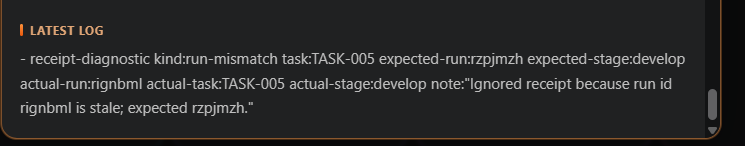
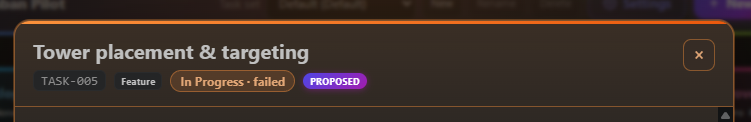

## Request
C:\Repositories\x\.kanban-pilot\tasks\TASK-005.md

## Refined

### Problem statement

The referenced `TASK-005` has implementation changes that were completed by an earlier Develop attempt, but the completion receipt uses the earlier run id `rignbml` after the extension has already timed out that attempt and started a later retry with run id `rzpjmzh`. RunManager therefore records a `receipt-diagnostic kind:run-mismatch`, leaves the card in In Progress with `status: failed`, and offers only another retry even though the work is finished.

The exact task/run/stage identity guard is correct and must remain: automatically treating `rignbml` as `rzpjmzh` could let an old chat turn overwrite the later retry. The missing capability is a deliberate, auditable recovery path for a human who has inspected the implementation and wants to adopt a successful receipt from a known superseded run. Existing late-receipt recovery is intentionally limited to the originating run with its fallback marker, and the existing Mark Run Complete command only handles a task whose `run` is still active; neither path resolves a failed card whose run has already been cleared.

This ticket should add explicit stale-completion recovery, not weaken automatic reconciliation. A candidate must be a canonical successful receipt for this exact task and stage, tied to a run that the extension actually started and durably ended through timeout or missing-receipt handling. The user must see which old run is being adopted, confirm the choice, and have the normal stage-specific gate outcome applied without starting another agent run. Wrong-task, wrong-stage, malformed, arbitrary, or still-active-run output must remain rejected.

### Acceptance criteria

- The reproduction remains safe by default: a successful receipt from `rignbml` does not automatically complete `TASK-005` while the current/latest attempt is `rzpjmzh`; the existing run-mismatch diagnostic remains actionable and is not duplicated by repeated watcher or activation passes.
- For a retryable failed or blocked card with no active `run` or pending outcome, the extension can discover stale completion candidates from the task's append-only log. A candidate must be a canonical `result:ok` receipt for the exact task and stage, and its run must have a matching extension activity-start plus a terminal timeout or missing-receipt/fallback history; an arbitrary hand-written run id is not eligible.
- A human-facing recovery action is available from the board/task detail or Command Palette. It lists the candidate run id, stage, and receipt summary, makes clear that the selected completion predates or supersedes another attempt, and requires explicit confirmation before applying it. The normal retry action remains available, and recovery is unavailable while any newer task run is active or after the task has been manually moved or otherwise superseded.
- After confirmation, the selected receipt is applied exactly once through the existing receipt/outcome path: Develop `ok` follows the configured manual or automatic Develop-to-Validation gate, Refine records its scope hash, Validate preserves its existing semantics, and eligible follow-up proposals are processed with existing provenance and caps. No second agent run is launched and the original receipt line is not rewritten.
- Recovery writes an extension-owned, append-only audit/correction record identifying the adopted run and remains idempotent across repeated command invocations, file-watcher events, activation/reload, and task-set changes. A recovered card cannot be re-adopted or produce duplicate state transitions, pending outcomes, proposals, or audit entries.
- The exact identity and supersession protections remain intact: receipts for another task, stage, or run are never auto-applied; a late result from a stopped, manually moved, or newer active run cannot change the card; and recovery operates only on the active task set without editing frontmatter directly from chat.
- Focused regression tests reproduce the `rignbml`/`rzpjmzh` sequence, prove automatic reconciliation rejects the stale receipt, prove explicit recovery applies the selected successful receipt under both manual and automatic gates, and cover invalid candidates, active/newer runs, manual moves, repeated recovery, reload/watcher idempotence, and proposal handling. The full extension test, build, and lint checks remain green.

## Scope
Implementation checklist, in dependency order:

1. **Model and validate stale-completion candidates — `src/chat/runManager.ts` (and `src/chat/receipt.ts` only if a small reusable lookup helper is needed).**
	- Enumerate canonical successful receipts by exact task and stage instead of using the active-run-only lookup.
	- Correlate each candidate with the extension's activity-start and terminal timeout/missing-receipt audit history, distinguish fallback receipts from agent completions, and expose enough run/stage/note data for a confirmation UI.
	- Keep ordinary active and late-receipt reconciliation strict; do not make a stale receipt eligible merely because its `result` is `ok`.

2. **Add an explicit recovery operation — `src/chat/runManager.ts`.**
	- Add a concurrency-serialized API to list candidates for a task and to recover one selected run id after a fresh re-read and explicit caller confirmation.
	- Require a retryable failed/blocked card in the stage's expected column, no active run, no pending outcome, a still-present exact receipt, and a durable run-history match. Refuse recovery after a move/stop or while a newer run is active; allow a human-confirmed terminal superseded attempt only as this explicit path, never through the watcher.
	- Route the chosen receipt through the existing `applyReceipt`/`applyOutcome` and completion-gate logic, with a distinct idempotent manual-recovery audit action/correction and no duplicate receipt or new executor run. Preserve scope-hash, proposal, close-on-Done, and task-set behavior.

3. **Expose the recovery workflow — `src/extension.ts` and `package.json`.**
	- Contribute a clearly named `Recover Stale Completion` command, resolve the active task set, let the user choose a retryable task and one of its validated candidates, show the old/current run ids and receipt summary, and require a modal confirmation before invoking RunManager.
	- Report no-candidate, active-run, stale-selection, and persistence failures without changing the task; keep `Mark Run Complete`'s existing active-run behavior compatible.

4. **Add a board/detail affordance — `src/board/boardPanel.ts`.**
	- Project whether a card has recoverable stale-success candidates and render an accessible recovery action/confirmation route in the task detail (or route the same action through the existing host message contract).
	- Keep the normal failed/blocked retry action and latest-log diagnostics visible, validate task/run ids at the host boundary, and refresh from the active task store after recovery rather than maintaining client-side state.

5. **Regression coverage — `src/test/runManager.test.ts`, `src/test/extension.test.ts`, and `src/test/boardPanel.test.ts`; update `src/test/receiptAndTemplates.test.ts` only if the canonical lookup contract changes.**
	- Build the exact two-run reproduction with an old timed-out run that has a successful completion receipt and a later failed retry; assert the stale receipt is ignored automatically and its diagnostic is idempotent.
	- Test candidate filtering for wrong task/stage/run, missing extension history, fallback-only lines, active runs, manual moves, and newer retries; test explicit confirmation/application for Develop, Refine, and Validate plus manual/automatic gates.
	- Assert recovery is exactly-once across repeated command calls, watcher notifications, activation/reload, and proposal-bearing receipts, and that no new run or direct chat-owned frontmatter edit occurs.
	- Cover command registration, active task-set routing, accessible detail action/host validation, no-candidate feedback, and preservation of the ordinary retry and Mark Run Complete paths.

6. **Document and verify — `docs/PRD.md` and `README.md` if the user-facing recovery command is documented there.**
	- Document the distinction between automatic same-run late recovery and human-confirmed stale-completion adoption, the identity/history prerequisites, supersession safety, audit/idempotence rules, and the fact that frontmatter remains extension-owned.
	- Run focused receipt/RunManager/board/extension tests, then `npm test`, `npm run build`, and lint; manually reproduce the supplied `TASK-005` log, confirm the stale line is not auto-promoted, recover the selected old completion, and verify the card follows the configured gate without rerunning implementation.

## Log
- audit:state-change at:2026-08-19T21:46:06Z task:TASK-002 from:backlog to:refine action:accept note:"State changed from backlog to refine via accept."
- audit:status-change at:2026-08-19T21:48:06Z task:TASK-002 from:idle to:running action:refine run:rlnzcg0 note:"Status changed from idle to running via refine."
- audit:activity-start at:2026-08-19T21:48:06Z task:TASK-002 stage:refine action:refine run:rlnzcg0 note:"Started refine activity."
- run:rlnzcg0 task:TASK-002 stage:refine result:ok note:"2026-08-19T21:50:49Z — scoped explicit stale-completion recovery while preserving strict automatic run identity checks"
- audit:status-change at:2026-08-19T21:52:22Z task:TASK-002 from:running to:idle action:receipt run:rlnzcg0 outcome:ok note:"Status changed from running to idle via receipt."
- audit:activity-finish at:2026-08-19T21:52:22Z task:TASK-002 stage:refine action:receipt run:rlnzcg0 outcome:ok note:"2026-08-19T21:50:49Z — scoped explicit stale-completion recovery while preserving strict automatic run identity checks"
- audit:state-change at:2026-08-19T22:02:04Z task:TASK-002 from:refine to:scoped action:apply-pending run:rlnzcg0 outcome:ok note:"State changed from refine to scoped via apply-pending."
- audit:state-change at:2026-08-19T22:02:06Z task:TASK-002 from:scoped to:approved action:approve note:"State changed from scoped to approved via approve."
- audit:state-change at:2026-08-19T22:02:07Z task:TASK-002 from:approved to:in-progress action:develop note:"State changed from approved to in-progress via develop."
- audit:status-change at:2026-08-19T22:02:07Z task:TASK-002 from:idle to:running action:develop run:rcczasy note:"Status changed from idle to running via develop."
- audit:activity-start at:2026-08-19T22:02:07Z task:TASK-002 stage:develop action:develop run:rcczasy note:"Started develop activity."
- receipt-diagnostic kind:run-mismatch task:TASK-002 expected-run:rcczasy expected-stage:develop actual-run:rlnzcg0 actual-task:TASK-002 actual-stage:refine note:"Ignored receipt because run id rlnzcg0 is stale; expected rcczasy."
- run:rcczasy task:TASK-002 stage:develop result:failed note:"timed out; awaiting late receipt"
- audit:status-change at:2026-08-19T22:22:07Z task:TASK-002 from:running to:failed action:timeout run:rcczasy outcome:timeout note:"Status changed from running to failed via timeout."
- audit:activity-finish at:2026-08-19T22:22:07Z task:TASK-002 stage:develop run:rcczasy outcome:timeout provisional:true note:"Activity timed out; awaiting late receipt."
- run:rcczasy task:TASK-002 stage:develop result:ok note:"2026-08-19T22:42:03Z — implemented strict human-confirmed stale completion recovery with gate-aware idempotence, command and board actions, and passing compile, package, lint, focused recovery, and full extension tests"
- audit:status-change at:2026-08-19T22:42:08Z task:TASK-002 from:failed to:idle action:late-receipt run:rcczasy outcome:ok note:"Status changed from failed to idle via late-receipt."
- audit:activity-finish at:2026-08-19T22:42:08Z task:TASK-002 stage:develop action:late-receipt run:rcczasy outcome:ok correction:true note:"2026-08-19T22:42:03Z — implemented strict human-confirmed stale completion recovery with gate-aware idempotence, command and board actions, and passing compile, package, lint, focused recovery, and full extension tests"
- audit:state-change at:2026-08-19T22:44:28Z task:TASK-002 from:in-progress to:validation action:apply-pending run:rcczasy outcome:ok note:"State changed from in-progress to validation via apply-pending."
