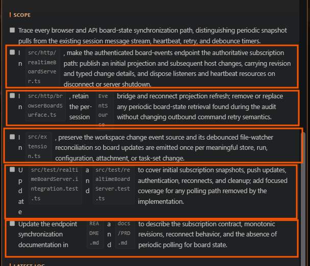

## Request

## Refined

### Problem statement
The Task Details modal renders Markdown checklist labels as an `inline-flex` row. When a checklist item contains a mixture of prose and inline code, the browser treats the label's text/code fragments as independently shrinkable flex items. As shown in the attached screenshot, this collapses words and code paths into narrow vertical fragments, overlaps item rows, and makes the Scope content unreadable. Restore normal inline text flow while retaining the disabled checkbox, alignment, wrapping, and Markdown rendering already provided by the modal.

### Acceptance criteria
- Opening a task whose Request, Refined, or Scope section has checklist items containing prose and inline code renders each item as readable, normally flowing text beside its checkbox; no text or code fragment is reduced to single-character/narrow-column wrapping.
- Long checklist content wraps within the modal's available width without overflowing, overlapping adjacent checklist items, or obscuring the checkbox.
- The checkbox remains disabled, visually aligned with the first line of its item, and checklist indentation/nested task lists continue to render correctly.
- Other Task Details Markdown content, including ordinary lists, headings, links, code blocks, tables, Mermaid diagrams, and attachments, retains its existing rendering and safety behavior.
- The fix is covered by a regression test using a task-list item representative of the screenshot: mixed prose and inline-code file paths/identifiers in a constrained modal width.

## Scope

- [ ] `src/board/boardPanel.ts` — replace the task-list label layout that causes independent flex-item shrinking with a layout that preserves normal inline text flow next to an aligned disabled checkbox; retain the existing modal sizing, wrapping, nested-list, and task-list styles.
- [ ] `src/test/boardPanel.test.ts` — extend Task Details/Markdown rendering coverage with checklist items containing mixed prose and inline code; assert the expected task-list DOM and stylesheet contract that prevents fragment-level flex shrinking while preserving disabled checkboxes and nested-list behavior.
- [ ] Run the focused board-panel test suite and the project compile/test checks required by the repository scripts to confirm the modal renders normally without regressing other Markdown features.

## Log
- audit:state-change at:2026-08-26T19:42:02Z task:TASK-005 from:backlog to:refine action:accept note:"State changed from backlog to refine via accept."
- audit:status-change at:2026-08-26T19:42:04Z task:TASK-005 from:idle to:running action:refine run:rcmdenw note:"Status changed from idle to running via refine."
- audit:activity-start at:2026-08-26T19:42:04Z task:TASK-005 stage:refine action:refine run:rcmdenw note:"Started refine activity."
- run:rcmdenw task:TASK-005 stage:refine result:ok note:"Scoped the task-list flex-layout defect, visual behavior, and board-panel regression coverage."
- audit:status-change at:2026-08-26T19:43:12Z task:TASK-005 from:running to:idle action:receipt run:rcmdenw outcome:ok note:"Status changed from running to idle via receipt."
- audit:activity-finish at:2026-08-26T19:43:12Z task:TASK-005 stage:refine action:receipt run:rcmdenw outcome:ok note:"Scoped the task-list flex-layout defect, visual behavior, and board-panel regression coverage."
- audit:state-change at:2026-08-26T19:43:36Z task:TASK-005 from:refine to:scoped action:apply-pending run:rcmdenw outcome:ok note:"State changed from refine to scoped via apply-pending."
- audit:state-change at:2026-08-26T19:43:38Z task:TASK-005 from:scoped to:approved action:approve note:"State changed from scoped to approved via approve."
- audit:state-change at:2026-08-26T19:43:39Z task:TASK-005 from:approved to:in-progress action:develop note:"State changed from approved to in-progress via develop."
- audit:status-change at:2026-08-26T19:43:39Z task:TASK-005 from:idle to:running action:develop run:rg1eltl note:"Status changed from idle to running via develop."
- audit:activity-start at:2026-08-26T19:43:39Z task:TASK-005 stage:develop action:develop run:rg1eltl note:"Started develop activity."
- run:rg1eltl task:TASK-005 stage:develop result:ok note:"2026-08-26T19:45:47Z — restored inline checklist flow and added mixed inline-code regression coverage; focused tests, compile, and lint pass."
- audit:status-change at:2026-08-26T19:46:01Z task:TASK-005 from:running to:idle action:receipt run:rg1eltl outcome:ok note:"Status changed from running to idle via receipt."
- audit:activity-finish at:2026-08-26T19:46:01Z task:TASK-005 stage:develop action:receipt run:rg1eltl outcome:ok note:"2026-08-26T19:45:47Z — restored inline checklist flow and added mixed inline-code regression coverage; focused tests, compile, and lint pass."
- audit:state-change at:2026-08-27T21:07:17Z task:TASK-005 from:in-progress to:done action:move note:"State changed from in-progress to done via move."
