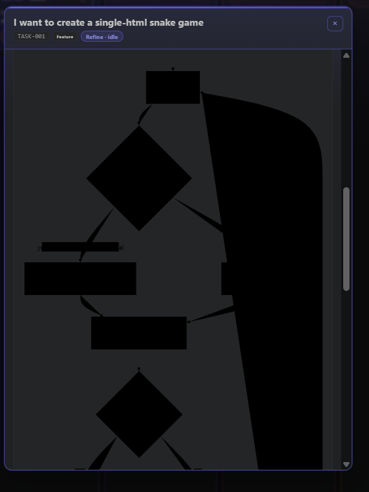

## Request

## Refined
Mermaid flowcharts rendered in task-detail modals currently render their node
fills and related shapes as solid black, making labels and diagram structure
unreadable in the VS Code dark theme. The Mermaid webview bridge must derive
and apply a complete, contrasting color palette from VS Code theme tokens so
flowcharts remain legible without weakening the existing local-only runtime,
strict security level, SVG sanitization, or responsive diagram layout.

Acceptance criteria:
- Mermaid flowchart node fills, borders, labels, connectors, and arrowheads
	use contrasting colors in the VS Code dark theme; nodes are not rendered as
	solid black shapes that obscure their labels.
- The palette is sourced from VS Code CSS variables with stable fallbacks so
	rendering remains legible in reduced DOM test hosts and when a theme token
	is unavailable.
- Flowchart rendering continues to honor authored Mermaid classes and styles
	where Mermaid permits them, while its default theme colors are readable.
- Sequence diagrams and existing Mermaid rendering behavior remain functional,
	including local runtime loading, strict security, sanitization, error
	fallback, and responsive SVG sizing.
- Automated coverage verifies that rendered flowchart SVG output receives the
	intended non-black default theme colors and that the existing flowchart and
	sequence rendering cases still pass.

## Scope
- Update `src/board/mermaidWebview.ts` to provide Mermaid's flowchart-specific
	default fill, text, border, line, and edge-label theme variables from
	appropriate VS Code CSS variables, including readable fallback values for
	missing tokens.
- Preserve the current Mermaid initialization options, local runtime contract,
	SVG sanitization, and rendering lifecycle; limit the change to default
	diagram theming needed to correct black flowchart shapes.
- Extend the Mermaid bridge coverage in `src/test/boardPanel.test.ts` with a
	flowchart assertion that inspects the rendered SVG styles for the configured
	readable default palette, while retaining the existing flowchart, sequence,
	invalid-diagram, and sanitization assertions.
- Run the focused board-panel test suite and the extension build/test command
	used by the repository to confirm the bundled Mermaid bridge still loads and
	renders correctly.

## Log
- audit:state-change at:2026-08-26T20:17:59Z task:TASK-006 from:backlog to:refine action:accept note:"State changed from backlog to refine via accept."
- audit:status-change at:2026-08-26T20:18:03Z task:TASK-006 from:idle to:running action:refine run:rxapfo3 note:"Status changed from idle to running via refine."
- audit:activity-start at:2026-08-26T20:18:03Z task:TASK-006 stage:refine action:refine run:rxapfo3 note:"Started refine activity."
- run:rxapfo3 task:TASK-006 stage:refine result:ok note:"Refined the Mermaid flowchart color defect, accessibility expectations, implementation boundaries, and rendering-test coverage."
- audit:status-change at:2026-08-26T20:18:50Z task:TASK-006 from:running to:idle action:receipt run:rxapfo3 outcome:ok note:"Status changed from running to idle via receipt."
- audit:activity-finish at:2026-08-26T20:18:50Z task:TASK-006 stage:refine action:receipt run:rxapfo3 outcome:ok note:"Refined the Mermaid flowchart color defect, accessibility expectations, implementation boundaries, and rendering-test coverage."
- audit:state-change at:2026-08-26T20:21:37Z task:TASK-006 from:refine to:scoped action:apply-pending run:rxapfo3 outcome:ok note:"State changed from refine to scoped via apply-pending."
- audit:state-change at:2026-08-26T20:21:38Z task:TASK-006 from:scoped to:approved action:approve note:"State changed from scoped to approved via approve."
- audit:state-change at:2026-08-26T20:21:39Z task:TASK-006 from:approved to:in-progress action:develop note:"State changed from approved to in-progress via develop."
- audit:status-change at:2026-08-26T20:21:39Z task:TASK-006 from:idle to:running action:develop run:r1259eq note:"Status changed from idle to running via develop."
- audit:activity-start at:2026-08-26T20:21:39Z task:TASK-006 stage:develop action:develop run:r1259eq note:"Started develop activity."
- run:r1259eq task:TASK-006 stage:develop result:ok note:"2026-08-26T20:29:32Z — configured readable Mermaid flowchart colors, retained safe SVG styles, and added palette coverage."
- audit:status-change at:2026-08-26T20:29:46Z task:TASK-006 from:running to:idle action:receipt run:r1259eq outcome:ok note:"Status changed from running to idle via receipt."
- audit:activity-finish at:2026-08-26T20:29:46Z task:TASK-006 stage:develop action:receipt run:r1259eq outcome:ok note:"2026-08-26T20:29:32Z — configured readable Mermaid flowchart colors, retained safe SVG styles, and added palette coverage."
