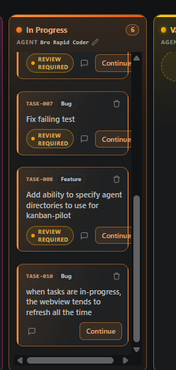

## Request

## Refined
When a board column accumulates enough task cards to show its vertical
scrollbar, the `.cards` scroller consumes horizontal space inside the fixed
column. Card content is not constrained to the remaining usable inline width,
so controls in the card header/footer, especially the Continue action, can
extend beneath the scrollbar or visually collide with it. Preserve the
existing board layout while making overflowing columns reserve and respect
scrollbar space so every card remains readable and operable.

**Acceptance criteria**
- A column with enough cards to require vertical scrolling displays each card
	fully within the visible content area; no card border, text, badge, icon, or
	action button sits under or overlaps the vertical scrollbar.
- The Continue button, review/status pill, comment affordance, and delete
	action remain visible, individually clickable, and keyboard-focusable in an
	overflowing column.
- Long task titles and the card header/footer continue to wrap or shrink
	within the available card width rather than causing horizontal overflow or
	overlapping adjacent card controls.
- Columns without a vertical scrollbar retain their current card sizing and
	board spacing, without a new page-level horizontal scrollbar or clipped
	focus rings.
- The fix works in the VS Code webview under supported editor themes and
	preserves the existing independent vertical card scrolling and horizontal
	board scrolling behavior.

## Scope
- [ ] Inspect the board stylesheet emitted by `src/board/boardPanel.ts`,
	focusing on `.column`, `.cards`, `.card`, `.card-top`, and `.card-foot` to
	identify why the current negative scroller margin/padding does not reserve
	usable space when a scrollbar is present.
- [ ] Adjust the `.cards` scrolling layout in `src/board/boardPanel.ts` to
	reserve a stable scrollbar gutter or equivalent in-content clearance, while
	retaining the focus-ring clearance and the column's fixed width.
- [ ] Add the needed flex/min-width/overflow constraints to affected card
	rows and controls in `src/board/boardPanel.ts` so long titles and action
	groups cannot paint into the scrollbar area after the gutter is reserved.
- [ ] Keep the changes scoped to board-webview CSS; do not change task state,
	action routing, card markup semantics, or board persistence behavior.
- [ ] Extend `src/test/boardPanel.test.ts` with regression assertions for the
	generated board stylesheet/markup contract that reserves overflow-scroller
	space and keeps card action rows constrained.
- [ ] Run the focused board-panel tests plus `npm run compile` and the
	relevant full test suite; manually verify a populated In Progress column in
	the webview with and without a vertical scrollbar.

## Log
- audit:state-change at:2026-08-26T23:27:07Z task:TASK-011 from:backlog to:refine action:accept note:"State changed from backlog to refine via accept."
- audit:status-change at:2026-08-26T23:27:08Z task:TASK-011 from:idle to:running action:refine run:rj9ufz3 note:"Status changed from idle to running via refine."
- audit:activity-start at:2026-08-26T23:27:08Z task:TASK-011 stage:refine action:refine run:rj9ufz3 note:"Started refine activity."
- run:rj9ufz3 task:TASK-011 stage:refine result:ok note:"2026-08-26T23:27:55Z — scoped a scrollbar-gutter and constrained-card-layout fix for overflowing board columns"
- audit:status-change at:2026-08-26T23:28:10Z task:TASK-011 from:running to:idle action:receipt run:rj9ufz3 outcome:ok note:"Status changed from running to idle via receipt."
- audit:activity-finish at:2026-08-26T23:28:10Z task:TASK-011 stage:refine action:receipt run:rj9ufz3 outcome:ok note:"2026-08-26T23:27:55Z — scoped a scrollbar-gutter and constrained-card-layout fix for overflowing board columns"
- audit:state-change at:2026-08-26T23:29:19Z task:TASK-011 from:refine to:scoped action:apply-pending run:rj9ufz3 outcome:ok note:"State changed from refine to scoped via apply-pending."
- audit:state-change at:2026-08-26T23:29:20Z task:TASK-011 from:scoped to:approved action:approve note:"State changed from scoped to approved via approve."
- audit:state-change at:2026-08-26T23:29:22Z task:TASK-011 from:approved to:in-progress action:develop note:"State changed from approved to in-progress via develop."
- audit:status-change at:2026-08-26T23:29:22Z task:TASK-011 from:idle to:running action:develop run:ry3o4vp note:"Status changed from idle to running via develop."
- audit:activity-start at:2026-08-26T23:29:22Z task:TASK-011 stage:develop action:develop run:ry3o4vp note:"Started develop activity."
- run:ry3o4vp task:TASK-011 stage:develop result:ok note:"2026-08-26T23:33:58Z — reserved scrollbar gutter space and constrained card layout actions with regression coverage"
- audit:status-change at:2026-08-26T23:34:08Z task:TASK-011 from:running to:idle action:receipt run:ry3o4vp outcome:ok note:"Status changed from running to idle via receipt."
- audit:activity-finish at:2026-08-26T23:34:08Z task:TASK-011 stage:develop action:receipt run:ry3o4vp outcome:ok note:"2026-08-26T23:33:58Z — reserved scrollbar gutter space and constrained card layout actions with regression coverage"
