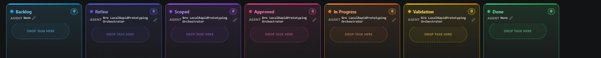

## Request

## Refined
The board webview's empty-column drop target, labeled `Drop task here`, is rendered as the first child of `.cards`, but the rounded dashed outline is clipped along its upper edge and top corners. This leaves the drop affordance visually incomplete. The leading layout condition to verify is the target's negative vertical margin (`margin: -2px 0`) against the `.cards` scroll container and the column's clipping; the fix must correct the inset without changing drag-and-drop semantics.

### Acceptance criteria
- On initial render, every empty column displays the complete rounded dashed outline of its `Drop task here` target, including the upper border and both top corners.
- The outline remains fully visible at the default VS Code webview zoom in both light and dark themes, including when the column has a scrollbar or is near the board edge.
- Dragging a task over an empty column preserves the complete outline and existing active styling, and dropping still moves the task into that column.
- Populated-column insertion targets, card spacing and order, vertical scrolling, and horizontal board scrolling remain unchanged.
- Automated structural coverage guards the layout rule that prevents the first empty target from being positioned outside the `.cards` scrollport, and a webview smoke check confirms the painted upper border.

## Scope
- `src/board/boardPanel.ts`: inspect the `.cards`, `.drop-slot`, `.drop-slot.empty-slot`, and `.column` styles; apply the smallest layout correction that keeps the first empty target wholly inside the `.cards` scrollport while preserving the existing spacing for populated-column insertion targets.
- `src/board/boardPanel.ts`: review `renderBoard` and `addDropSlot` only as needed to preserve the empty-slot class, separator role, accessible label, and existing dragover, dragleave, and drop handlers; do not alter the move or reorder protocol.
- `src/test/boardPanel.test.ts`: add focused regression coverage for the generated stylesheet or markup that protects the non-clipped first empty target; keep the assertion structural and avoid unrelated snapshot or formatting changes.
- Verification: run the existing build, lint, and board-panel test commands, then inspect empty and populated columns in the webview at default zoom in light and dark themes, including drag-over activation and scrolling.

## Log
- audit:state-change at:2026-08-27T21:10:44Z task:TASK-001 from:backlog to:refine action:accept note:"State changed from backlog to refine via accept."
- audit:status-change at:2026-08-27T21:10:45Z task:TASK-001 from:idle to:running action:refine run:rmbxrq9 note:"Status changed from idle to running via refine."
- audit:activity-start at:2026-08-27T21:10:45Z task:TASK-001 stage:refine action:refine run:rmbxrq9 note:"Started refine activity."
- progress run:rmbxrq9 task:TASK-001 at:2026-08-27T21:14:32Z note:"inspecting the drop-target layout and defining regression checks"
- run:rmbxrq9 task:TASK-001 stage:refine result:ok note:"2026-08-27T21:14:44Z — refine completed: documented the clipping hypothesis, acceptance criteria, and focused implementation checklist"
- audit:status-change at:2026-08-27T21:15:16Z task:TASK-001 from:running to:idle action:receipt run:rmbxrq9 outcome:ok note:"Status changed from running to idle via receipt."
- audit:activity-finish at:2026-08-27T21:15:16Z task:TASK-001 stage:refine action:receipt run:rmbxrq9 outcome:ok note:"2026-08-27T21:14:44Z — refine completed: documented the clipping hypothesis, acceptance criteria, and focused implementation checklist"
- audit:state-change at:2026-08-27T21:16:48Z task:TASK-001 from:refine to:scoped action:apply-pending run:rmbxrq9 outcome:ok note:"State changed from refine to scoped via apply-pending."
- audit:state-change at:2026-08-27T21:16:57Z task:TASK-001 from:scoped to:approved action:approve note:"State changed from scoped to approved via approve."
- audit:state-change at:2026-08-27T21:17:01Z task:TASK-001 from:approved to:in-progress action:develop note:"State changed from approved to in-progress via develop."
- audit:status-change at:2026-08-27T21:17:01Z task:TASK-001 from:idle to:running action:develop run:rs51g4v note:"Status changed from idle to running via develop."
- audit:activity-start at:2026-08-27T21:17:01Z task:TASK-001 stage:develop action:develop run:rs51g4v note:"Started develop activity."
- progress run:rs51g4v task:TASK-001 at:2026-08-27T21:18:27Z note:"blocked before implementation because the required coder delegation is unavailable"
- run:rs51g4v task:TASK-001 stage:develop result:blocked note:"2026-08-27T21:18:27Z — develop blocked: the required Bro LocalRapidPrototyping Coder delegation is unavailable in this session"
- progress run:rs51g4v task:TASK-001 at:2026-08-27T21:23:18Z note:"implemented the drop-target inset and completed build, lint, and regression verification"
- run:rs51g4v task:TASK-001 stage:develop result:ok note:"2026-08-27T21:23:18Z — develop completed: inset empty drop targets and added coverage while preserving populated-slot spacing"
- audit:status-change at:2026-08-27T21:24:31Z task:TASK-001 from:running to:idle action:receipt run:rs51g4v outcome:ok note:"Status changed from running to idle via receipt."
- audit:activity-finish at:2026-08-27T21:24:31Z task:TASK-001 stage:develop action:receipt run:rs51g4v outcome:ok note:"2026-08-27T21:23:18Z — develop completed: inset empty drop targets and added coverage while preserving populated-slot spacing"
- audit:state-change at:2026-08-27T21:26:08Z task:TASK-001 from:in-progress to:validation action:apply-pending run:rs51g4v outcome:ok note:"State changed from in-progress to validation via apply-pending."
- audit:state-change at:2026-08-27T21:26:11Z task:TASK-001 from:validation to:done action:move note:"State changed from validation to done via move."
