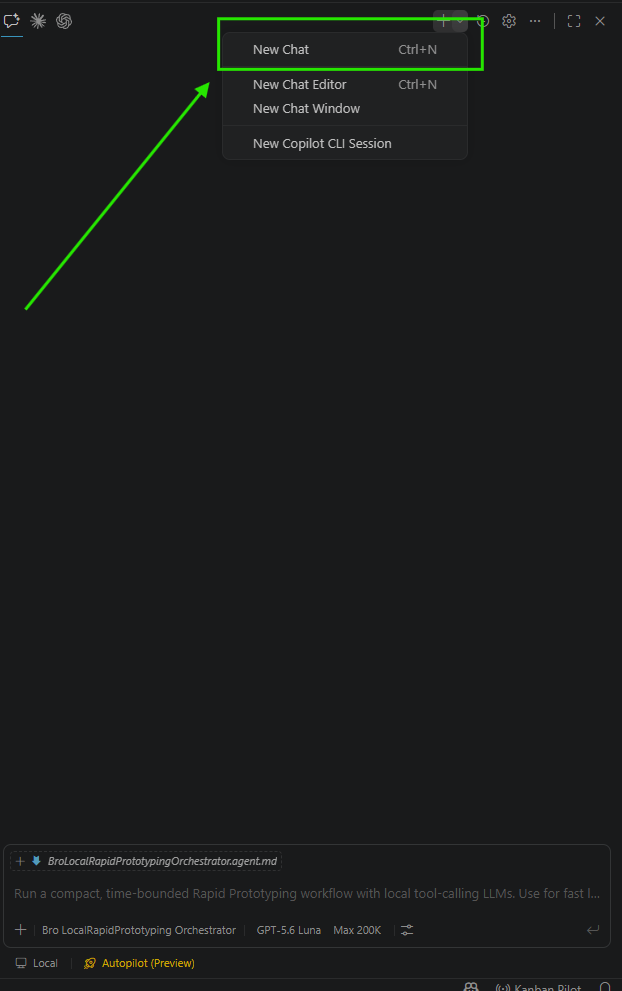

## Request
this will carry over the Agent and LLM configurations of the Copilot Chat.

## Refined

### Problem statement

When Kanban Pilot starts the first Copilot Chat turn for a task, it opens a task-bound session directly before injecting the stage prompt. A newly opened session can therefore lose the Agent and LLM/model selections that are active in Copilot Chat. The first task chat must instead be created through Copilot Chat's built-in **New Chat** action so it inherits the active configuration shown in the attached example: `Bro LocalRapidPrototyping Orchestrator` as the Agent and `GPT-5.6 Luna` as the LLM. The task's existing one-chat-per-task binding, prompt attachments, and run tracking must remain intact.

For this ticket, a **new chat** means the task has no concrete Copilot conversation identity yet; a generated local task binding by itself does not prove that a conversation already exists. **Agent** means the custom Agent selected in the Copilot Chat UI, not the board's prompt persona label. **LLM** means the currently selected Copilot model. An explicit `kanbanPilot.chat.modelSelector` pin remains an intentional override; when it is unset, the New Chat selection is authoritative.

### Acceptance criteria

1. On the first stage run for a task without an existing Copilot conversation, Kanban Pilot invokes `workbench.action.chat.newChat` in the Copilot Chat context before submitting the task prompt, and the prompt runs with the active Copilot Chat Agent and LLM/model without requiring the user to select them again.
2. The first-run request retains the current task prompt contract: the Markdown task is attached first, referenced task images remain read-only context, the configured mode and tool exclusions are preserved, and an explicit model pin is still honored.
3. The returned Copilot conversation identity is persisted as the task's binding. Refine retries, Develop, Continue, and Validate reuse that task conversation and do not invoke New Chat again; the existing opt-in `chat.resetOnApprove` behavior remains separate and unchanged.
4. Two tasks cannot share the newly created conversation, and serialized injection/focus handling still routes each first prompt to its owning task rather than to a previously focused chat.
5. If New Chat is unavailable or fails, the extension reports an actionable failure or uses the existing safe fallback with an explicit diagnostic; it never silently claims that Agent/LLM inheritance occurred or injects into an ambiguous unrelated conversation.
6. Focused automated tests cover first-use New Chat ordering, inherited-versus-explicit model behavior, persisted-session reuse, failure handling, and the unchanged continuation/reset paths. A manual Extension Development Host smoke check confirms the selected Agent and LLM shown in the attached image are present on a newly started task chat.

## Scope

- Update `src/chat/executor.ts` to model the one-time first-use New Chat operation, feature-detect/handle `workbench.action.chat.newChat`, and keep New Chat plus prompt injection inside the existing serialized focus/mutex protocol. Do not scrape Copilot Chat internals; rely on the built-in action for Agent/LLM carry-over and preserve the existing payload, attachment, tool-exclusion, and explicit `modelSelector` behavior.
- Update `src/chat/runManager.ts` to distinguish a genuinely unused task conversation from a generated or legacy binding, pass the first-use flag only for the initial run, persist the concrete conversation identity returned by Copilot, and leave Continue/retry/Validate and the separate `resetOnApprove` path unchanged.
- Add or adjust a small session-binding helper in `src/chat/sessionUri.ts` (and the related task type/comment only if required) so first-use detection does not mistake the derived task URI for an already-created Copilot conversation and remains compatible with legacy task files.
- Extend `src/test/executor.test.ts` with command-availability, command-ordering, payload/configuration, and New Chat failure cases; update existing command stubs to represent the built-in command without weakening the narrow-window assertions.
- Extend `src/test/runManager.test.ts` to prove that only the first run creates a New Chat, the returned session id is reused on later stage runs, separate tasks remain isolated, and `chat.resetOnApprove` continues to behave as currently specified.
- Update the relevant Copilot Chat/session lifecycle and configuration notes in `docs/PRD.md` so the documented first-use flow, fallback, and Agent/LLM precedence match the implementation. Do not edit the attached image or generated `dist-test` output by hand.
- Perform the acceptance smoke check in an Extension Development Host with a selected custom Agent and LLM (the attached `Bro LocalRapidPrototyping Orchestrator` / `GPT-5.6 Luna` combination when available), then verify a second run reuses the task chat without triggering New Chat and a different task receives its own chat.

## Log
- audit:state-change at:2026-08-27T21:13:47Z task:TASK-002 from:backlog to:refine action:accept note:"State changed from backlog to refine via accept."
- audit:status-change at:2026-08-27T21:13:49Z task:TASK-002 from:idle to:running action:refine run:r30xk4p note:"Status changed from idle to running via refine."
- audit:activity-start at:2026-08-27T21:13:49Z task:TASK-002 stage:refine action:refine run:r30xk4p note:"Started refine activity."
- progress run:r30xk4p task:TASK-002 at:2026-08-27T21:16:32Z note:"Refined the first-use chat behavior and implementation boundaries."
- run:r30xk4p task:TASK-002 stage:refine result:ok note:"2026-08-27T21:16:32Z — refine completed: documented New Chat inheritance, session reuse, safe fallback, tests, and smoke validation"
- audit:status-change at:2026-08-27T21:17:04Z task:TASK-002 from:running to:idle action:receipt run:r30xk4p outcome:ok note:"Status changed from running to idle via receipt."
- audit:activity-finish at:2026-08-27T21:17:04Z task:TASK-002 stage:refine action:receipt run:r30xk4p outcome:ok note:"2026-08-27T21:16:32Z — refine completed: documented New Chat inheritance, session reuse, safe fallback, tests, and smoke validation"
- audit:state-change at:2026-08-27T21:17:52Z task:TASK-002 from:refine to:scoped action:apply-pending run:r30xk4p outcome:ok note:"State changed from refine to scoped via apply-pending."
- audit:state-change at:2026-08-27T21:17:54Z task:TASK-002 from:scoped to:approved action:approve note:"State changed from scoped to approved via approve."
- audit:state-change at:2026-08-27T21:17:57Z task:TASK-002 from:approved to:in-progress action:develop note:"State changed from approved to in-progress via develop."
- audit:status-change at:2026-08-27T21:17:57Z task:TASK-002 from:idle to:running action:develop run:rsagix1 note:"Status changed from idle to running via develop."
- audit:activity-start at:2026-08-27T21:17:57Z task:TASK-002 stage:develop action:develop run:rsagix1 note:"Started develop activity."
- progress run:rsagix1 task:TASK-002 at:2026-08-27T21:38:28Z note:"Implementation and automated validation are complete; live Copilot smoke remains unavailable."
- run:rsagix1 task:TASK-002 stage:develop result:blocked note:"2026-08-27T21:38:36Z — implementation complete and 357 automated tests pass, but live Extension Development Host smoke is blocked because Copilot authentication and the required Agent/model are unavailable"
- receipt-diagnostic kind:run-mismatch task:TASK-002 expected-run:rsagix1 expected-stage:develop actual-run:r30xk4p actual-task:TASK-002 actual-stage:refine note:"Ignored receipt because run id r30xk4p is stale; expected rsagix1."
- run:rsagix1 task:TASK-002 stage:develop result:failed note:"timed out; awaiting late receipt"
- audit:status-change at:2026-08-27T21:37:57Z task:TASK-002 from:running to:failed action:timeout run:rsagix1 outcome:timeout note:"Status changed from running to failed via timeout."
- audit:activity-finish at:2026-08-27T21:37:57Z task:TASK-002 stage:develop run:rsagix1 outcome:timeout provisional:true note:"Activity timed out; awaiting late receipt."
- audit:status-change at:2026-08-27T21:38:40Z task:TASK-002 from:failed to:blocked action:late-receipt run:rsagix1 outcome:blocked note:"Status changed from failed to blocked via late-receipt."
- audit:activity-finish at:2026-08-27T21:38:40Z task:TASK-002 stage:develop action:late-receipt run:rsagix1 outcome:blocked correction:true note:"2026-08-27T21:38:36Z — implementation complete and 357 automated tests pass, but live Extension Development Host smoke is blocked because Copilot authentication and the required Agent/model are unavailable"
- audit:state-change at:2026-08-27T21:53:47Z task:TASK-002 from:in-progress to:validation action:move note:"State changed from in-progress to validation via move."
- audit:status-change at:2026-08-27T21:53:47Z task:TASK-002 from:blocked to:idle action:move note:"Status changed from blocked to idle via move."
- audit:status-change at:2026-08-27T21:53:50Z task:TASK-002 from:idle to:running action:validate run:rqkf4kt note:"Status changed from idle to running via validate."
- audit:activity-start at:2026-08-27T21:53:50Z task:TASK-002 stage:validate action:validate run:rqkf4kt note:"Started validate activity."
- progress run:rqkf4kt task:TASK-002 at:2026-08-27T21:57:45Z note:"Automated validation is green; reviewing the required live Copilot inheritance evidence."
- run:rqkf4kt task:TASK-002 stage:validate result:blocked note:"2026-08-27T21:57:52Z — 357 automated tests, compile, bundle, lint, and diagnostics pass, but the live Extension Development Host smoke cannot confirm Agent and model carry-over, second-run reuse, or separate-task isolation"
- audit:status-change at:2026-08-27T21:58:39Z task:TASK-002 from:running to:blocked action:receipt run:rqkf4kt outcome:blocked note:"Status changed from running to blocked via receipt."
- audit:activity-finish at:2026-08-27T21:58:39Z task:TASK-002 stage:validate action:receipt run:rqkf4kt outcome:blocked note:"2026-08-27T21:57:52Z — 357 automated tests, compile, bundle, lint, and diagnostics pass, but the live Extension Development Host smoke cannot confirm Agent and model carry-over, second-run reuse, or separate-task isolation"
- audit:state-change at:2026-08-27T22:03:45Z task:TASK-002 from:validation to:done action:move note:"State changed from validation to done via move."
- audit:status-change at:2026-08-27T22:03:45Z task:TASK-002 from:blocked to:idle action:move note:"Status changed from blocked to idle via move."
- audit:state-change at:2026-08-28T00:08:52Z task:TASK-002 from:done to:in-progress action:move note:"State changed from done to in-progress via move."
- audit:state-change at:2026-08-28T00:45:02Z task:TASK-002 from:in-progress to:done action:move note:"State changed from in-progress to done via move."
