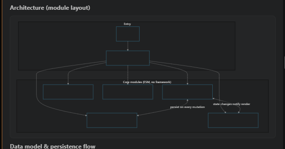

## Request

## Refined

### Problem statement

The task-detail Markdown renderer displays Mermaid flowcharts from the local bundled bridge, but the flowchart shapes in the supplied screenshot are empty: borders, connectors, group captions, and edge labels render while the text inside the node shapes does not. The bug is specific to flowchart node labels being produced as removable HTML/SVG content before the bridge's security sanitization; the fix must make those labels survive as readable SVG text. It must preserve the existing local-only Mermaid integration, security boundary, surrounding Markdown, and other diagram types rather than redesigning the renderer.

### Acceptance criteria

- A Mermaid flowchart containing explicit labels inside rectangular, rounded, or other supported node shapes renders those labels visibly inside the corresponding shapes through the complete packaged local runtime, bridge, and SVG-sanitization path.
- Flowchart connectors, edge labels, subgraph or cluster captions, and ordinary Markdown before and after the diagram remain visible and are not regressed.
- Sequence diagrams continue to render, and invalid Mermaid continues to show the existing readable fallback with its source instead of breaking the task detail.
- SVG sanitization continues to remove unsafe generated elements and external/actionable references; the fix does not weaken the existing security checks or require remote Mermaid assets.
- The focused BoardPanel Mermaid regression coverage, extension compilation, lint, and existing automated test suite pass without a dependency, CSP, or resource-loading redesign.

## Scope
- [ ] Update `src/board/mermaidWebview.ts` so Mermaid's global initialization disables HTML labels (`htmlLabels: false`), causing flowchart node labels to be emitted as sanitizer-preserved SVG text; retain the existing `flowchart.useMaxWidth` and theme configuration, and leave `sanitizeSvg`'s unsafe-element removal unchanged.
- [ ] Extend the packaged local Mermaid bridge regression fixture in `src/test/boardPanel.test.ts` with explicit flowchart node labels, an edge label, and representative grouped nodes if needed; assert that the expected node and edge text is present in the rendered SVG and that no `foreignObject` remains, while retaining the sequence-diagram and style assertions.
- [ ] Keep the existing invalid-diagram fallback, unsafe-reference sanitization, replacement-rendering, Markdown-fence classification, and local-resource coverage in `src/test/boardPanel.test.ts` passing; add only focused assertions needed to prevent the blank-node-label regression.
- [ ] Rebuild the existing generated `dist/mermaid-runtime.js` and `dist/mermaid-webview.js` through the normal compile/package workflow for validation; do not hand-edit generated bundles, change `package.json` or `webpack.config.js`, alter BoardPanel Markdown parsing/CSP, or weaken sanitizer behavior.

## Log
- audit:state-change at:2026-08-31T03:50:28Z task:TASK-004 from:backlog to:refine action:accept note:"State changed from backlog to refine via accept."
- audit:status-change at:2026-08-31T03:50:46Z task:TASK-004 from:idle to:running action:refine run:rybofax note:"Status changed from idle to running via refine."
- audit:activity-start at:2026-08-31T03:50:46Z task:TASK-004 stage:refine action:refine run:rybofax note:"Started refine activity."
- progress run:rybofax task:TASK-004 at:2026-08-31T03:57:51Z note:"refinement complete: isolated the flowchart label loss and documented the focused renderer and regression-test work"
- run:rybofax task:TASK-004 stage:refine result:ok note:"2026-08-31T03:57:51Z — refined the flowchart node-label failure, acceptance criteria, and focused implementation scope"
- audit:status-change at:2026-08-31T03:58:37Z task:TASK-004 from:running to:idle action:receipt run:rybofax outcome:ok note:"Status changed from running to idle via receipt."
- audit:activity-finish at:2026-08-31T03:58:37Z task:TASK-004 stage:refine action:receipt run:rybofax outcome:ok note:"2026-08-31T03:57:51Z — refined the flowchart node-label failure, acceptance criteria, and focused implementation scope"
- audit:state-change at:2026-08-31T04:10:51Z task:TASK-004 from:refine to:scoped action:apply-pending run:rybofax outcome:ok note:"State changed from refine to scoped via apply-pending."
- audit:state-change at:2026-08-31T04:10:55Z task:TASK-004 from:scoped to:approved action:approve note:"State changed from scoped to approved via approve."
- audit:state-change at:2026-08-31T04:10:58Z task:TASK-004 from:approved to:in-progress action:develop note:"State changed from approved to in-progress via develop."
- audit:status-change at:2026-08-31T04:10:58Z task:TASK-004 from:idle to:running action:develop run:r6u92ey note:"Status changed from idle to running via develop."
- audit:activity-start at:2026-08-31T04:10:58Z task:TASK-004 stage:develop action:develop run:r6u92ey note:"Started develop activity."
- progress run:r6u92ey task:TASK-004 at:2026-08-31T04:29:34Z note:"implementation and validation complete: flowchart labels render as readable SVG text with regressions covered"
- run:r6u92ey task:TASK-004 stage:develop result:ok note:"2026-08-31T04:29:34Z — fixed global Mermaid label rendering, added node edge and group label regression coverage, and passed package and test validation"
- audit:status-change at:2026-08-31T04:30:13Z task:TASK-004 from:running to:idle action:receipt run:r6u92ey outcome:ok note:"Status changed from running to idle via receipt."
- audit:activity-finish at:2026-08-31T04:30:13Z task:TASK-004 stage:develop action:receipt run:r6u92ey outcome:ok note:"2026-08-31T04:29:34Z — fixed global Mermaid label rendering, added node edge and group label regression coverage, and passed package and test validation"
- audit:state-change at:2026-08-31T04:51:10Z task:TASK-004 from:in-progress to:validation action:apply-pending run:r6u92ey outcome:ok note:"State changed from in-progress to validation via apply-pending."
- audit:state-change at:2026-08-31T05:04:09Z task:TASK-004 from:validation to:done action:move note:"State changed from validation to done via move."
