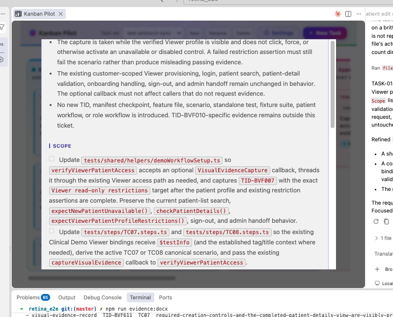

## Request

## Refined

### Problem statement

At narrow board or webview widths, opening a task with enough detail to exceed the available viewport can leave the vertically stacked detail layout centered while its content overflows. The top of the task-details dialog, including the title/header and the beginning of the task content, is then clipped above the visible surface as shown in the attachment. This makes the dialog's identity and controls difficult or impossible to reach when it first opens. The dialog should keep its top portion accessible while still allowing long task details to scroll.

### Acceptance criteria

- At the narrow responsive width represented by the report, opening a task-detail dialog keeps the dialog's top edge, title, badges, close control, and beginning of the detail content within the visible viewport.
- When the task details are taller than the available viewport, all sections and actions remain reachable through vertical scrolling, including Request, Refined, Scope, logs or activity, and the optional Task Tree; no horizontal overflow is introduced.
- At wide desktop widths, the existing centered detail dialog and optional two-pane Task Tree layout retain their current sizing and placement.
- Existing close behavior (close button, backdrop dismissal, and Escape), focus behavior, and detail refresh/scroll preservation continue to work after the responsive layout change.

## Scope

- [ ] Update the responsive detail-modal styles in `src/board/boardPanel.ts`, covering `.modal-backdrop`, `.detail-dialog-layout`, and the detail modal/Task Tree sizing rules so narrow layouts are top-safe, constrained to the viewport, and vertically scrollable without clipping the header.
- [ ] Preserve the existing wide-screen centered dialog and two-pane Task Tree presentation while preventing narrow layouts from creating horizontal overflow or inaccessible content.
- [ ] Extend the focused detail/webview coverage in `src/test/boardPanel.test.ts` with a representative tall task at a narrow viewport or equivalent responsive-layout assertion that proves the header is visible on open and the remaining content can be reached by scrolling.
- [ ] Run the focused board-panel regression test and, where layout geometry requires it, a browser smoke check at narrow and wide viewport sizes, covering detail opening, scrolling, and dismissal.

## Log
- audit:state-change at:2026-09-03T03:15:50Z task:TASK-010 from:backlog to:refine action:accept note:"State changed from backlog to refine via accept."
- audit:status-change at:2026-09-03T03:16:05Z task:TASK-010 from:idle to:running action:refine run:rg9qivq note:"Status changed from idle to running via refine."
- audit:activity-start at:2026-09-03T03:16:05Z task:TASK-010 stage:refine action:refine run:rg9qivq note:"Started refine activity."
- progress run:rg9qivq task:TASK-010 at:2026-09-03T03:17:14Z note:"refinement captured the narrow viewport failure and focused implementation scope"
- run:rg9qivq task:TASK-010 stage:refine result:ok note:"2026-09-03T03:17:14Z — refine completed: documented the responsive detail-modal fix and regression checklist"
- audit:status-change at:2026-09-03T03:17:56Z task:TASK-010 from:running to:idle action:receipt run:rg9qivq outcome:ok note:"Status changed from running to idle via receipt."
- audit:activity-finish at:2026-09-03T03:17:56Z task:TASK-010 stage:refine action:receipt run:rg9qivq outcome:ok note:"2026-09-03T03:17:14Z — refine completed: documented the responsive detail-modal fix and regression checklist"
