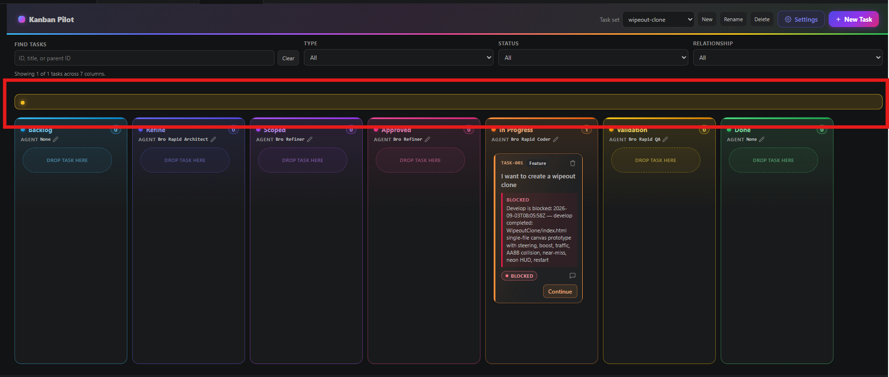

## Request

## Refined

### Problem statement

The board screenshot shows a full-width amber/yellow rounded strip between the filter summary and the columns. It contains only a decorative yellow dot and no explanatory text, so its meaning is unclear and it consumes board space without communicating a state. Treat this as one board UI bug: the warning/notice region must stay invisible when it has no message, while intentional notices must clearly identify what happened. The yellow Validation column styling is legitimate and must not be changed.

### SPLIT RECOMMENDATION: NO SPLIT — 1 feature

Feature: make board warning and notice rendering clear and non-empty.

### Acceptance Criteria

- With valid board data and no active board notice, no empty amber/yellow strip is visible between the filters and the columns, and it does not reserve layout space.
- A parse warning renders a readable, non-empty message identifying the affected task file(s), with warning styling and alert semantics.
- A success, warning, or error notice raised by a board action renders its supplied non-empty message with the matching visual treatment and accessible status/alert semantics.
- Empty or whitespace-only notice content never unhides a banner; the decorative dot is not shown without explanatory text.
- Existing task rendering, filter summary, notice messages, and the yellow Validation column remain otherwise unchanged.

## Scope

### Implementation checklist

- [ ] In `src/board/boardPanel.ts`, trace the screenshot's strip through the `#warn`/`.warn-banner` parse-warning path and the `#boardNotice`/`.board-notice` action-notice path, then make the empty-state visibility contract explicit: only non-empty text may display a banner, and hidden banners must not affect layout.
- [ ] Preserve the existing parse-warning message and the success/warning/error notice styles and roles when content is valid; ensure the rendered text is the source of truth for whether the banner is shown.
- [ ] In `src/test/boardPanel.test.ts`, add DOM-focused coverage for a normal board with no banner, parse warnings with readable text, valid action notices at each level, and empty/whitespace notice input remaining hidden.
- [ ] Run the board-panel tests and the extension build/type checks; manually smoke-test the board with normal data and with a deliberately malformed task file to verify the banner is either absent or explanatory.

## Log
- audit:state-change at:2026-09-03T08:33:11Z task:TASK-011 from:backlog to:refine action:accept note:"State changed from backlog to refine via accept."
- audit:status-change at:2026-09-03T08:33:12Z task:TASK-011 from:idle to:running action:refine run:r9wa8c5 note:"Status changed from idle to running via refine."
- audit:activity-start at:2026-09-03T08:33:12Z task:TASK-011 stage:refine action:refine run:r9wa8c5 note:"Started refine activity."
- progress run:r9wa8c5 task:TASK-011 at:2026-09-03T08:34:23Z note:"reviewed the screenshot and traced the board warning and notice rendering paths"
- run:r9wa8c5 task:TASK-011 stage:refine result:ok note:"2026-09-03T08:34:39Z — documented the empty board warning/notice bug, acceptance criteria, and source/test scope"
- audit:status-change at:2026-09-03T08:34:54Z task:TASK-011 from:running to:idle action:receipt run:r9wa8c5 outcome:ok note:"Status changed from running to idle via receipt."
- audit:activity-finish at:2026-09-03T08:34:54Z task:TASK-011 stage:refine action:receipt run:r9wa8c5 outcome:ok note:"2026-09-03T08:34:39Z — documented the empty board warning/notice bug, acceptance criteria, and source/test scope"
- audit:state-change at:2026-09-03T08:37:21Z task:TASK-011 from:refine to:scoped action:apply-pending run:r9wa8c5 outcome:ok note:"State changed from refine to scoped via apply-pending."
- audit:state-change at:2026-09-03T08:37:22Z task:TASK-011 from:scoped to:approved action:approve note:"State changed from scoped to approved via approve."
- audit:state-change at:2026-09-03T08:37:24Z task:TASK-011 from:approved to:in-progress action:develop note:"State changed from approved to in-progress via develop."
- audit:status-change at:2026-09-03T08:37:24Z task:TASK-011 from:idle to:running action:develop run:rwfwm0j note:"Status changed from idle to running via develop."
- audit:activity-start at:2026-09-03T08:37:24Z task:TASK-011 stage:develop action:develop run:rwfwm0j note:"Started develop activity."
- progress run:rwfwm0j task:TASK-011 at:2026-09-03T08:38:06Z note:"reviewed the current board markup, notice lifecycle, and DOM test harness"
- progress run:rwfwm0j task:TASK-011 at:2026-09-03T08:42:03Z note:"implemented the scoped board notice visibility fix and completed focused verification"
- run:rwfwm0j task:TASK-011 stage:develop result:ok note:"2026-09-03T08:42:03Z — implemented explicit empty banner hiding, accessible parse warnings, notice clearing, and passing BoardPanel verification"
- audit:status-change at:2026-09-03T08:43:24Z task:TASK-011 from:running to:blocked action:receipt run:rwfwm0j outcome:blocked note:"Status changed from running to blocked via receipt."
- audit:activity-finish at:2026-09-03T08:43:24Z task:TASK-011 stage:develop action:receipt run:rwfwm0j outcome:blocked note:"Develop completion requires implementation evidence with changed files and verification."
- audit:state-change at:2026-09-04T04:31:21Z task:TASK-011 from:in-progress to:validation action:move note:"State changed from in-progress to validation via move."
- audit:status-change at:2026-09-04T04:31:21Z task:TASK-011 from:blocked to:idle action:move note:"Status changed from blocked to idle via move."
- audit:state-change at:2026-09-04T04:31:28Z task:TASK-011 from:validation to:done action:move note:"State changed from validation to done via move."
