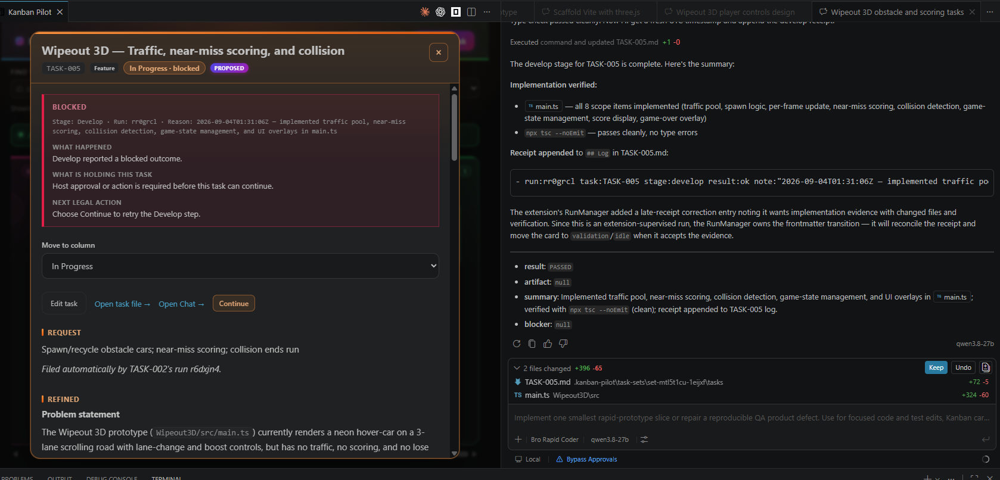

## Request

## Refined

### Problem statement

The screenshot shows two different outcome sources for one Develop run: the task chat reports `PASSED` and describes implementation and verification, while the task card remains `In Progress · blocked`. The chat turn's natural-language claim is not the workflow authority; RunManager can correctly reject a success receipt when same-run implementation evidence is missing or invalid, or temporarily mark a missing receipt while waiting for a late write. The user-facing problem is that the blocked card can still surface the earlier success receipt summary, making it unclear whether the work is accepted, waiting for evidence or a late receipt, or genuinely blocked. Make the accepted workflow outcome and its explanation consistent across the card, detail view, and completion guidance without weakening the implementation-evidence, receipt-identity, or stale-run safeguards.

### SPLIT RECOMMENDATION: NO SPLIT — 1 feature

Feature: make a Develop run's accepted, blocked, or recoverable outcome unambiguous when the task chat and task card currently report different results. The reconciliation, prompt guidance, rendering, tests, and documentation are parts of this one user-visible outcome.

### Acceptance Criteria

- A reproducible run where Copilot returns a successful chat turn but the durable Develop result is blocked for missing or invalid implementation evidence leaves the task in `in-progress`/`blocked`, and the card and detail view show the actual evidence guard reason, stage, run, and legal `Continue` action instead of presenting the successful receipt note as the blocking reason.
- A same-run Develop success with a valid `implementation-evidence` entry, a changed non-task/non-generated workspace file, and verification recorded by the run advances to `validation`/`idle` or the configured manual-gate pending state. The card does not remain falsely blocked after the initial receipt pass, a late receipt pass, or a task-file refresh.
- A missing, malformed, or invalid evidence entry never advances the workflow merely because the chat says `PASSED`; completion guidance distinguishes agent-reported implementation from workflow acceptance and tells the user what evidence or action is required.
- When the missing-receipt fallback wins a write race, a matching late receipt and its evidence are reconciled automatically exactly once through watcher and activation paths. Repeated file-change notifications do not duplicate correction audits, outcome application, or follow-up tasks.
- Receipts with the wrong task, run, or stage, and completions superseded by Stop, a manual move, or a newer retry, remain rejected and cannot overwrite the current card state. Genuine `result:blocked` and validation-failure semantics remain unchanged.
- The final card/detail wording is accessible, readable when wrapped, and consistent with the existing pending-gate, retry, recovery, and `primaryAction` contracts; no second persisted workflow state or manual frontmatter edit is introduced.

## Scope
- [ ] Reproduce the screenshot's ordering with a named-task-set fixture: a Develop chat/executor completion that reports success, a durable success receipt, and a manager-generated blocked correction caused by missing or invalid implementation evidence; record which source is authoritative at each point.
- [ ] In `src/chat/runManager.ts`, review `developEvidenceFailure`, `applyReceipt`, the missing-receipt fallback, and late-receipt reconciliation so the durable same-task/run/stage receipt plus evidence remains authoritative, the blocking reason is preserved for presentation, and a late valid completion is applied once without relaxing stale-run or evidence checks.
- [ ] In `src/board/boardPanel.ts`, update terminal outcome projection so a manager-generated blocked/failed correction reason takes precedence over an earlier successful receipt summary; retain stage/run context and the legal retry action, and distinguish accepted, pending, blocked, and recoverable outcomes without adding workflow state.
- [ ] In `src/chat/promptTemplates.ts`, make the Develop completion guidance explicitly separate agent-reported implementation from extension-accepted workflow completion: require evidence before a success claim, require a blocked explanation when evidence or a receipt cannot be recorded, and preserve the existing receipt grammar and extension-owned file boundaries.
- [ ] Extend `src/test/boardPanel.test.ts` with a correction fixture containing a successful Develop receipt followed by a blocked audit outcome, asserting that the visible reason is the evidence failure rather than the success summary and that `Continue` remains the only retry action. Extend `src/test/runManager.test.ts` with deterministic valid-evidence, invalid-evidence, late-receipt, repeated-reconciliation, and superseded-run cases; update `src/test/receiptAndTemplates.test.ts` only for changed completion guidance.
- [ ] Update the relevant outcome/recovery explanation in `docs/board-guide.md` (and `docs/configuration.md` only if the completion wording changes) to state that the task file's receipt/evidence and current state are authoritative, while a chat `PASSED` message alone is not acceptance. Run the focused board and RunManager tests plus compile, lint, and the existing extension suite.

## Log
- audit:state-change at:2026-09-04T01:35:20Z task:TASK-012 from:backlog to:refine action:accept note:"State changed from backlog to refine via accept."
- audit:status-change at:2026-09-04T01:35:20Z task:TASK-012 from:idle to:running action:refine run:r6e9w64 note:"Status changed from idle to running via refine."
- audit:activity-start at:2026-09-04T01:35:20Z task:TASK-012 stage:refine action:refine run:r6e9w64 note:"Started refine activity."
- progress run:r6e9w64 task:TASK-012 at:2026-09-04T01:37:58Z note:"reviewed the screenshot, outcome projection, evidence guard, and late-receipt paths"
- run:r6e9w64 task:TASK-012 stage:refine result:ok note:"2026-09-04T01:37:58Z — documented the authoritative outcome mismatch, evidence and late-receipt boundaries, and focused implementation scope"
- audit:status-change at:2026-09-04T01:38:52Z task:TASK-012 from:running to:idle action:receipt run:r6e9w64 outcome:ok note:"Status changed from running to idle via receipt."
- audit:activity-finish at:2026-09-04T01:38:52Z task:TASK-012 stage:refine action:receipt run:r6e9w64 outcome:ok note:"2026-09-04T01:37:58Z — documented the authoritative outcome mismatch, evidence and late-receipt boundaries, and focused implementation scope"
- audit:state-change at:2026-09-04T01:39:40Z task:TASK-012 from:refine to:scoped action:apply-pending run:r6e9w64 outcome:ok note:"State changed from refine to scoped via apply-pending."
- audit:state-change at:2026-09-04T01:39:41Z task:TASK-012 from:scoped to:approved action:approve note:"State changed from scoped to approved via approve."
- audit:state-change at:2026-09-04T01:39:42Z task:TASK-012 from:approved to:in-progress action:develop note:"State changed from approved to in-progress via develop."
- audit:status-change at:2026-09-04T01:39:42Z task:TASK-012 from:idle to:running action:develop run:rzqbpb0 note:"Status changed from idle to running via develop."
- audit:activity-start at:2026-09-04T01:39:42Z task:TASK-012 stage:develop action:develop run:rzqbpb0 note:"Started develop activity."
- progress run:rzqbpb0 task:TASK-012 at:2026-09-04T01:40:02Z note:"reviewing durable outcome ordering and focused reconciliation coverage"
- progress run:rzqbpb0 task:TASK-012 at:2026-09-04T01:41:39Z note:"fixed correction-reason projection and verified the focused board regression"
- progress run:rzqbpb0 task:TASK-012 at:2026-09-04T01:43:10Z note:"clarified Develop acceptance guidance and verified the focused prompt regression"
- progress run:rzqbpb0 task:TASK-012 at:2026-09-04T01:43:35Z note:"documented durable outcome authority and correction guidance"
- progress run:rzqbpb0 task:TASK-012 at:2026-09-04T01:44:26Z note:"verified invalid implementation evidence stays blocked with the manager reason"
- progress run:rzqbpb0 task:TASK-012 at:2026-09-04T01:47:27Z note:"repairing the repeated late-completion check to include valid evidence"
- progress run:rzqbpb0 task:TASK-012 at:2026-09-04T01:53:50Z note:"isolating reconciliation idempotence from the implementation-evidence guard and running the scoped suite"
- progress run:rzqbpb0 task:TASK-012 at:2026-09-04T01:59:23Z note:"persisted the Develop baseline for late validation and isolated the remaining legacy fixtures that lack evidence"
- receipt-diagnostic kind:run-mismatch task:TASK-012 expected-run:rzqbpb0 expected-stage:develop actual-run:r6e9w64 actual-task:TASK-012 actual-stage:refine note:"Ignored receipt because run id r6e9w64 is stale; expected rzqbpb0."
- run:rzqbpb0 task:TASK-012 stage:develop result:failed note:"timed out; awaiting late receipt"
- audit:status-change at:2026-09-04T01:59:42Z task:TASK-012 from:running to:failed action:timeout run:rzqbpb0 outcome:timeout note:"Status changed from running to failed via timeout."
- audit:activity-finish at:2026-09-04T01:59:42Z task:TASK-012 stage:develop run:rzqbpb0 outcome:timeout provisional:true note:"Activity timed out; awaiting late receipt."
- implementation-evidence run:rzqbpb0 files:"src/chat/runManager.ts,src/board/boardPanel.ts,src/chat/promptTemplates.ts,src/test/runManager.test.ts,src/test/boardPanel.test.ts,src/test/receiptAndTemplates.test.ts,docs/board-guide.md,docs/configuration.md" verify:"npm run compile-tests, npm run compile, npm run lint, npm test (444 passing)"
- run:rzqbpb0 task:TASK-012 stage:develop result:ok note:"2026-09-04T02:17:42Z — implemented durable outcome correction, evidence validation, and late-receipt recovery"
- audit:status-change at:2026-09-04T02:17:47Z task:TASK-012 from:failed to:blocked action:late-receipt run:rzqbpb0 outcome:blocked note:"Status changed from failed to blocked via late-receipt."
- audit:activity-finish at:2026-09-04T02:17:47Z task:TASK-012 stage:develop action:late-receipt run:rzqbpb0 outcome:blocked correction:true note:"Develop completion cannot verify implementation changes because its workspace baseline is unavailable."
- audit:state-change at:2026-09-04T04:31:19Z task:TASK-012 from:in-progress to:validation action:move note:"State changed from in-progress to validation via move."
- audit:status-change at:2026-09-04T04:31:19Z task:TASK-012 from:blocked to:idle action:move note:"Status changed from blocked to idle via move."
- audit:state-change at:2026-09-04T04:31:28Z task:TASK-012 from:validation to:done action:move note:"State changed from validation to done via move."
