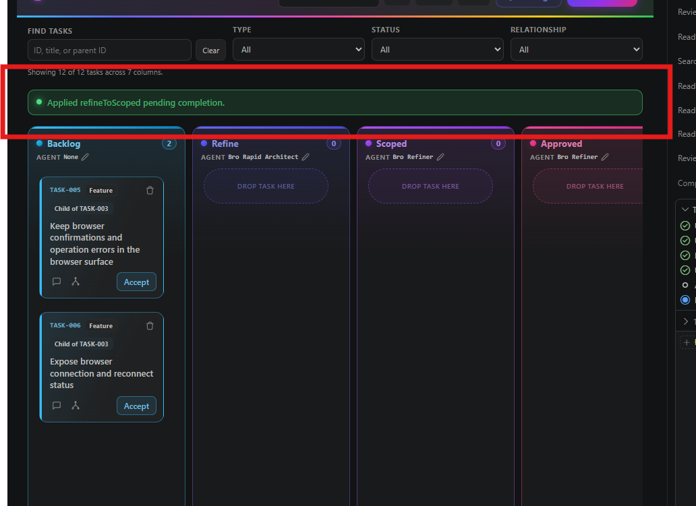

## Request

## Refined

### Problem statement

Based on the attached screenshot, “this part” is the green success banner at the top of the Kanban Pilot board that says `Applied refineToScoped pending completion.` The banner is transient feedback after a pending completion is applied, but it adds visual noise and is the highlighted UI element to remove. The pending-completion action and its task-state transition must continue to work, and warning or error notices for unsuccessful operations remain in scope only as existing behavior to preserve.

### SPLIT RECOMMENDATION

NO SPLIT — 1 feature: remove the highlighted successful pending-completion board notice.

### Acceptance Criteria

- After a pending completion is applied successfully, the board does not display a green success banner or an `Applied … pending completion.` message.
- Applying a pending completion still performs the existing operation and refreshes the task/card state and column normally.
- Warning and error notices for unsuccessful pending-completion or recovery operations continue to render as before.
- The behavior is covered by a regression test for the successful apply path without changing the immutable task request or attachment.

## Scope

- Update `src/board/boardPanel.ts` in the `pending/apply` handling so the successful result still applies the outcome and calls the normal board refresh, but no longer publishes the success `board/notice`; preserve the existing warning and error branches and shared notice renderer.
- Update `src/test/boardPanel.test.ts` with a regression assertion that a successful pending apply emits no success board notice, while retaining coverage for the existing stale/unsuccessful warning notice behavior.
- Run the focused board-panel tests and the normal TypeScript/test build to verify the UI change without editing generated artifacts, task frontmatter, the original request, or attachments.

## Log
- audit:state-change at:2026-09-04T02:19:37Z task:TASK-013 from:backlog to:refine action:accept note:"State changed from backlog to refine via accept."
- audit:status-change at:2026-09-04T02:19:38Z task:TASK-013 from:idle to:running action:refine run:r499b0d note:"Status changed from idle to running via refine."
- audit:activity-start at:2026-09-04T02:19:38Z task:TASK-013 stage:refine action:refine run:r499b0d note:"Started refine activity."
- progress run:r499b0d task:TASK-013 at:2026-09-04T02:20:52Z note:"scoped the highlighted success notice removal"
- run:r499b0d task:TASK-013 stage:refine result:ok note:"2026-09-04T02:20:52Z — refine completed: documented the highlighted success-notice removal and implementation scope"
- audit:status-change at:2026-09-04T02:21:25Z task:TASK-013 from:running to:idle action:receipt run:r499b0d outcome:ok note:"Status changed from running to idle via receipt."
- audit:activity-finish at:2026-09-04T02:21:25Z task:TASK-013 stage:refine action:receipt run:r499b0d outcome:ok note:"2026-09-04T02:20:52Z — refine completed: documented the highlighted success-notice removal and implementation scope"
- audit:state-change at:2026-09-04T02:21:44Z task:TASK-013 from:refine to:scoped action:apply-pending run:r499b0d outcome:ok note:"State changed from refine to scoped via apply-pending."
- audit:state-change at:2026-09-04T02:21:45Z task:TASK-013 from:scoped to:approved action:approve note:"State changed from scoped to approved via approve."
- audit:state-change at:2026-09-04T02:21:46Z task:TASK-013 from:approved to:in-progress action:develop note:"State changed from approved to in-progress via develop."
- audit:status-change at:2026-09-04T02:21:46Z task:TASK-013 from:idle to:running action:develop run:rwbywkc note:"Status changed from idle to running via develop."
- audit:activity-start at:2026-09-04T02:21:46Z task:TASK-013 stage:develop action:develop run:rwbywkc note:"Started develop activity."
- progress run:rwbywkc task:TASK-013 at:2026-09-04T02:22:58Z note:"adding regression coverage before the implementation change"
- progress run:rwbywkc task:TASK-013 at:2026-09-04T02:23:40Z note:"implementation is complete and focused validation is starting"
- progress run:rwbywkc task:TASK-013 at:2026-09-04T02:27:05Z note:"focused and full validation completed successfully"
- run:rwbywkc task:TASK-013 stage:develop result:ok note:"2026-09-04T02:27:40Z — implemented successful pending-notice suppression and verified state refresh with focused and full tests"
- audit:status-change at:2026-09-04T02:27:56Z task:TASK-013 from:running to:blocked action:receipt run:rwbywkc outcome:blocked note:"Status changed from running to blocked via receipt."
- audit:activity-finish at:2026-09-04T02:27:56Z task:TASK-013 stage:develop action:receipt run:rwbywkc outcome:blocked note:"Develop completion requires implementation evidence with changed files and verification."
- audit:state-change at:2026-09-04T04:31:16Z task:TASK-013 from:in-progress to:validation action:move note:"State changed from in-progress to validation via move."
- audit:status-change at:2026-09-04T04:31:16Z task:TASK-013 from:blocked to:idle action:move note:"Status changed from blocked to idle via move."
- audit:state-change at:2026-09-04T04:31:27Z task:TASK-013 from:validation to:done action:move note:"State changed from validation to done via move."
