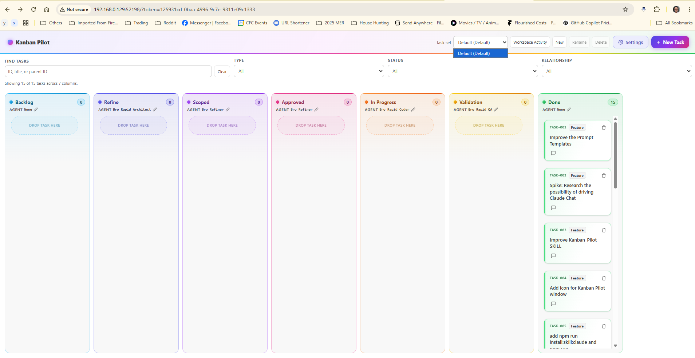

## Request

## Refined

### Problem statement

The browser-hosted board currently receives an `EndpointTaskSetHost` that exposes only the endpoint-bound task set. Consequently, the Task set picker shows only `Default` even when the workspace registry contains named task sets, so a browser user cannot discover or switch to those sets from the board.

### SPLIT RECOMMENDATION

NO SPLIT — 1 feature: allow a browser board to list and select the workspace's registered task sets.

### Acceptance Criteria

- A browser board opened from a workspace endpoint lists `Default` and every valid named task set from the workspace registry in its Task set picker.
- The picker identifies the task set currently displayed by that browser session.
- Selecting another listed task set refreshes that browser session to the selected set's tasks, attachments, workspace activity, and valid task actions without changing the active editor board or another browser session.
- Invalid or unavailable set selections leave the current browser session unchanged and present the existing error feedback.
- Existing per-task-set endpoint isolation and token protection remain intact.
- Automated coverage verifies the initial list, a successful browser-side switch, session isolation, and rejected selection behavior.

## Scope

- Update [src/extension.ts](src/extension.ts) so the browser endpoint host can obtain the workspace `TaskSetRegistry` and create or select an isolated task-set context for an individual browser board session, rather than returning only its endpoint-bound set from `EndpointTaskSetHost.listTaskSets()`.
- Update [src/http/realtimeBoardServer.ts](src/http/realtimeBoardServer.ts) and the browser-session construction flow to bind each session's `BoardPanel` and resource roots to its selected set; retain the endpoint's configured default set for newly opened sessions and do not mutate the editor's active set.
- Update the endpoint host/controller contract in [src/board/boardPanel.ts](src/board/boardPanel.ts) only as needed to support browser-session task-set selection and ensure the `taskSet/select` message triggers a fresh board, detail, settings, and workspace-activity projection.
- Preserve attachment path containment and bearer-token checks while changing a session's task-store directory.
- Add focused coverage in [src/test/realtimeBoardServer.integration.test.ts](src/test/realtimeBoardServer.integration.test.ts) for registered-set projection, session-local switching, isolation between browser sessions, and invalid-selection rejection; adjust endpoint-host coverage in [src/test/extension.test.ts](src/test/extension.test.ts) if its contract changes.
- Update [docs/http-endpoint.md](docs/http-endpoint.md) to state that task-set selection is browser-session-local while endpoint credentials and task-set data remain isolated.

## Log
- audit:state-change at:2026-09-05T06:00:16Z task:TASK-018 from:backlog to:refine action:accept note:"State changed from backlog to refine via accept."
- audit:status-change at:2026-09-05T06:00:20Z task:TASK-018 from:idle to:running action:refine run:rogue4i note:"Status changed from idle to running via refine."
- audit:activity-start at:2026-09-05T06:00:20Z task:TASK-018 stage:refine action:refine run:rogue4i note:"Started refine activity."
- run:rogue4i task:TASK-018 stage:refine result:blocked note:"interrupted by window reload; no receipt found; awaiting late receipt"
- audit:status-change at:2026-09-05T06:01:22Z task:TASK-018 from:running to:blocked action:missing-receipt run:rogue4i outcome:missing-receipt note:"Status changed from running to blocked via missing-receipt."
- audit:activity-finish at:2026-09-05T06:01:22Z task:TASK-018 stage:refine run:rogue4i outcome:missing-receipt provisional:true note:"interrupted by window reload; no receipt found; awaiting late receipt"
- run:rogue4i task:TASK-018 stage:refine result:ok note:"Scoped browser-local task-set discovery and selection with endpoint isolation coverage."
- audit:status-change at:2026-09-05T10:58:43Z task:TASK-018 from:blocked to:idle action:late-receipt run:rogue4i outcome:ok note:"Status changed from blocked to idle via late-receipt."
- audit:activity-finish at:2026-09-05T10:58:43Z task:TASK-018 stage:refine action:late-receipt run:rogue4i outcome:ok correction:true note:"Scoped browser-local task-set discovery and selection with endpoint isolation coverage."
- audit:state-change at:2026-09-05T10:59:41Z task:TASK-018 from:refine to:scoped action:apply-pending run:rogue4i outcome:ok note:"State changed from refine to scoped via apply-pending."
- audit:state-change at:2026-09-05T10:59:42Z task:TASK-018 from:scoped to:approved action:approve note:"State changed from scoped to approved via approve."
- audit:state-change at:2026-09-05T10:59:43Z task:TASK-018 from:approved to:in-progress action:develop note:"State changed from approved to in-progress via develop."
- audit:status-change at:2026-09-05T10:59:43Z task:TASK-018 from:idle to:running action:develop run:rknpqxp note:"Status changed from idle to running via develop."
- audit:activity-start at:2026-09-05T10:59:43Z task:TASK-018 stage:develop action:develop run:rknpqxp note:"Started develop activity."
- progress run:rknpqxp task:TASK-018 at:2026-09-05T10:59:58Z note:"Inspecting browser session and task-set host boundaries."
- run:rknpqxp task:TASK-018 stage:develop result:blocked note:"2026-09-05T11:02:03Z — develop blocked: deleted src/http/endpointSharePanel.ts prevents TypeScript compilation and automated test execution."
- audit:status-change at:2026-09-05T11:02:11Z task:TASK-018 from:running to:blocked action:receipt run:rknpqxp outcome:blocked note:"Status changed from running to blocked via receipt."
- audit:activity-finish at:2026-09-05T11:02:11Z task:TASK-018 stage:develop action:receipt run:rknpqxp outcome:blocked note:"2026-09-05T11:02:03Z — develop blocked: deleted src/http/endpointSharePanel.ts prevents TypeScript compilation and automated test execution."
- audit:state-change at:2026-09-06T03:16:55Z task:TASK-018 from:in-progress to:validation action:move note:"State changed from in-progress to validation via move."
- audit:status-change at:2026-09-06T03:16:55Z task:TASK-018 from:blocked to:idle action:move note:"Status changed from blocked to idle via move."
- audit:state-change at:2026-09-06T03:16:58Z task:TASK-018 from:validation to:done action:move note:"State changed from validation to done via move."
