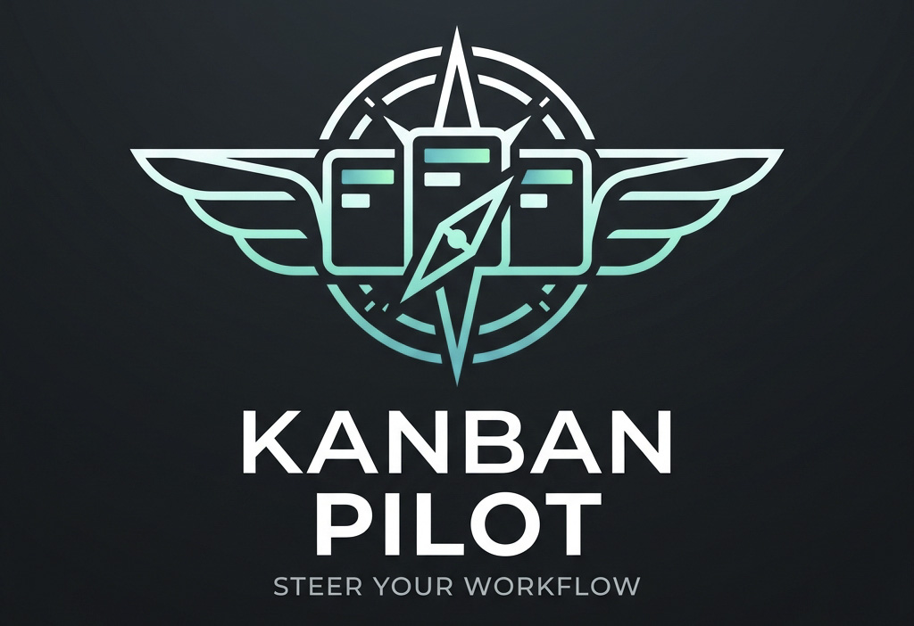
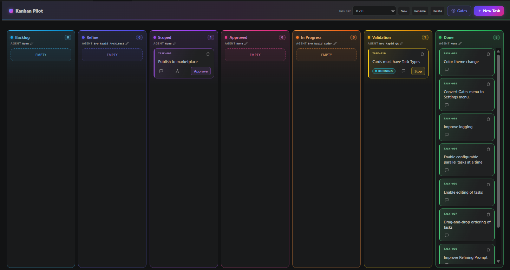
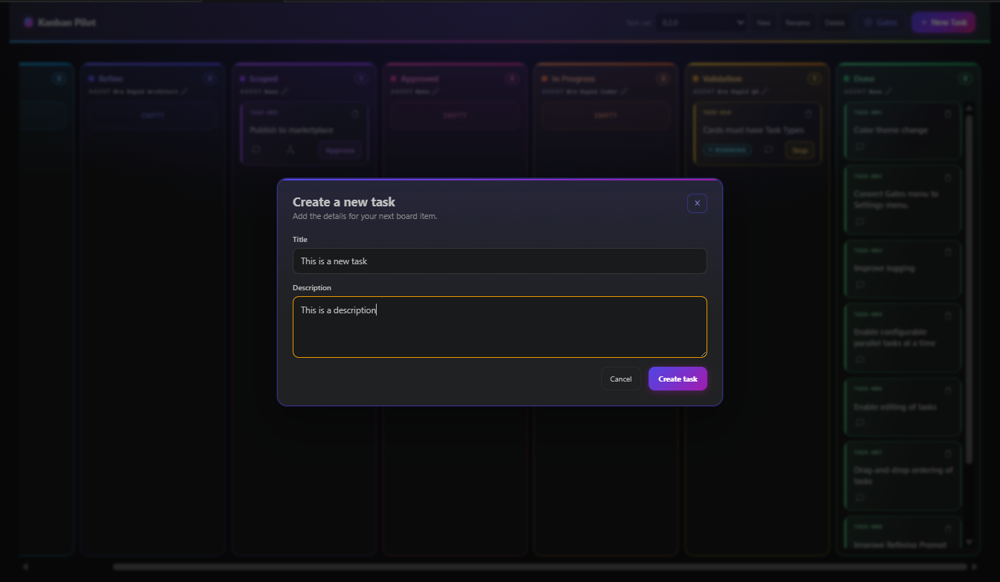
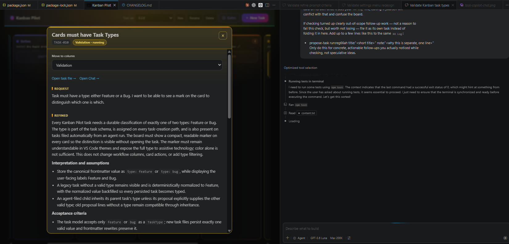

# Kanban Pilot

**A Kanban board for VS Code with an optional real-time HTTP endpoint.**

You work the board — create a card, accept it, refine it, approve it, ship it. The VS Code
extension drives GitHub Copilot Chat in the workspace. Its optional HTTP endpoint exposes that
same board state and those same validated actions in real time.

Every task is a plain Markdown file in your repo. The endpoint reads that existing task store and
routes mutations through the existing run manager; it does not mirror or scrape a VS Code Copilot
transcript.

## Why you might want it

- **Nothing gets built before you've read the plan.** There's a deliberate review stop between
  "here's the plan" and "go write the code."
- **One conversation per task.** No context bleeding between unrelated pieces of work.
- **You stay in control.** Every step waits for a click by default. Turn on auto-advance only
  where you want it.
- **Your tasks are durable.** Task Markdown remains in `.kanban-pilot/`; the endpoint does not add
   another state store.

## VS Code extension

- VS Code 1.125.0 or later
- GitHub Copilot Chat, installed and signed in

## Real-time HTTP endpoint

Kanban Pilot can expose the **existing extension host** through an authenticated HTTP endpoint.
It does not create another board, task store, state machine, or run manager: task Markdown and
the current `TaskStore` remain authoritative, while mutations use the existing `RunManager`.

Opening the endpoint in a browser serves **the extension's own board webview** — the same
document, markup, styling, and message protocol `BoardPanel` renders in the editor — rather than a
second, reduced board. A browser client therefore gets drag-and-drop reordering, the task detail
and edit panes, attachments, Mermaid rendering, Settings, gates, agent assignment, and task sets,
and any change to the board reaches both clients at once. Each connected browser holds its own
board session, so one person's card selection does not move anybody else's.

The endpoint is opt-in. Open **Kanban Pilot Settings** from the board, select **HTTP endpoint**,
and enable it. Settings take effect immediately; no VS Code restart is required.

| Setting | Required | Meaning |
| --- | --- | --- |
| `kanbanPilot.http.token` | Yes | Bearer token required by every endpoint. Use a high-entropy secret. |
| `kanbanPilot.http.port` | Yes | TCP port from 1 through 65535. |
| `kanbanPilot.http.host` | No | Bind address; defaults to `0.0.0.0`. A wildcard bind (`0.0.0.0` or `::`) makes the share URL/QR use the machine's LAN IPv4 when available. Use only on trusted networks or behind a TLS reverse proxy. |
| `kanbanPilot.http.publicUrl` | No | Public `http` or `https` URL shown by the status-bar QR code; set this when a reverse proxy fronts the endpoint. |

| Endpoint | Method | Purpose |
| --- | --- | --- |
| `/` | `GET` | The board webview itself. Each load starts a board session. |
| `/session/events` | `GET` | That session's board message stream. |
| `/session/messages` | `POST` | One board message from that session. |
| `/resource/:root/*` | `GET` | Bundled assets and task attachments the board references. |
| `/health` | `GET` | Endpoint liveness, current revision, and live session count. |
| `/api/board` | `GET` | Current authoritative board snapshot and active task set. |
| `/api/events` | `GET` | Server-sent events. Sends a full snapshot immediately and on every task, attachment, configuration, task-set, or run update. |
| `/api/tasks/:taskId/actions` | `POST` | Runs an existing validated card action. Body: `{ "action": "develop" }`. |
| `/api/tasks/:taskId/pending` | `POST` | Applies the existing pending completion gate. |

The share URL authenticates with its `token` query parameter. API clients can instead send
`Authorization: Bearer <kanbanPilot.http.token>` on every request, including the event stream.
Consumers must treat `revision` as monotonic, only apply newer snapshots, and reconnect to obtain
the immediate full snapshot.

This is a real-time transport for the existing board and actions, not a replacement UI. The
current `BoardPanel` remains canonical — it is what a browser runs. Existing Copilot Chat sessions
remain VS Code editor sessions; task actions over HTTP still use the existing `RunManager`, but
the private Copilot transcript is not scraped or mirrored over HTTP.

Two board actions act on the editor rather than the board — **Open task file** and **Open Chat** —
so they are hidden on browser clients instead of silently operating on the host's screen.
Dialogs that were VS Code modals (new/rename/delete task set, delete task, recover a stale
completion) are now rendered by the board itself, so they appear for whoever clicked them.

When the endpoint starts, click **Kanban Pilot: Share** in VS Code's status bar to display a
scannable QR code and a copyable live board URL. Both include the bearer token as a `token` query
parameter, so treat them as secrets and do not expose them in logs, screenshots, or insecure
channels. A non-loopback bind also triggers a warning because direct HTTP provides no TLS and the
token travels in the URL; use a trusted LAN or set `kanbanPilot.http.publicUrl` for a TLS reverse
proxy. If a wildcard bind has no usable LAN IPv4, the generated URL falls back to `localhost`.

## Get started

1. **Open the board.** Click the Kanban Pilot icon in the activity bar, or run
   **Kanban Pilot: Open Board** from the Command Palette. The board follows your first
   workspace folder.
2. **Create a task.** Click **New Task**, give it a title, an optional description, and pick
   whether it's a **Feature** or a **Bug**.
3. **Accept it.** Select the card and click **Accept** to move it out of Backlog.
4. **Refine it.** Click **Refine**. Copilot Chat writes the problem statement, acceptance
   criteria, and a scope checklist onto the card. It won't touch code at this stage.
5. **Read the scope, then approve.** Open the card and read the **Scope** section. Happy? Click
   **Approve**. Too big? Click **Split** instead and it becomes several smaller tasks.
6. **Develop.** Click **Develop** and Copilot Chat implements the approved checklist. If a run
   needs to pick up where it left off, the card offers **Continue**.
7. **Validate.** When the card reaches Validation, click **Validate**. The QA stage checks the
   real implementation against the acceptance criteria, and passing work lands in **Done**.

At any point, **Open Chat** on a card opens that task's own Copilot Chat session beside the board.

## The workflow

| Column | What you do here |
| --- | --- |
| **Backlog** | New tasks land here. Click **Accept** when you're ready to work on one. |
| **Refine** | Click **Refine** to have the problem, criteria, and scope written up — or **Split** if it's too big for one ticket. |
| **Scoped** | Read what came back. This is your review stop. |
| **Approved** | You've signed off on the plan. Click **Develop** to start building. |
| **In Progress** | Copilot Chat is implementing the checklist. |
| **Validation** | Click **Validate** to check the work against the acceptance criteria. |
| **Done** | Validation passed. |

Each column can show an agent label — **Bro Refiner**, **Bro Coder**, and **Bro QA** by default —
so it's clear who's on the hook at each stage. You can rename these in Settings.

## A look at the board



The board shows your columns, the agent handling each one, the gate controls, and the next action
for the selected card. The header holds the task-set picker and the **Settings** button.



**New Task** creates a Markdown-backed card — title, optional description, Feature or Bug.



Select a card to read its Request, Refined, and Scope sections. **Open Chat** is the explicit
handoff to that task's private Copilot Chat session.

Task Details renders the Request, Refined, and Scope sections as safe CommonMark/GFM, including
headings, lists, checklists, tables, code, links, and task-local images. Fenced blocks tagged
`mermaid` render as charts. If a chart cannot be rendered, its source remains visible in a
readable fallback and the rest of the modal stays usable. Unsafe links and unavailable or remote
images are not loaded. Rendering is read-only; choose **Edit task** to edit the authored Markdown.

## Gates: who decides when a card moves

Every normal pipeline transition has its own **gate**, and all nine gates start out **manual** —
the card waits for you. Flip any gate to **Auto** in Settings when you'd rather not be asked.

**Starting gates** decide when a stage kicks off:

- `gates.backlogToRefine` — accept a Backlog task and launch Refine automatically.
- `gates.scopedToApproved` — approve a Scoped task into the Approved ready queue.
- `gates.approvedToInProgress` — start the next eligible Approved task when capacity is available.
- `gates.validationAutoStart` — launch Validate when a task reaches Validation.

**Finishing gates** decide when a completed run is allowed to move the card:

- `gates.refineToScoped` — commit a successful Refine receipt into Scoped.
- `gates.developToValidation` — commit a successful Develop receipt into Validation.
- `gates.validateToDone` — commit a passing Validate receipt into Done.
- `gates.validateFailedToInProgress` — send a failed validation verdict back to In Progress.
- `gates.splitToDone` — retire a Split parent after its children are persisted.

When a finishing gate is manual, the run still completes and its result is written to the card's
log — the card just holds the outcome for review instead of moving and shows **Review Required**.
Apply it from the card's detail dialog or the **Apply Pending Completion** command whenever you're
ready; the transition context remains available, applying it only moves the card, and it never
starts another agent run. Review-required outcomes survive reloads and window restarts. Auto stage
starts still respect the shared run-capacity limit. Blocked or failed work is never retried on its
own.

## Things you'll do along the way

### Keep separate piles of work with task sets

Use the **Task set** picker in the header to switch between the built-in **Default** set and any
named sets you create. Each set keeps its own tasks, its own card order, and its own chat
sessions, so an experiment doesn't get tangled up with your main work. A task's persisted chat
binding is reused by **Open Chat** and later stage runs after the board or window is reloaded; the
set-specific binding keeps chats from different sets isolated.

- **New** creates a set and switches to it.
- **Rename** works on named sets; **Delete** works on empty named sets.
- Default can't be renamed or deleted.
- You can't switch or create sets while a task is running — a run always stays with its set.

### Edit a card without leaving the board

Select a card and choose **Edit task**. You can change the title and the Markdown in the
**Request**, **Refined**, and **Scope** sections, checklists and code blocks included. **Save
changes** keeps it; **Cancel**, Escape, or clicking outside throws it away. If a save fails, the
message stays on screen so you can fix it without retyping everything.

Editing never changes the card's column, its run state, or its history — those only move through
workflow actions and run results. A task that's currently running can't be saved until it stops.

### Reorder cards

Drag a card up or down within its column to set an order that sticks across reloads and restarts.
Prefer the keyboard? Focus a card and use Arrow Up / Arrow Down; the board announces where it
landed. Reordering never starts a run. Dragging a card to a *different* column is still a normal
workflow move.

### Split something that's too big

If a task is clearly more than one ticket, click **Split**. Kanban Pilot files the smaller pieces
as new backlog tasks and leaves the original as a tracking card. Refine also leaves an advisory
note about whether a split looks worthwhile — a suggestion for you, not an automatic action.

### Run recovery and Split safety

Split is transactional: the parent is retired only after valid, same-run child proposals have
been persisted in the active task set. Missing or invalid proposals, or a child-write failure,
leave the parent retryable instead of silently marking it Done; repeated reconciliation does not
create duplicate children. Receipt reconciliation requires the exact task, run, and stage identity;
wrong-task, wrong-run, wrong-stage, or malformed receipt-like lines are ignored and leave an
actionable diagnostic in the task log. A timed-out run is marked failed and remains retryable when
no receipt arrives, but a matching late receipt from that run can still be reconciled once its
fallback history is verified. A receipt from a run that was stopped, manually moved, or replaced
by a newer retry cannot overwrite the newer task state.

If an earlier implementation finished but its receipt arrived after the extension had already
timed out that run and a later retry failed, use **Kanban Pilot: Recover Stale Completion** or
the recovery action in the task detail. Automatic reconciliation never treats old and new run
ids as interchangeable. The command lists only candidates with an exact successful receipt,
extension-owned start and timeout/missing-receipt history, and a retryable task with no active
run or pending outcome. It shows the old and latest run context and asks for modal confirmation
before applying the ordinary stage gate. Recovery is append-only and idempotent, records a
manual-recovery correction audit, processes eligible proposals once, and never starts another
agent run. The normal retry remains available when no validated candidate exists.

### Let agents file follow-up work

While developing or validating, an agent can propose follow-up tasks. Those show up as new backlog
cards in the **active task set**, inheriting the parent's Feature/Bug type unless the proposal says
otherwise. The proposal line belongs in the attached parent task file, so named sets never leak
children into the legacy Default folder.

The built-in prompts ask the agent to write proposals before the receipt, but the extension also
handles older prompt files and out-of-order filesystem writes. If a receipt lands first, a bounded
post-receipt recovery window plus the task-file watcher and next activation pass re-check the
settled Develop/Validate run and create any valid same-run proposals. Repeated passes are safe: the
parent outcome is not replayed and each proposal's provenance prevents duplicate children. Invalid,
foreign, Refine, over-cap, or setting-disabled proposals remain inert. This optional follow-up
path is separate from **Split**, where child proposals are mandatory and successful persistence is
required before the parent becomes a tracking card.

### Tune it in Settings

The **Settings** button in the header opens a keyboard-friendly, two-pane editor covering every
option, grouped into automation gates, agent names per column, task storage and startup, chat,
tools and model, run behavior, and board layout. Values are saved at workspace scope and can be
reset to the effective default; invalid values are rejected rather than half-saved. Agent
assignments are the one batched category: one **Save** commits all seven column selections, while
each column keeps its own **Reset** control before the shared save.

Agent assignments use keyboard-accessible dropdowns populated when Settings opens or refreshes.
Choices come from workspace `.github/agents` and `.claude/agents` folders, configured agent-file
locations, `chat.agentDirectories`, and user-level `~/.copilot/agents` and `.claude/agents`
folders. **Additional agent directories** is an ordered newline-separated list in Settings; entries
may be absolute, `~/`-relative, or workspace-relative. Empty, duplicate, missing, or unreadable
entries are ignored. Workspace choices win when names collide, followed by configured and then user-level choices. Existing or legacy
labels remain selectable as a compatibility fallback even when their profile is no longer
discoverable. The pencil on a column header jumps straight to that column's field. Refine's name
is also used for **Split**, and names on the resting columns are just labels — they never start a
chat run.

Gate changes take effect immediately. Chat, tools, model, and run settings apply to the *next*
run, so changing them never disturbs something already running. Changing the tasks folder or the
open-on-startup option shows a reload notice, because those are read when the extension starts.

## How many tasks run at once

By default, **one run at a time**. That's the safest setting: parallel agents editing the same
working tree can step on each other.

Raise `kanbanPilot.run.maxParallelTasks` if you want more, but treat that as opting into concurrent
edits in the same workspace — set up git worktrees or another isolation strategy yourself if
parallel runs will be writing code. When capacity is full, extra work simply waits in **Approved**.
Raising the limit lets waiting work start; lowering it never interrupts runs already going. A
finished run holding a pending outcome doesn't occupy a slot. `RunManager` owns this complete-run
capacity; the chat executor only serializes the short task-session open-and-inject handoff and
releases that mutex before waiting for Copilot's terminal response. No backend server is needed
for this coordination, and adding one would not provide workspace or chat-session isolation.

## Where your tasks live

```
.kanban-pilot/
├─ tasks/                    # the Default task set
├─ task-sets/<id>/tasks/     # each named set
├─ task-sets.json            # which sets exist, and which one is active
└─ prompts/                  # your stage prompts (yours to edit; never overwritten)
```

Each task is one Markdown file: a bit of frontmatter (id, type, column, status) plus **Request**,
**Refined**, **Scope**, and an append-only **Log**.

### Attach images to a task

The **New Task** and **Edit task** dialogs accept one or more PNG, JPEG, GIF, or WebP images up to
10 MiB each. Use **Attach image** to choose files, or paste an image into the focused Description,
Request, Refined, or Scope field. Each image is previewed immediately, inserted at the caret, and
can be removed before saving. Ordinary text paste is unchanged.

Images are durable task-owned files, not data embedded in frontmatter or the log. For example:

```
.kanban-pilot/tasks/
├─ TASK-009.md
└─ TASK-009.attachments/
   └─ browser-screenshot.png
```

The Markdown section contains a relative link such as
``. Named task sets use the
same layout under `.kanban-pilot/task-sets/<id>/tasks`, so attachments never cross task sets.
The extension validates MIME type, magic bytes, size, and generated safe names before an atomic
save; SVG, remote images, raw HTML, arbitrary filesystem paths, and invalid or missing assets are
not rendered as local images. Cancel, Escape, backdrop dismissal, and failed saves leave staged
files untouched. Deleting a task removes only its own attachment directory, while legacy and
text-only tasks remain compatible.

Refine, Develop, Continue, and Validate attach the task Markdown first and its referenced images
in Markdown order. Agents are told to treat those images as read-only task context unless the
task Scope explicitly permits modifying them. If automatic chat injection is unavailable, the
existing clipboard fallback remains text-only. Valid supported images referenced by the current
task render in its detail view through safe webview resources; missing, corrupt, cross-task,
remote, SVG, raw-HTML, and other unsafe references remain an unavailable placeholder rather than
being loaded from an arbitrary path.

### The activity log

The `## Log` section is a running history that both Kanban Pilot and the agent write to. Agent
results appear as `- run:...` lines; Kanban Pilot's own audit entries use `- audit:...` with UTC
timestamps:

```text
- audit:state-change at:2026-08-17T10:00:00Z task:TASK-142 from:backlog to:refine action:accept note:"State changed from backlog to refine via accept."
- audit:activity-start at:2026-08-17T10:00:01Z task:TASK-142 stage:refine action:refine run:r7 note:"Started refine activity."
- audit:activity-finish at:2026-08-17T10:00:12Z task:TASK-142 stage:refine action:receipt run:r7 outcome:ok note:"scope written, 3 files"
```

Every run records one start and one finish — success, failure, timeout, stop, or manual
completion. If a result arrives late, Kanban Pilot reconciles it, provided a newer retry or a
manual move hasn't already taken over. Receipt lines must match the expected task, run, and stage;
rejected or malformed lines produce a diagnostic instead of silently completing the card. Hand
edits you make directly to a task file are fully supported, but they won't produce audit lines: a
file watcher can't tell what the old value was or who changed it.

Agents can also append coarse `- progress ...` summaries while a run is active. Task Details
shows this activity read-only, and connected browser boards receive updates through the same live
board projection. Progress is deliberately not a Copilot transcript: summaries must not contain
source, secrets, paths, or tokens, and they cannot complete a run or approve an action. If a task
is blocked, return to the host VS Code window for any Copilot Chat interaction or tool approval.

Clicking **Stop** requests cancellation of the matching task-bound Copilot turn before applying
the card's existing stopped transition. Cancellation is isolated by task and run; if the host
cannot cancel the turn, Kanban Pilot reports the failure instead of claiming that it stopped.

## Install the agent skill

The repository ships the canonical Kanban Pilot skill at `.claude/skills/kanban-pilot/SKILL.md`.
From the repository root:

```sh
npm run install:skill:claude    # installs to <home>/.claude/skills/kanban-pilot/SKILL.md
npm run install:skill:copilot   # installs to <home>/.copilot/skills/kanban-pilot/SKILL.md
```

Both commands create missing folders and overwrite an existing copy. Installed copies are
snapshots, so re-run the command whenever the repository's skill changes.

Stage prompts in `.kanban-pilot/prompts` belong to you and are never migrated automatically. If an
older copy predates the `kanban-pilot: extension-supervised` marker, either update it by hand or
delete it and let the extension write a fresh default.

## All settings

Every option lives under `kanbanPilot.*` and can be edited from the board's **Settings** pane.

| Setting | Default | What it does |
| --- | --- | --- |
| `tasksDir` | `.kanban-pilot/tasks` | Where the Default task set is stored. Named sets live under `.kanban-pilot/task-sets/<id>/tasks`. |
| `gates.backlogToRefine` | `manual` | `auto` accepts a new task and starts Refine. |
| `gates.refineToScoped` | `manual` | `auto` moves a finished Refine to Scoped. |
| `gates.scopedToApproved` | `manual` | `auto` approves freshly scoped work. |
| `gates.approvedToInProgress` | `manual` | `auto` starts development when there's capacity. |
| `gates.developToValidation` | `manual` | `auto` moves finished development to Validation. |
| `gates.validationAutoStart` | `manual` | `auto` runs Validate as soon as a task reaches Validation. |
| `gates.validateToDone` | `manual` | `auto` moves a passing validation to Done. |
| `gates.validateFailedToInProgress` | `manual` | `auto` sends a failed validation back to In Progress. |
| `gates.splitToDone` | `manual` | `auto` retires a split parent once its children exist. |
| `chat.mode` | `agent` | Copilot Chat mode used when a prompt is sent (`agent` or `ask`). |
| `chat.sessionPrefix` | `kanban-pilot-` | Prefix for each task's private session id. |
| `chat.closeTabOnDone` | `true` | Close a task's chat tab when it's finished (the session is kept). |
| `chat.resetOnApprove` | `false` | Clear the task's conversation at the Approve gate. |
| `chat.agentDirectories` | `[]` | Ordered additional custom-agent directories. Enter one absolute, `~/`-relative, or workspace-relative path per line; this complements VS Code's `chat.agentFilesLocations`. |
| `chat.toolsExclude` | `["memory", "resolveMemoryFileUri"]` | Tools blocked on every stage. |
| `refine.toolsInclude` | `[]` | Optional allowlist of tools available during Refine. |
| `chat.modelSelector` | `{}` | Pin a model per run with `{id, vendor}`. |
| `chat.agentNames` | `{}` | Dropdown-selected labels for each column's agent; the Agent assignments category saves all seven together and preserves legacy values. |
| `chat.allowTaskProposals` | `true` | Let develop and validate runs file follow-up backlog tasks. |
| `run.timeoutMinutes` | `20` | How long a run may go before it's marked failed. |
| `run.maxParallelTasks` | `1` | How many complete Refine, Split, Develop/Continue, and Validate runs may be active at once; values above one allow same-workspace edits without worktree isolation. |
| `board.openOnStartup` | `false` | Open the board automatically when the workspace loads. |
| `layout.dockChat` | `true` | Open the selected task's chat beside the board. |
| `layout.dockChatOnSelect` | `false` | Dock the chat as soon as you select a card. |
| `http.enabled` | `false` | Enable the authenticated real-time HTTP endpoint. |
| `http.host` | `0.0.0.0` | Bind address. Wildcard binds share on all interfaces and derive a LAN address for the URL/QR; use a trusted network or TLS reverse proxy. |
| `http.port` | `4173` | TCP port for the HTTP endpoint. |
| `http.token` | `kanban-pilot` | Bearer token required by the endpoint; replace the default with a high-entropy secret. |
| `http.publicUrl` | empty | Optional public `http` or `https` URL used by the share URL/QR when a reverse proxy fronts the endpoint. |

## Known issues

None tracked yet.

## Releasing a version

A release runs when a `v<major>.<minor>.<patch>` tag is pushed:

1. Update `version` in `package.json` (and the matching versions in `package-lock.json`), commit.
2. Push a tag that exactly matches, e.g. `v0.3.2`.
3. GitHub Actions installs with `npm ci`, runs tests, build, and lint, packages the VSIX, and
   checks its metadata.
4. Once everything passes, it creates the GitHub Release and attaches
   `kanban-pilot-<version>.vsix`.

## Release notes

The current documented release is **0.4.2**.

**0.4.2 (2026-09-01)** — Mermaid flowchart labels now remain readable across VS Code themes.
Moving a task between workflow columns preserves its task-bound Copilot Chat conversation, and
stage runs now select configured custom agents rather than only displaying their assignments.

**0.4.1** — Configure additional custom-agent directories from Settings using
absolute, home-relative, or workspace-relative paths. Board and Task Details
now absorb live refreshes without disrupting active New Task or Settings
dialogs, preserve and clamp reader scroll positions, and keep narrow cards'
content and actions within their columns. Mermaid diagrams better follow the
active VS Code theme while continuing to reject unsafe external style content.
The real-time endpoint also keeps its event-stream listeners and revisions
consistent as clients connect, disconnect, and receive live board updates.

**0.4.0** — The optional authenticated HTTP endpoint now serves the canonical board in a browser
with live snapshots, validated actions, isolated per-browser sessions, task attachments, and
read-only agent progress. Sharing supports QR/copyable URLs, wildcard LAN binds, and public URLs
for reverse proxies while retaining explicit token and non-TLS warnings. This release also makes
card-level Stop cancel the matching Copilot turn, repairs the shared editor/browser board surface,
and keeps Task Details at the reader's position during same-task updates. Browser clients still do
not mirror or control the private Copilot Chat transcript; editor-only actions remain in VS Code.

**0.3.3** — Task Details now renders Request, Refined, and Scope as safe CommonMark/GFM,
including Mermaid charts from fenced blocks, while preserving authored Markdown for editing and
showing readable source fallbacks for invalid diagrams. Unsafe links and unavailable or remote
images remain unloaded, and existing task-local attachments and modal actions continue to work.

**0.3.2** — Exact task/run/stage receipt reconciliation with actionable diagnostics and
idempotent same-run late-result handling; explicit, confirmed stale-completion recovery with
supersession protection; durable task-to-chat bindings across reloads; response-independent
parallel runs without a backend server; secure task-local image detail rendering; expanded
Copilot and Claude agent-profile discovery; and clearer **Review Required** wording for pending
outcomes without changing the apply decision flow.

**0.3.1** — Improved the board for smaller views, fixed pasted task images, and fixed parallel
task handling.

**0.3.0** — Complete manual/auto gates for the normal pipeline with durable pending outcomes;
the full in-board Settings editor; Copilot custom-agent discovery and assignment dropdowns; one
shared Agent assignments Save with per-column Reset; transactional Split child-task persistence;
and timeout recovery with matching late-receipt reconciliation and stale-run protection.

**0.2.0** — Named task sets, Feature/Bug card types, in-board task editing, persisted card
ordering, a theme-aware and accessible board, the categorized Settings pane, a gate for every
pipeline edge with durable pending completions, activity logging, configurable run capacity, and
split recommendations during Refine. Plus better recovery from late run results and improved
compatibility with older tasks and settings.

**0.1.0** — Initial build.

See [CHANGELOG.md](CHANGELOG.md) for the full history.
