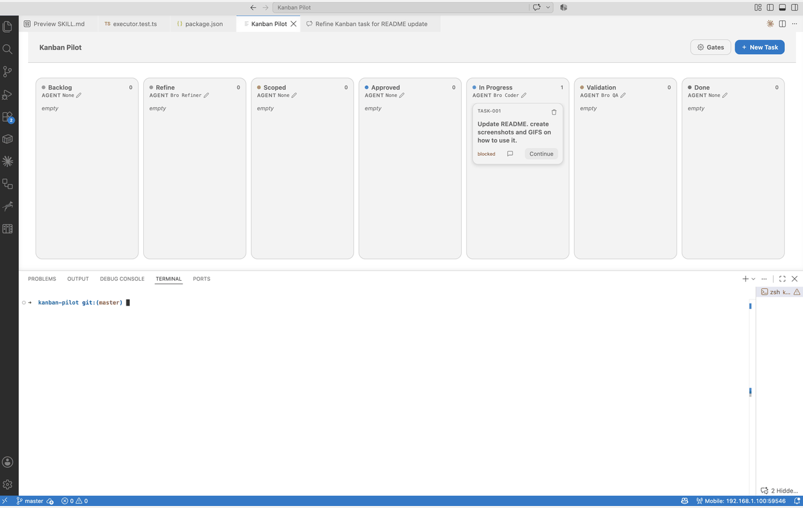

# Kanban Pilot

A Kanban-first driver for Copilot Chat. The board is the control plane; chat is the execution
surface — you interact with cards (accept, refine, approve, develop), and the extension
composes and injects the right prompt into Copilot Chat at the right moment.

Each task is a durable, git-diffable markdown file on disk. The board is a live projection of
that folder: editing a task file by hand moves the card, and moving the card rewrites the file.

## How It Works

Kanban Pilot is a VS Code extension for driving GitHub Copilot Chat. It does not replace
Copilot Chat or implement the work by itself. The Kanban board is the control plane: task cards,
workflow columns, and gates decide what should happen next. GitHub Copilot Chat is the execution
surface: Kanban Pilot opens a private session for the selected task, injects the stage prompt,
and records the result back in the task file.

The default workflow is deliberately staged so a task can be clarified and reviewed before
Copilot Chat is asked to change code:

| Stage | What happens |
| --- | --- |
| Backlog | Create or select a task, then click **Accept**. |
| Refine | Click **Refine** to ask Copilot Chat to write the problem statement, acceptance criteria, and Scope. Click **Split** instead when the task is too big for one ticket. |
| Scoped | Review the generated Scope and use the gate before approving it. |
| Approved | Click **Approve** when the scope is ready for implementation. |
| In Progress | Click **Develop** to ask Copilot Chat to implement the approved Scope. |
| Validation | Click **Validate** to ask the QA stage to check the implementation against the criteria. |
| Done | The task is complete after a successful validation receipt. |

## Quick Start

1. Install or enable GitHub Copilot Chat in VS Code, then install Kanban Pilot. GitHub Copilot
  Chat is required because Kanban Pilot drives that chat surface.
2. Open a workspace and run **Kanban Pilot: Open Board** from the Command Palette, or select the
  Kanban Pilot activity-bar icon. The board is bound to the first workspace folder.
3. Click **New Task** to enter a title and optional description, or select an existing card.
  Selecting a card opens its task detail dialog; the task is stored as a markdown file under
  `.kanban-pilot/tasks` by default.
4. From **Backlog**, click **Accept**, then click **Refine**. Copilot Chat fills the task's
  **Refined** and **Scope** sections and returns a receipt. Refine is a documentation step;
  it must not write implementation code.
5. Read the **Scope** in the task detail dialog. When it is ready, click **Approve**. This is
  the review gate between planning and implementation. If the task turns out to be too large,
  click **Split** instead — the run files the smaller pieces as new backlog tasks and leaves this
  one as tracking-only.
6. In **Approved**, click **Develop**. Copilot Chat receives the approved task and implements
  the checklist. A task may show **Continue** when a run needs to resume.
7. When the task reaches **Validation**, click **Validate**. The QA stage checks the actual
  implementation against the acceptance criteria and moves successful work to **Done**.
8. Use **Open Chat** in the task detail dialog to open that task's private Copilot Chat session
  beside the board. Stage runs open the same task-specific session automatically when chat
  docking is enabled.

## Install the Agent Skill

The repository includes the canonical Kanban Pilot skill at
`.claude/skills/kanban-pilot/SKILL.md`. From the repository root, install it into the personal
skill directory for the tool you use:

```sh
npm run install:skill:claude
npm run install:skill:copilot
```

The Claude command writes to `<user-home>/.claude/skills/kanban-pilot/SKILL.md`, and the Copilot
command writes to `<user-home>/.copilot/skills/kanban-pilot/SKILL.md`. The commands create missing
parent directories and overwrite an existing copy. The canonical skill distinguishes direct
skill runs from extension-supervised prompts: the generated completion contract owns the
frontmatter boundary for an extension run, while a direct skill run performs its own legal state
transition. Installed skill copies are snapshots, so re-run the relevant command after every
repository skill update to refresh the installed version.

Stage prompt files under `.kanban-pilot/prompts` are user-owned and are never silently migrated.
If an existing copy predates the `kanban-pilot: extension-supervised` marker, update it manually
or remove it to let the extension seed the current built-in default; keep its footer's explicit
extension-frontmatter ownership rule if retaining the older copy.

## Visual Walkthrough

The board is the control plane for the task-specific Copilot Chat runs:


The board shows the staged columns, per-stage agent labels, gate controls, and the card action
for the current task.


Use **New Task** to create a markdown-backed card with a title and an optional description.


Select a card to review its Request, Refined, and Scope sections. **Open Chat** is the explicit
handoff to that task's private GitHub Copilot Chat session, which opens beside the board.



This walkthrough uses the same board, New Task, and task detail surfaces in sequence so the
control-plane-to-Copilot-Chat handoff is visible before running a stage.

## Features

- **Staged workflow** — Backlog → Refine → Scoped → Approved → In Progress → Validation → Done,
  with a hard review point before any code is written.
- **Gated by default** — every stage transition requires an explicit click unless you opt into
  auto-advance per gate (`kanbanPilot.gates.*`).
- **One private chat session per task** — no context bleed between unrelated tasks.
- **Docked chat** — the active task's Copilot Chat session opens beside the board, and Refine,
  Develop, and Validate dock it before the prompt is injected.
- **Split** — fan an oversized ticket out into smaller ones instead of scoping it in place.
- **Task proposals** — running agents can file follow-up work as new backlog tasks.
- **Run capacity** — one run at a time by default, raised via `kanbanPilot.run.maxParallelTasks`.

## Requirements

- VS Code 1.125.0 or later.
- GitHub Copilot Chat, since Kanban Pilot drives it rather than replacing it.

## Extension Settings

This extension contributes the following settings (all under `kanbanPilot.*`):

| Setting | Default | Description |
| --- | --- | --- |
| `kanbanPilot.tasksDir` | `.kanban-pilot/tasks` | Workspace-relative folder holding task markdown files. |
| `kanbanPilot.gates.backlogToRefine` | `manual` | `auto` accepts a new task and launches Refine automatically. |
| `kanbanPilot.gates.scopedToApproved` | `manual` | `auto` approves a freshly-scoped task into the ready queue. |
| `kanbanPilot.gates.approvedToInProgress` | `manual` | `auto` starts development on the next Approved task when run capacity has room. |
| `kanbanPilot.gates.validationAutoStart` | `manual` | `auto` launches Validate as soon as a task lands in Validation. |
| `kanbanPilot.chat.mode` | `agent` | Chat mode requested at injection (`agent` or `ask`). |
| `kanbanPilot.chat.sessionPrefix` | `kanban-pilot-` | Prefix used to build each task's private session id. |
| `kanbanPilot.chat.closeTabOnDone` | `true` | Close a task's chat tab once it reaches Done. |
| `kanbanPilot.chat.resetOnApprove` | `false` | Clear the task's conversation at the Approve gate. |
| `kanbanPilot.refine.toolsInclude` | `[]` | Optional allowlist restricting tools available during Refine. |
| `kanbanPilot.chat.toolsExclude` | `["memory", "resolveMemoryFileUri"]` | Tools denied on every injection, every stage. |
| `kanbanPilot.chat.modelSelector` | `{}` | Optional `{id, vendor}` to pin a model per run. |
| `kanbanPilot.chat.agentNames` | `{}` | Per-stage persona overrides (`refine`/`develop`/`validate`; `split` reuses `refine`). Editable from the board via each column's Agent edit icon. |
| `kanbanPilot.run.timeoutMinutes` | `20` | Minutes before a run is marked failed. |
| `kanbanPilot.run.maxParallelTasks` | `1` | Maximum active Refine, Split, Develop/Continue, and Validate runs. Values above one opt into concurrent agent edits in the same workspace; no worktree isolation is provided. |
| `kanbanPilot.board.openOnStartup` | `false` | Open the board automatically on workspace load. |
| `kanbanPilot.layout.dockChat` | `true` | Open the selected task's chat beside the board. |
| `kanbanPilot.layout.dockChatOnSelect` | `false` | Dock the chat as soon as a card is selected. |
| `kanbanPilot.chat.allowTaskProposals` | `true` | Let develop/validate runs file follow-up work as new backlog tasks. |

Run capacity is global across all active agent stages and counts persisted `status: running`
tasks after a reload. The default of one preserves the safest working-tree behavior. When the
capacity is full, new manual and automatic starts are left untouched rather than assigned a new
queue status; Approved remains the visible ready queue. Increasing the limit explicitly opts into
same-workspace concurrent edits, so use a worktree or another isolation strategy separately if
parallel code-writing runs need filesystem safety.

## Known Issues

None tracked yet — this is a pre-release build.

## Release Notes

### 0.0.1

Initial build.
