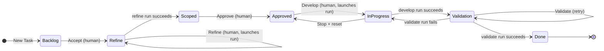
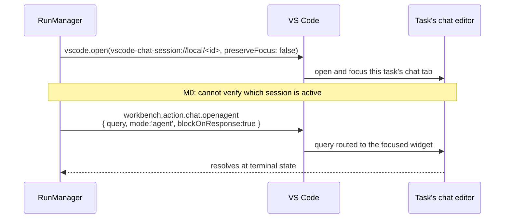
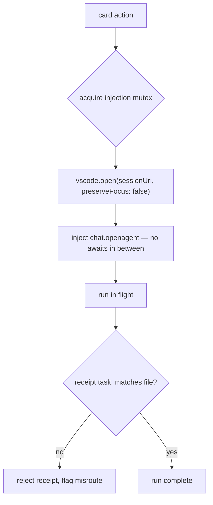

# Kanban Pilot — Product Requirements Document

**Status:** Draft v1.34 — the board now fits the panel viewport exactly, no page-level scroll (§6.11)
**Last updated:** 2026-08-14
**Design reference:** https://flourished-costs-247065.framer.app/
**API findings verified against:** `microsoft/vscode@main` — `chat/browser/actions/chatActions.ts`,
`chat/common/model/chatUri.ts`, `chat/common/chatSessionsService.ts`, `base/common/network.ts`
**Measured against:** VS Code 1.133.0 — see [M0 findings](m0-findings.md)

---

## 1. Thesis

Coding agents today are driven from a chat prompt: a linear, ephemeral, single-threaded
surface with no memory of what you asked it to do yesterday and no notion of "not yet."
Everything is either happening right now or forgotten.

Kanban Pilot inverts the relationship. **The board is the control plane; the chat is the
execution surface.** Work is durable, reviewable, and parked between stages. You interact
with cards — accept, refine, approve, develop — and the extension composes and injects the
right prompt into Copilot Chat at the right moment. The chat panel becomes a runtime you
watch, not an interface you operate.

The unit of work is a task file on disk. The board is a projection of a folder. The agent
advances tasks by editing those files, which is also exactly how a human advances them.

---

## 2. Problem

| Pain | Today | With Kanban Pilot |
| --- | --- | --- |
| Work is ephemeral | Prompts vanish into scrollback | Every task is a durable markdown file |
| No staging | Ask → agent immediately writes code | Refine → scope → approve → develop, each reviewable |
| No parking | You must finish or abandon | Cards rest in Backlog/Scoped/Approved indefinitely |
| No queue | One conversation, one thread of thought | Approved column is a ready-queue |
| Invisible state | "What was the agent doing?" | Column + status is visible at a glance |
| Context bleed | One chat accumulates every task's history | One private chat session per task |
| Unreviewable scope | Agent decides scope silently mid-run | Scope is written down and gated before code is touched |

---

## 3. Goals & Non-Goals

### Goals (v1)

- **G1** — The board is the primary interaction surface. A user can run a task from intake
  to merged code without typing into the chat panel.
- **G2** — Every task's full history (original request, refined statement, scope, run log)
  lives in a git-diffable markdown file.
- **G3** — Every stage transition is gated by default. The agent never silently crosses a
  column boundary unless the user opts in per-transition.
- **G4** — Scope is agreed *before* code is written. The Scoped column is a hard review point.
- **G5** — The board and the filesystem never disagree. Editing a task file by hand moves
  the card; moving the card rewrites the file.
- **G6** — **Every task owns a private chat session. No two tasks ever share one.** Context
  never bleeds between tasks, and resuming a paused task re-enters its own conversation.

### Non-Goals (explicitly out of scope for v1)

- Multi-user / real-time collaborative boards.
- Parallel agent execution via git worktrees *(deferred — see §8.4)*.
- GitHub Issues / Jira / Linear sync.
- Non-Copilot model backends *(the executor is abstracted for this, but only one is shipped)*.
- Remote or headless execution.
- Time tracking, estimation, burndown, or any reporting surface.
- **Re-rendering the chat transcript inside the board webview.** The real chat is docked beside
  it instead — see §6.10 for why a mirror is both unbuildable and undesirable.

Agent-initiated task creation was on this list through v1.25 — sketched, then deferred to v2 —
but shipped ad hoc on 2026-08-13 (§6.12), ahead of M4, at the user's request. Not a goal that
changed; a sequencing call.

---

## 4. Users & Primary Flow

**Primary persona: the solo developer running an agent on their own repo.** Has 5–15 things
they want done, trusts the agent for mechanical work, does not trust it to decide scope.

### The happy path

1. Click **New Task**, type *"Set up billing webhook"*. Card `TASK-142` appears in **Backlog**.
2. Click **Accept**. Card moves to **Refine**; the extension injects a refinement prompt into
   Copilot Chat. The agent reads the repo, asks clarifying questions in chat if needed, and
   writes a sharpened problem statement + acceptance criteria back into the task file.
3. Card lands in **Scoped**. User reads the scope in the card detail. It's wrong — user edits
   the markdown directly, or clicks **Refine** to re-run.
4. Click **Approve**. Card moves to **Approved** — the ready queue — and the task's chat is
   reset, so implementation starts from the agreed scope rather than the refinement debate.
5. Click **Develop**. Extension checkpoints the working tree, then injects an implementation
   prompt scoped to the agreed checklist. Card is in **In Progress**, status `running`.
6. Agent finishes and writes a completion receipt. Card moves to **Done**. User reviews the
   diff, commits.

Total chat panel interaction: zero, unless the agent asks a question.

---

## 5. The Board Model

**Seven columns, not six.** §12 Q10: the live Framer prototype added a **Validation** stage
between In Progress and Done, gated by a human **Validate** click — resolved in favor of
adopting it (2026-08-13), since it strengthens the design's core bet (a human reviews before
the agent's work is trusted) rather than complicating it.

**Correction, same day:** this section originally classified Validation as *resting* — a pure
human gate, like Scoped or Approved, specifically so it wouldn't touch §8.4's single-slot
model. That held for about one turn. Working through the actual trigger model (below) made
clear that Validate needed to be agent-driven too — it reads the implementation against the
acceptance criteria and can send the card *backward* to In Progress on a real failure, which a
pure gate can't express. **Validation is a working column.** §8.4 has been re-examined
accordingly, not just patched.

| Column | Kind | Meaning |
| --- | --- | --- |
| **Backlog** | resting | Captured, untriaged |
| **Refine** | working | Agent is sharpening the request into a spec |
| **Scoped** | resting | Has an agreed scope, awaiting human approval |
| **Approved** | resting | Approved to build — the ready queue |
| **In Progress** | working | Agent is writing code |
| **Validation** | working | Agent is checking the implementation against acceptance criteria |
| **Done** | resting | Complete |

Human gates sit on resting→working boundaries — but not every working-column entry launches a
run by itself. Two shapes coexist, both real product decisions rather than an M3 stub:

- **Two-step (Backlog → Refine):** `Accept` is a pure gate — it moves the card and stops. A
  separate click on `Refine` (the working column's own action) is what launches the run. This
  is deliberately the one place a human can enter a working column and pause before spending a
  turn on it.
- **One-step (Approved → In Progress, Validation's own retry):** `Develop` and `Validate` both
  move the card *and* launch the run in the same click. There's no idle-in-a-working-column
  state to pause in for these — see §6.6's trigger-model table for exactly which actions launch
  a run and which don't.



The new edge is `Validation --> InProgress: validate run fails`. This is a real verdict, not an
error path — §6.3's receipt grammar note explains why `result:failed` means something different
for validate than it does for refine or develop.

### 5.1 Status is orthogonal to column

A card carries a **runtime status** independent of its column. This is what the design
encodes in its per-card buttons — two cards in the same column showing different actions.

| Status | Meaning |
| --- | --- |
| `idle` | No run in flight |
| `running` | A run is currently injected and executing |
| `paused` | A run was stopped partway; resumable |
| `blocked` | Agent reported it cannot proceed (needs a decision) |
| `failed` | Run timed out or errored |

### 5.2 Card action matrix

This table reproduces the design exactly and is the authoritative spec for card buttons.

| Column | Status | Primary action | Secondary |
| --- | --- | --- | --- |
| Backlog | `idle` | **Accept** | — |
| Refine | `idle` | **Refine** | — |
| Refine | `running` | **Stop** | — |
| Refine | `blocked` / `failed` | **Refine** (retry) | — |
| Scoped | `idle` | **Approve** | Refine |
| Approved | `idle` | **Develop** | — |
| In Progress | `running` | **Stop** | — |
| In Progress | `paused` | **Continue** | Stop |
| In Progress | `blocked` / `failed` | **Continue** (retry) | — |
| In Progress | `idle` | **Continue** | — |
| Validation | `idle` | **Validate** | — |
| Validation | `running` | **Stop** | — |
| Validation | `blocked` / `failed` | **Validate** (retry) | — |
| Done | *any* | — | Reopen |

> The `In Progress` + `idle` row was **missing from the original table and found during M1** by
> looking at the rendered board: a card sat in a working column with no run in flight, offering
> `Stop`. That state is reachable — a window reload loses the `blockOnResponse` await and
> reconciliation (§6.4) parks the card rather than inventing a result — and `Stop` is meaningless
> there. The matrix is now total: every column/status pair resolves, enforced by a test.

> **The card face renders only the Primary column — one button per card.** Confirmed by
> re-inspecting the live prototype for M2 (§13): Scoped cards show just `Approve`, Done cards
> show no button at all. The Secondary actions (Scoped's redo-scope `Refine`, Done's `Reopen`)
> are still fully implemented — the state machine and command palette carry them unchanged —
> but surface in the task detail modal (§6.11) rather than crowding a second button onto the
> card.

> The design shows **In Progress: 2** with one card offering *Stop* and one offering
> *Continue*. That is consistent with single-slot execution (§8.4): In Progress may hold
> several cards, but **at most one may be `running`**. *Correction:* an earlier draft of this
> note said the rest sit `paused`. They don't — `stateMachine.ts`'s `stop` rule bounces In
> Progress all the way back to Approved ("Stop + reset"), so `paused` is never actually
> produced there. The second card offering `Continue` is one sitting `blocked` or `failed`
> instead — Continue is that status's retry action (§5.2), not a resume-from-pause.
>
> **Continue** is only meaningful because each task owns a private chat session (§6.7): the
> retried card's conversation is still intact, so resuming re-enters it rather than restarting
> from a cold prompt.

> This table doesn't carry `split` (§6.14) — it isn't a Primary/Secondary action in the sense
> above, it's a persistent icon alongside the card's existing trash/open-file icons, shown
> whenever the column/status combination makes splitting legal (Backlog/idle, Refine/idle,
> blocked,failed, Scoped/idle).

### 5.3 Column header

Each column header shows its title, a live count of contained cards, and a per-column **Agent**
badge — `Backlog 6 / Agent None`, `Refine 2 / Agent Bro Refiner`, `Scoped 3 / Agent None`,
`Approved 2 / Agent None`, `In Progress 2 / Agent Bro Coder`, `Validation 2 / Agent Bro QA`,
`Done 5 / Agent None`. As of the stage-wiring pass (§6.6), the badge for the three agent columns
is **not cosmetic** — it's `resolveAgentName`'s result for that column's stage (`chat/agentNames.ts`),
the same call `RunManager` makes to open every prompt for that stage, so the badge tells you
exactly who's about to be asked to do the work. The pencil icon is no longer inert either
(§12 Q10, now fully closed, §6.17): clicking it opens a small modal to rename that stage's
persona, writing straight to `kanbanPilot.chat.agentNames`.

---

## 6. Architecture

### 6.1 Component overview

```mermaid
flowchart TB
    subgraph W["Webview — Board UI"]
        UI["Columns · Cards · New Task"]
    end
    subgraph E["Extension Host"]
        BC["BoardController<br/><i>action → transition</i>"]
        SM["StateMachine<br/><i>legal moves + gates</i>"]
        TS["TaskStore<br/><i>read/write markdown</i>"]
        RUN["RunManager<br/><i>launch · watch · timeout</i>"]
        EX["ChatSessionExecutor<br/><i>bind session · inject · await</i>"]
        FW["FileWatcher"]
    end
    subgraph D["Disk — source of truth"]
        MD[".kanban-pilot/tasks/*.md"]
    end
    subgraph C["Copilot Chat — one session per task"]
        C1["vscode-chat-session://local/…TASK-142"]
        C2["vscode-chat-session://local/…TASK-151"]
    end

    UI -- "action/invoke" --> BC
    BC -- "board/state" --> UI
    BC --> SM
    SM --> TS
    BC --> RUN
    RUN --> EX
    EX -- "vscode.open + chat.openAgent" --> C1
    EX -- "" --> C2
    C1 -- "edits task file + repo" --> MD
    C1 -. "blockOnResponse resolves" .-> EX
    TS <--> MD
    MD --> FW
    FW -- "receipt detected" --> RUN
    RUN -- "run complete" --> BC
```

### 6.2 Closing the loop: two independent completion signals

Injection is **not** fire-and-forget. `IChatViewOpenOptions` exposes:

```ts
/**
 * Wait to resolve the command until the chat response reaches a terminal state
 * (complete, error, or pending user confirmation, etc.).
 */
blockOnResponse?: boolean;
```

and the action resolves with `IChatAgentResult & { type?: 'confirmation' }`. So the primary
completion signal is simply **awaiting the command**.

**M0 confirmed this**: the same prompt took **2754 ms** with the flag and **19 ms** without. The
resolved value is richer than assumed — `timings`, `metadata.promptTokens` / `outputTokens`,
`toolCallRounds`, `resolvedModel`, and a `details` string carrying credit cost. Per-run token and
cost telemetry is therefore available for free, which §11 can use.

Kanban Pilot uses two signals, because each covers the other's blind spot:

| Signal | Answers | Fails when |
| --- | --- | --- |
| `blockOnResponse` await | *Has the turn ended?* | Window reloads mid-run; resolves on `confirmation` (a pause, not a finish) |
| `## Log` receipt line | *Did the work actually succeed?* | Agent forgets to write it |

A run resolves `ok` when **both** the await returns and a receipt matching its `runId` is
present. Await-without-receipt → `blocked`, surfaced on the card for a human call.
Receipt-without-await (window reloaded) → reconciled from disk on next activation, which is
why the receipt cannot be dropped even though the await exists.

The receipt is deliberately the *only* structural thing the agent is asked to write.
Everything else it produces is free-form prose in body sections, where malformed output is
harmless. **The extension — never the agent — owns YAML frontmatter.**

**Execution context is explicit when the standalone skill is also available.** An
extension-supervised prompt carries the stable `kanban-pilot: extension-supervised` marker and
a generated `## On Completion` contract containing the current `run:` and `task:` values. That
contract is authoritative: the agent writes only the stage-owned body sections and appends its
receipt, while `RunManager` owns the frontmatter transition. Older user-owned prompt copies may
not carry the marker, so an explicit footer that says the extension owns frontmatter has the same
meaning. A direct run of `.claude/skills/kanban-pilot/SKILL.md` has no supervising extension and
therefore follows the skill's legal frontmatter transition rules. If the context cannot be
identified or the instructions conflict, the worker reports a blocker instead of guessing.

### 6.3 Task file format

One file per task at `.kanban-pilot/tasks/TASK-142.md`.

```markdown
---
id: TASK-142
title: Set up billing webhook
state: scoped          # backlog | refine | scoped | approved | in-progress | validation | done
status: idle           # idle | running | paused | blocked | failed
created: 2026-08-13T10:04:12Z
updated: 2026-08-13T11:22:40Z
run: null              # active run id, or null
chat: kanban-pilot-TASK-142   # this task's private chat session id (§6.7)
copilot_session_id: 8fea0d54-9fd9-4cca-ab2c-e3a51d78d3f1   # Copilot's own id, for automatic misroute detection (§6.9)
scope_hash: 4e91a0c    # hash of ## Scope as refine wrote it; mismatch ⇒ human edited (§6.8)
chat_reset_required: false    # set when a misroute may have polluted this session (§6.9)
checkpoint: a3f9c21    # git sha of pre-develop checkpoint
origin_task: TASK-118  # set only if this task was filed by another task's run (§6.12)
---

## Request
Stripe webhooks aren't handled at all — we need the billing events to actually
land somewhere.

## Refined
<!-- written by the refine stage -->
Add a signed webhook endpoint for Stripe billing events.

**Acceptance criteria**
- Endpoint rejects requests with an invalid signature (400).
- `invoice.paid` and `customer.subscription.deleted` update local subscription state.
- Handler is idempotent on redelivery.

## Scope
<!-- written by the refine stage; edited by the human -->
- [ ] `src/routes/webhooks/stripe.ts` — route + signature verification
- [ ] `src/billing/events.ts` — event → state reducer
- [ ] `src/billing/events.test.ts` — redelivery idempotency test

## Log
- run:r7 task:TASK-142 stage:refine result:ok note:"scope written, 3 files"
```

**Field ownership**

| Section | Written by | Notes |
| --- | --- | --- |
| Frontmatter | Extension only for extension-supervised runs | The generated prompt explicitly assigns ownership to `RunManager` (§6.5). A direct skill run has no extension supervisor and follows the skill's own legal transition rules. Includes `origin_task` (§6.12) — set only on a task an agent filed via `propose-task`, never by the agent itself |
| `## Request` | Human | Verbatim original ask; immutable |
| `## Refined` | Refine stage | Free-form |
| `## Scope` | Refine stage, then human | The contract the develop stage is held to |
| `## Log` | Agent (append-only) + extension | The receipt channel |

**Correction, found via live testing (2026-08-13):** "agent is never asked to touch it" used to
be aspirational, not enforced — nothing in the prompt actually said so. A live develop run wrote
a well-formed `## Log` receipt (`result:ok`) *and*, unprompted, also rewrote the frontmatter's
`state`/`status` to its own vocabulary (`completed`/`passed`) — values outside the real
`Column`/`Status` enums. `taskFromRaw`'s R4 degrade-gracefully path (§8.1: unrecognized state
falls back to `backlog`) then did exactly what it's supposed to, silently — which from the
board's side looked like the finished task reset itself to Backlog for no reason. Same failure
family as the refine tools-allowlist bug (§6.6): a boundary the design assumed but never
actually told the agent about, discovered by watching a real run rather than by reasoning about
the code. Fixed by adding an explicit "do not touch frontmatter or anything outside the
stage-owned sections and `## Log`" line to all four templates' `## On Completion` sections —
prompt-level trust, not a technical boundary (the agent
still has unrestricted file-edit access), the same posture already accepted for G4 (§6.6).

**Receipt grammar** — the one structural thing the agent must emit:

```
- run:<runId> task:<taskId> stage:<refine|develop|validate|split> result:<ok|blocked|failed> note:"<free text>"
```

`result` means something stage-dependent for `validate`. Everywhere else, `failed` means the
*run* went wrong — the agent errored or couldn't proceed. For validate it doubles as *"the run
succeeded and the agent determined the acceptance criteria were not met"* — a real outcome, not
an error, which is why `RunManager` routes it back to In Progress rather than leaving the card
stuck (§5's new `Validation → InProgress` edge). An actually-errored validate run never reaches
this far: it's caught before a receipt is even looked for, same as any other stage (§6.4).

`task:` is the misroute detector (§6.9): a receipt whose task id disagrees with the file it
appeared in is rejected rather than accepted as completion.

### 6.4 Run lifecycle

```mermaid
sequenceDiagram
    participant U as User
    participant B as Board
    participant R as RunManager
    participant C as TASK-142's chat session
    participant F as Task file

    U->>B: click Develop
    B->>F: status=running, run=r8 (frontmatter)
    B->>R: startRun(TASK-142, develop, r8)
    R->>R: git checkpoint (M4 — not yet built)
    R->>C: open session URI, focus, inject prompt (runId r8)
    C->>F: edits repo, appends "- run:r8 ... result:ok"
    F-->>R: blockOnResponse resolves; re-read finds the receipt
    R->>R: both signals present → ok
    R->>B: runComplete(ok)
    B->>F: state=validation, status=idle, run=null
    B->>U: card moves to Validation, awaiting Validate
```

    This lifecycle describes an extension-supervised run: the agent supplies the
    stage-owned body changes and receipt, while `RunManager` remains the only
    component that reconciles the receipt and patches frontmatter. A direct skill
    run does not use this executor/ watcher boundary and instead follows the
    standalone skill's direct-run transition rules.

**Failure and escape hatches** — all of which are required, because the receipt is a
cooperative protocol with a non-deterministic party:

- **Timeout** (`kanbanPilot.run.timeoutMinutes`, default 20) → status `failed`, card offers retry.
  Still required: `blockOnResponse` is a promise that can outlive the run's usefulness.
- **Awaited but no receipt** → status `blocked`. Usually means the agent stopped to ask a
  question — `blockOnResponse` counts *pending user confirmation* as terminal, so this is the
  common case, not an edge case. The card deep-links into its session (§6.7) so the user lands
  in the right conversation.
- **`result:blocked`** → status `blocked`, the note surfaces on the card face. For validate
  specifically, three outcomes exist, not two — see §6.3's grammar note and §5's new
  `Validation → InProgress` edge for what `result:failed` does there.
- **Stop** → run abandoned. *Correction:* an earlier draft said this leaves status `paused`; it
  doesn't. Refine and Validation cancel in place (status → `idle`); In Progress bounces all the
  way back to Approved ("Stop + reset," §5's diagram). Either way `run` is explicitly cleared,
  not just `status` — otherwise a resolution that arrives after the stop could still overwrite
  it, since the reconciliation guard below keys off `run`, not `status`.
- **Window reload mid-run** → the await is lost. On activation, `RunManager` reconciles every
  `running` task against its receipt on disk. This is why both signals are kept.
- **A run resolves after it's been superseded** (by Stop, by `markRunComplete`, or by a newer
  run) → `RunManager` re-checks the task's *current* `run` id before applying anything; a
  mismatch means skip. This is the same mechanism the reload case above uses, just triggered by
  a stale in-memory promise instead of a lost one.
- **Manual completion** — `Kanban Pilot: Mark Run Complete`, for when the agent did the work
  but never wrote the receipt. **This must exist in v1.** A board you cannot un-stick is worse
  than no board.

### 6.5 Prompt templates

Stage prompts live at `.kanban-pilot/prompts/{refine,develop,validate,split}.md` and are user-editable
— they are the main tuning surface for output quality. Extension seeds each default on its
first use (`chat/promptTemplates.ts`); once a file exists, it always wins over the built-in
default, including when the built-in default text later changes.

Templates are rendered with the task's fields and a mandatory receipt footer the extension
appends (users can edit the body but not remove the receipt contract). Structure is fixed
across all four stage templates — `@{{agentName}}`, then a `## [{{projectName}} {{id}}]` banner,
then `# {{title}}`, then the stable `kanban-pilot: extension-supervised` execution-context
marker and ownership instructions, then the stage's own instructions, then `## Request` with
the material this stage needs, then `## On Completion` with separately labelled `### Completion`
and `### Non-completion` receipt instructions. The **develop** template:

```
@{{agentName}}
## [{{projectName}} {{id}}]
# {{title}}

## Execution Context
kanban-pilot: extension-supervised

This prompt was generated by the Kanban Pilot extension and is supervised by
RunManager. The generated ## On Completion contract below is authoritative for
this run, even if a standalone Kanban Pilot skill is also loaded. Only edit the
stage-owned sections described by this prompt and append the stage receipt to
## Log. Do not edit YAML frontmatter (state, status, run, updated, or
scope_hash) or immutable task sections; RunManager applies the state transition
after it reconciles the receipt.

Implement this task.
{{#scopeEdited}}
The scope below was revised by a human after refinement. Treat it as the
final word — anything you reasoned about earlier in this conversation is
superseded.
{{/scopeEdited}}
Implement exactly the checklist under Scope below and nothing else. If
something outside it blocks you, stop and report it rather than improvising.

## Request
**Refined**
{{refined}}

**Scope**
{{scope}}

## On Completion
### Completion
After completing the implementation work, append this line to the `## Log` section of
`.kanban-pilot/tasks/{{id}}.md`:
- run:{{runId}} task:{{id}} stage:develop result:ok note:"<one line summary>"
### Non-completion
If a concrete blocker prevents implementation, do not append the completion receipt.
Append exactly one non-completion receipt, with a concise, actionable explanation of
the blocker, missing decision, required human input, or unresolved question in `note`:
- run:{{runId}} task:{{id}} stage:develop result:blocked note:"<one line reason>"
```

**Refine** is shaped the same way but its `## Request` holds the raw `## Request` section
instead of `## Refined`/`## Scope` (nothing to inherit yet) and it explicitly forbids editing
code. **Validate** reads `## Refined`/`## Scope` like develop does, but its `## On Completion`
has two completion outcomes plus a non-completion outcome — see below. **Split** uses the
same receipt sections while treating `propose-task` lines as its primary completion work;
when no split is needed, its blocked note explains why one ticket is sufficient.

Four details are load-bearing rather than cosmetic:

- **`## [{{projectName}} {{id}}]`** makes a misrouted prompt visible to a human (§6.9).
- **`@{{agentName}}`** is a real reflection of the board's own Agent badge (§5.3), not a
  decoration — `chat/agentNames.ts` is the single source both draw from. It is **not** a
  registered VS Code chat participant (see that module's doc for why `@Bro Refiner` is read as
  persona framing, not resolved specially).
- **`## Refined`/`## Scope` are inlined rather than referenced**, so recency favours a human's
  edit over the agent's own earlier reasoning (§6.8) — this matters more than it used to, now
  that develop and validate reuse the *same* session refine started (`resetOnApprove` defaults
  to `false`; §6.8 explains why that's safe).
- **`kanban-pilot: extension-supervised`** makes the frontmatter ownership boundary explicit.
  When this marker and the generated completion contract are present, that contract takes
  precedence over a standalone skill's direct-run transition instructions. The agent writes
  only the stage-owned sections and receipt; `RunManager` applies the transition.
- **`task:{{id}}`** in the `## On Completion` receipt instruction is the misroute detector (§6.9).

Because prompt files are user-owned, an existing `.kanban-pilot/prompts/*.md` copy always wins
over a later built-in default and is never silently migrated. A copy created before the marker
was added remains compatible when its footer explicitly assigns frontmatter ownership to the
extension; users who want the newer marker or wording must edit that copy or remove it and let
the extension seed a fresh default. Re-run the relevant skill installer after changing the
canonical `.claude/skills/kanban-pilot/SKILL.md`; installed personal skill copies are snapshots,
not live links.

**Validate's footer is the one structurally different piece**, because its result has three
live outcomes instead of two:

```
### Completion
When validation reaches a pass/fail verdict, append exactly one of these completion lines
to the `## Log` section of
`.kanban-pilot/tasks/{{id}}.md`:
- run:{{runId}} task:{{id}} stage:validate result:ok note:"<what you checked>"
  — the criteria are met.
- run:{{runId}} task:{{id}} stage:validate result:failed note:"<what's missing>"
  — validation completed, but the criteria are not met; the ticket goes back to In Progress
  for another pass. This is a verdict, not a run error.
### Non-completion
If missing evidence, ambiguous criteria, or another concrete blocker prevents a pass/fail
verdict, do not use `result:failed`. Append exactly one blocked receipt instead, with a
concise, actionable explanation of the missing evidence, blocker, required human input, or
unresolved question in the `note`.
- run:{{runId}} task:{{id}} stage:validate result:blocked note:"<one line reason>"
```

`result:failed` here is a genuine verdict the agent is being asked to *reach*, not merely an
error state it falls into — §6.3's receipt-grammar doc has the full reasoning for why this stage
alone gets a different reading of the same field.

### 6.6 Execution: the ChatExecutor

```ts
interface Executor {
  isAvailable(mode?: string): Promise<boolean>;
  /** Opens the task's session and injects `prompt`, resolving at terminal state. */
  run(task: Task, taskFileUri: Uri, prompt: string, stage: Stage, options: RunOptions): Promise<ExecutorResult>;
}
```

(This is the interface as actually implemented in `chat/executor.ts` — an earlier draft of this
section sketched `run(task, prompt, runId, stage)`; the real shape takes the task's file URI
directly for `attachFiles` and a `RunOptions` bag for the per-run config below, and returns
`{ ok, error?, sessionId? }` rather than a bare `RunOutcome`, since `sessionId` is what feeds
§6.9's misroute detection.)

The v1 implementation is `ChatSessionExecutor` — the mechanism from
[`copilot-poc/src/extension.ts`](../../copilot-poc/src/extension.ts), extended with the session
binding of §6.7:

```ts
// Open immediately before injecting, with nothing awaited in between (§6.9).
await vscode.commands.executeCommand('vscode.open', sessionUriFor(task), { preserveFocus: false });

const result = await vscode.commands.executeCommand(
  openCommand,                              // mode-scoped, resolved live — see below
  {
    query: prompt,
    mode: options.mode,                      // kanbanPilot.chat.mode, default 'agent'
    blockOnResponse: true,                   // resolves at terminal state
    attachFiles: [taskFileUri],              // task file as first-class context
    toolsInclude: resolveToolsInclude(stage, options.toolsIncludeForRefine),
    toolsExclude: options.toolsExclude,      // R12 (confirmed) — every stage, always
  },
);
```

Four options from `IChatViewOpenOptions` are doing real work here:

- **`blockOnResponse`** — the completion signal (§6.2).
- **`attachFiles`** — attaches the task file as context rather than pasting its content into
  the prompt, so the agent reads the live file.
- **`toolsInclude`** is **refine-only and opt-in**, `undefined` by default. It *could* turn the
  scope-before-code guarantee (G4) from a polite instruction into a real capability boundary —
  but only if set to tool ids confirmed against the live Configure Tools picker first, the same
  discipline `MEMORY_TOOLS` was held to (§8.2 R12). An earlier default of
  `['codebase', 'search', 'usages']` skipped that verification and turned out to be wrong: it
  blocked every tool including file edits, which stops refine from writing its own
  `## Refined`/`## Scope`/receipt — the one thing its own prompt requires it to do. Until
  someone verifies a real allowlist, G4 rests on the prompt instruction alone for refine, the
  same trust already placed in develop and validate below.
- **`toolsExclude: MEMORY_TOOLS`** — closes R12 (§10). Applied unconditionally, on *every*
  stage, independent of whatever `toolsInclude` allowlist (if any) refine is running under,
  because `toolsInclude` and `toolsExclude` combine (exclusions win) — it is what protects
  **develop and validate**, neither of which has an allow-list to implicitly exclude memory
  through.

**These are private, undocumented VS Code commands and remain the single largest technical
risk in the product** (§10, R1). The `Executor` interface exists so a `LanguageModelExecutor`
built on `vscode.lm` can replace it without touching the board, store, or state machine —
though note that only the injection path gives one-chat-per-task in the *user-visible* chat UI.

`isAvailable()` feature-detects each command id via `vscode.commands.getCommands(true)`. M0
resolved the mode-scoped id to **`workbench.action.chat.openagent`** (lowercase), but it is
derived at runtime from the mode's display name, so it is looked up rather than hardcoded. On failure the executor degrades to opening the task's
session and copying the prompt to the clipboard for the user to paste — the session binding
still holds, and the board still tracks state via the receipt.

#### Which actions launch a run

Not every action that lands a card in an agent column also starts the agent — `RunManager`
(`chat/runManager.ts`) makes that decision per action, and `stateMachine.ts`'s `needsAgent` flag
exists specifically to name it:

| Action | Pure gate or launches a run? | Notes |
| --- | --- | --- |
| `accept` | Pure gate | Backlog → Refine. Deliberately does **not** launch refine — see §5's two-step note |
| `refine` | Launches `refine` | Legal both as Refine's own start/retry and as Scoped's secondary "redo scope" |
| `approve` | Pure gate | Scoped → Approved. No session reset by default (§6.8) |
| `develop` | Launches `develop` | One click both moves Approved → In Progress and starts the run |
| `continue` | Launches `develop` | In Progress's retry action after `blocked`/`failed` |
| `validate` | Launches `validate` | One click, in place — Validation never has an idle-and-waiting sibling action |
| `stop` | Pure gate | Also clears `run` on the task file — closes a real gap: without it, a run that resolves *after* Stop could still overwrite the stop, since §6.9's staleness guard keys off `run`, not `status` |
| `reopen` | Pure gate | Done → Approved |

Every "launches a run" row follows the same two-phase shape (§6.4): `invokeTaskAction` applies
the pure transition first — the card visibly moves before the agent has said anything — then
`RunManager` patches `status: 'running'` and hands off to the executor in the background.

### 6.7 Session binding — one chat per task

**Requirement: every task card owns a private chat session. No two tasks ever share one.**

Without this, a single chat accumulates every task's history: TASK-142's scope bleeds into
TASK-151's implementation, the agent conflates checklists, and context window is burned on
irrelevant work. It is also what makes **Continue** on a paused card mean *resume* rather than
*restart* — the conversation is still there.

#### Sessions are addressable by URI

VS Code chat sessions are backed by resource URIs, constructed deterministically
(`chat/common/model/chatUri.ts`):

```ts
export namespace LocalChatSessionUri {
  export const scheme = Schemas.vscodeLocalChatSession;   // 'vscode-chat-session'

  export function forSession(sessionId: string): URI {
    const encodedId = encodeBase64(VSBuffer.wrap(new TextEncoder().encode(sessionId)), false, true);
    return URI.from({ scheme, authority: localChatSessionType /* 'local' */, path: '/' + encodedId });
  }
}
```

The session id is arbitrary text, base64url-encoded into the path. VS Code's own new-session
helper just uses `chat-${random}` — nothing stops us choosing a **meaningful, stable** id:

```
kanban-pilot-TASK-142  →  vscode-chat-session://local/a2FuYmFuLXBpbG90LVRBU0stMTQy
kanban-pilot-TASK-151  →  vscode-chat-session://local/a2FuYmFuLXBpbG90LVRBU0stMTUx
```

**This makes the requirement structural rather than procedural.** The session URI is a pure
function of the task id, so two tasks *cannot* collide, the binding survives window reloads
and needs no bookkeeping beyond the `chat:` frontmatter field, and every run for a task lands
in the same conversation by construction.

#### Targeting the right session

`workbench.action.chat.open` **cannot** target a specific session. Its handler reads:

```ts
let chatWidget = widgetService.lastFocusedWidget;
if (!this.mode || !chatWidget || !isAncestorOfActiveElement(chatWidget.domNode)) {
    chatWidget = await widgetService.revealWidget();
}
```

`this.mode` is `undefined` for the primary action, so the guard always short-circuits to
`revealWidget()` — the default chat view. **This is why the POC's approach cannot satisfy the
requirement as written.**

The mode-scoped variants — `workbench.action.chat.open<ModeName>`, registered by
`getOpenChatActionIdForMode()` — *do* have `this.mode` set, and therefore route to the
**focused widget**. Hence the three-step injection protocol:



The mode-scoped action requires `isAncestorOfActiveElement` — the widget must genuinely hold
DOM focus, not merely be visible. `workbench.action.chat.focusInput` cannot be used to acquire
that focus, because it focuses `lastFocusedWidget`, which may be another task's session.

**M0 confirmed the binding half of this works and the checking half does not:** two derived URIs
open two distinct tabs, and reopening one refocuses it rather than forking. But no API reveals
which session is active, so the injection cannot be gated on a check. §6.9 covers what replaces
the gate.

#### Lifecycle

| Event | Session behaviour |
| --- | --- |
| **New Task** | No session created — ids are derived, not allocated. Nothing exists until the first run. |
| **First run** (Accept) | `vscode.open` mints the session; tab titled after the task |
| **Later runs** (Refine, Continue) | Same URI → same conversation, full history intact |
| **Approve** | Conversation cleared, URI unchanged — the implementation phase starts clean (§6.8) |
| **Stop** | Session left untouched; `Continue` resumes it in place |
| **Done** | Tab closed via `window.tabGroups.close`; session persists in VS Code's session list |
| **Reopen** | Same derived URI — the original conversation comes back |

A pleasant consequence: VS Code's own sessions list becomes a mirror of the board, with one
named session per task, navigable even when the board isn't open.

#### Fallback if targeting proves unreliable

If focus-based targeting fails in the M0 spike, `IChatViewOpenOptions.previousRequests`
(`{ request, response }[]`, replayed via `chatService.addCompleteRequest`) allows a **fresh**
session to be seeded with the task's prior turns. Continuity is preserved and the
one-chat-per-task invariant still holds — at the cost of replaying history each run.

### 6.8 Stage boundaries — keeping the human's scope authoritative

One session per task means the develop run inherits the entire refinement transcript. That
sounds like continuity; it is actually the most dangerous context in the system.

**The failure:** refine proposes scope A. The human edits it to scope B — which is the entire
purpose of the Scoped gate (G4). Develop then runs in a session where the agent's own
reasoning for A is still present, and re-litigates or quietly implements A. The gate becomes
theatre, and the failure is silent.

The task file already solves this. `## Refined` and `## Scope` exist precisely so that
stage-to-stage handoff does not depend on a transcript. Anything the transcript adds beyond
the file is either redundant or stale.

> **Principle: context crosses a stage boundary only in writing.**

#### Four layers, strongest first

**0 — Deny the memory tool, on every injection, unconditionally.** M0 **confirmed** (R12) that
Copilot ships a built-in `memory` tool — *"Manage persistent memory across conversations,"*
visible in the Configure Tools picker under the built-in `vscode` toolset, enabled globally by
default. It is a store that survives `newChat`, survives a brand-new never-used session id,
and is not touched by session identity at all. This is the actual root cause R10's probe
measured (below) — not conversational carryover, a side channel around it.

Every `ChatExecutor` call sets `toolsExclude: MEMORY_TOOLS` (§6.6), regardless of stage. This is
listed as layer 0, ahead of resetting the conversation, because it removes a *capability* rather
than attempting to erase *already-written* state — and because §6.9 already established that
Kanban Pilot cannot verify what it can't prevent. Denying the tool is prevention; everything
below is response.

**This also protects G6, not just this stage boundary.** The memory tool is scoped to the user,
not to a session — so without layer 0, task A's refine run could write something the memory tool
later hands to task B's session, entirely outside the routing this document otherwise controls.
"No two tasks share a chat" (§6.7) was never sufficient on its own; it needed "and no tool that
bypasses chat isolation is available," which layer 0 now provides.

**1 — Reset the conversation at the Approve gate — off by default (`chat.resetOnApprove: false`).**
When enabled, entering Approved clears the task's session (`workbench.action.chat.newChat`) and
the implementation phase opens with a fresh transcript. The session **URI is unchanged** either
way, so one-chat-per-task holds exactly as specified: one tab, one entry in VS Code's session
list, one conversation per task at any time. The audit trail was never the transcript — it is
`## Log` and the file's git history.

**Why off by default:** develop and validate are meant to continue the *same* conversation
refine started — "the existing chat," not a fresh one — so the agent doing the implementation
has the benefit of everything the refine stage already worked out, not just the final artifact.
That is a deliberate product choice, not an oversight: it means this layer, when it *would* have
mattered, is now doing nothing by default, and layers 2–3 alone are load-bearing for keeping a
human's scope edit authoritative. Concretely: every stage's prompt (§6.5) inlines the current
`## Refined`/`## Scope` verbatim on every single run, so even inside one long-lived conversation,
the newest message always carries the human's latest edit — recency, not isolation, is what's
actually being relied on. A user who wants the stronger guarantee back can flip the setting; nothing
else in the design assumes either value.

This layer, when on, addresses **ordinary conversational carryover** — the reasoning-for-scope-A
problem this section opened with. It does **not** address the memory-tool leak; that is layer
0's job alone, confirmed by M0: `newChat` was invoked, the session id changed, and the codeword
still came back, with zero tool calls visible in the response metadata (a detection blind spot
in its own right — the tool clearly ran, per its own narrated reply, but did not surface in
`toolCallRounds[].toolCalls`).

**2 — Detect that the human intervened.** Refine records `scope_hash` (a hash of `## Scope` as
it wrote it) in frontmatter. If the live scope hashes differently at Develop time, the human
edited it, and the prompt says so in as many words:

```
The scope below was revised by a human after refinement. Any earlier proposal
is superseded. Implement exactly this and nothing else:

<inlined ## Scope>
```

**3 — Inline the scope, don't reference it.** The develop prompt embeds the checklist verbatim
in the newest message rather than relying on the agent to re-read the file. Recency then works
for the design instead of against it.

Layers 1–3 together make ordinary transcript carryover belt-and-braces **for users who opt into
layer 1**; with the default off, layers 2–3 are doing that job alone, on purpose, as explained
above. Layer 0 is the only one of the four that stops the *confirmed* leak vector; the other
three exist for the conversational version of the same failure, which layer 0 does not touch.

#### Fallback: split the session at the boundary

For a user who *has* enabled `chat.resetOnApprove` and finds `newChat` unreliable for ordinary
conversational reset, derive **two** sessions per task instead:

```
kanban-pilot-TASK-142-spec     ← refine
kanban-pilot-TASK-142-build    ← develop, continue
```

This still guarantees no two *tasks* share a chat, and gives isolation by construction rather
than by a command that must work. The cost is two entries per task in the session list, and a
card whose "open chat" action must pick the one matching its current stage.

`Continue` is unaffected either way: it resumes within the implementation phase, which is never
cleared mid-flight.

**This fallback does not substitute for layer 0.** A fresh session id has no bearing on the
memory tool — M0's confirming probe used a session that had never existed before, and the leak
still occurred. Splitting sessions is a fix for `newChat`'s reliability, not for R12; layer 0
(tool exclusion) is required regardless of which reset strategy is in use.

### 6.9 Misroute handling — what M0 changed

The sharpest risk in the system (R8). Three properties compound:

1. **Focus always starts in the wrong place.** Injection is triggered by a click on a card, so
   focus is in the board webview every single time. Every run must *steal* focus.
2. **Routing is decided by a focus check** — `isAncestorOfActiveElement(chatWidget.domNode)`.
3. **Failure is silent.** When the check fails, `chat.open<Mode>` does not error; it falls back
   to `revealWidget()` and delivers the prompt to the default chat view.

#### What M0 measured

This section previously specified a *fail-closed* protocol: verify the active tab matches the
session URI, and abort rather than inject into an unknown target. **M0 proved that assertion
cannot be built.**

| Hoped-for primitive | Measured result (VS Code 1.133) |
| --- | --- |
| Identify a session from `Tab.input` | **Opaque.** Minified class, zero properties on the entire prototype chain |
| Fall back to matching `tab.label` | **Useless.** Titles are auto-generated from conversation content, mutate as it develops, are not unique, and are user-renamable — and a fresh session is always just `"Chat"` |
| A command that opens a session *and* targets it | **None.** All candidates reject a session resource across six argument shapes |
| `workbench.action.chat.focusInput` to focus our editor | Focuses `lastFocusedWidget` — a trap, not a safeguard |

What M0 *did* confirm is that the **binding** works: two derived URIs open two distinct tabs,
and reopening one refocuses it rather than forking a second conversation.

> **The write path works; the read path does not.** We can put a prompt in a specific session.
> We cannot ask which session we are in.

This is a better outcome than the contingency this section previously planned for. The
G6-versus-chat-UI fork assumed *unverifiable* implied *unbindable*; it does not. **G6 stands
exactly as designed (§6.7), and the docked chat UI (§6.10) stands with it.** What is lost is
only the guarantee that a given injection reached its target.

#### Policy: narrow the window, then contain

Prevention by verification is off the table, so prevention reduces to shrinking the race:



- **Nothing is awaited between opening and injecting.** Every added `await` is another window
  for focus to move.
- **A process-wide mutex serializes injections**, so two card actions can never race for focus.
- **Auto gates defer while `window.state.focused` is false**, rather than yanking focus out of
  another application.
- **§6.10's Open Chat button (or `dockChatOnSelect`) can pre-open the session**, so a re-focus
  rather than a cold open is possible — but not guaranteed, since docking is opt-in by default.

#### Containment now carries the weight

With prevention weakened, these stop being defence-in-depth and become the actual mechanism:

| Layer | Mechanism | Turns a misroute into |
| --- | --- | --- |
| **Self-contained prompts** | Every prompt names the task id, its file path, and inlines the scope — it never depends on conversation history | Correct work recorded in the correct file, in the wrong room |
| **Visible banner** | Every prompt opens with `@{{agentName}}` then a `## [kanban-pilot TASK-142]` banner | A human-visible anomaly, not a silent absorb |
| **Receipt carries the task id** | `- run:r8 task:TASK-142 …` — a receipt whose `task:` disagrees with the file it landed in is rejected | A detected, logged error |
| **Automatic repair** | `copilot_session_id` mismatch (above) sets `chat_reset_required` without operator action; `Kanban Pilot: Reset This Task's Chat` remains for manual use | A self-detected, one-click fix |

Repair is **user-triggered rather than automatic**, because a misroute cannot be detected
in-band. The banner is what makes it noticeable; the reset command is what makes it cheap.

#### Accepted residual risk

A prompt can still land in the wrong session, and the extension will not know. The blast radius
is **context pollution, not wrong work** — the receipt still lands in the right file, because
the prompt names it. That is the entire reason self-contained prompts are non-negotiable.

Whether this is acceptable was an empirical question, and **M0 answered it: 0 misroutes in 20
interleaved turns** against a live model, detected via per-session codewords (recall depends on
conversation history, so a wrong codeword is positive evidence of a misroute). The narrow window
holds in practice, and §8.2 stays closed — chat injection survives.

The same run demonstrated G6 rather than merely arguing it: each session retained its own
codeword across ten interleaved turns.

**Confirmed: automatic detection is restored.** The injection result carries
`metadata.sessionId` — Copilot's own conversation id, not our derived one — and M0 measured it
as **stable within a session and distinct between sessions** across five interleaved turns.
That makes it usable as a fingerprint:

1. On a task's first run, record the returned `metadata.sessionId` in frontmatter
   (`copilot_session_id`).
2. On every later run, compare the freshly-returned id against the recorded one.
3. A mismatch means the injection landed somewhere else — flip `chat_reset_required` and
   surface the banner automatically, no operator needed to notice a stray transcript.

This upgrades the "user-triggered repair" row in the containment table below to **automatic**.
It is still detection *after the fact*, not prevention — the prompt has already been sent — so
the self-contained-prompt requirement stays exactly as load-bearing as before.

### 6.10 Layout — board and chat side by side

Selecting a card shows its details; the conversation opens alongside on request, so the board
is a place you stay rather than a launcher you bounce out of.

#### Why the webview does not mirror the transcript

Reproducing the chat *inside* the board webview requires reading the transcript, and there is
no supported way to do that:

| Route | Why it fails |
| --- | --- |
| Extension API | Nothing exposes another participant's session content. `ChatContext.history` gives a participant only *its own* prior turns |
| Read the persisted session | Sessions do persist (`getChatSessionStorageResource(storageRoot, sessionId)`), but under an internal root in an undocumented format, with no flush-timing guarantee. Scraping it is fragile and laggy |
| `workbench.action.chat.export` | Opens a `showSaveDialog` — interactive, so unusable for continuous mirroring |

Even granting the data, a mirror **breaks exactly when it matters**. Tool-approval prompts and
confirmations are interactive, and they are precisely the moments a run goes `blocked` and needs
a human. A read-only copy would force the user out to the real chat at the one moment it was
supposed to save them the trip — while costing a permanent reimplementation of streaming,
markdown, code blocks, and tool cards that can only ever lag Copilot's own.

#### Instead: dock the real chat

The task's chat editor opens beside the board. It is not a copy of the chat — it *is* the chat.
Docking is explicit rather than a side effect of browsing: the detail pane's **Open Chat**
button opens it, and clicking **Refine**, **Develop**, or **Validate** pre-opens it before the
stage run's own open+inject (§6.9) — but selecting a card by itself only shows the detail pane.
`kanbanPilot.layout.dockChatOnSelect` (default `false`) opts back into the earlier behaviour
of docking on every selection, for anyone who prefers it.

```
┌──────────────────────────────────────┬────────────────────────────┐
│  Kanban Pilot — board (webview)      │  TASK-142 — chat (real)    │
│  ┌────────┬────────┬────────┐        │  ┌──────────────────────┐  │
│  │Backlog │ Refine │ Scoped │  …     │  │ reading repo…        │  │
│  └────────┴────────┴────────┘        │  │ [tool] read file     │  │
│  ── TASK-142 ─────────────────       │  │ …streaming…          │  │
│  Request · Refined · Scope           │  └──────────────────────┘  │
│  develop · 4m12s · running           │  [model ▾]        [send]   │
└──────────────────────────────────────┴────────────────────────────┘
        ViewColumn.One                       ViewColumn.Beside
```

Opening it — from the Open Chat button, a named stage action, or via `dockChatOnSelect` — calls
`vscode.open(sessionUriFor(task), { viewColumn: Beside, preserveFocus: true, pinned: false })`.
`preserveFocus` keeps the user's cursor on the board; `pinned: false` gives preview-tab
behaviour so opening another task's chat **replaces** this one rather than accumulating tabs.

**You do not lose the model picker.** Because this is the real chat editor, everything works —
model selection, tool approvals, follow-up questions, slash commands. The constraint you were
prepared to accept turns out not to apply.

#### What the card detail shows

The webview renders what it has authoritative access to, and does not pretend to be the chat:
`## Request`, `## Refined`, `## Scope` (checklist), current stage and status, elapsed run time,
and the most recent `## Log` receipt — including the note from a `blocked` run, which is the
line a user most wants without leaving the board.

`## Request`/`## Refined`/`## Scope` are rendered as markdown, not preformatted text — the
refine template asks the agent to write headings, checklists, and prose there (§6.5), so
showing it as plain text would show the markup instead of the structure it's meant to convey.
Rendering is a small hand-rolled parser (headings, bold/italic, inline code, fenced code,
checklists, ordered/unordered lists, blockquotes, links), the same "no dependency for a small
fixed vocabulary" call as `renderTemplate`'s mustache-lite (§6.5) — the vocabulary needed is
exactly what our own prompts ask an agent to produce, not the whole of CommonMark. This content
is agent-authored, not fully trusted: the renderer always HTML-escapes literal text and never
passes raw HTML through, and link hrefs are allowlisted to `http(s)://` before being emitted —
verified directly (not just reasoned about) by rendering a payload containing a raw
`<script>` tag and a `javascript:` link and confirming neither executes nor reaches an `href`.
The `## Log` receipt line is kept as literal preformatted text rather than run through this
renderer — it's a fixed grammar line (§6.3), not prose.

#### Consequence for R8

*Conditionally* improves the risk posture of §6.9, not unconditionally. When the session is
already open — via the Open Chat button, a prior run, or `dockChatOnSelect` turned on — the
run's own `vscode.open` is a warm re-focus rather than a cold open, narrowing the window
described in §6.9. With docking off by default, the common first action on a task is a cold
open: the same `vscode.open` immediately followed by injection (§6.9's narrow-window protocol,
unchanged), just without the earlier warm-up. Leakage was measured at 0/20 (§8.2) under M0's
conditions; nothing here is known to change that number, but it also hasn't been re-measured
against a cold-only path specifically.

### 6.11 Webview contract

The webview is a **pure projection**. It holds no authoritative state and performs no
transition logic; it renders a snapshot and emits intents.

| Direction | Message | Payload |
| --- | --- | --- |
| ext → view | `board/state` | Full board snapshot (columns, cards, statuses) |
| ext → view | `run/progress` | `{ taskId, elapsedMs }` for the running-card affordance |
| view → ext | `task/select` | `{ taskId }` — open the task detail modal; docks that task's chat too only if `dockChatOnSelect` is on (§6.10) |
| view → ext | `task/deselect` | `{}` — close the task detail modal (its × button, a backdrop click, or Escape) |
| view → ext | `task/move` | `{ taskId, destination }` — manually move a card to another workflow column; the extension validates both values |
| view → ext | `board/ready` | Webview mounted, request initial state |
| view → ext | `action/invoke` | `{ taskId, action: 'accept' \| 'refine' \| ... }` — Refine, Develop, and Validate first dock the task's chat beside the board when `layout.dockChat` is enabled |
| view → ext | `task/create` | `{ title, description }` — the New Task modal (§6.16); `description` becomes `## Request`, falling back to `title` when left blank |
| view → ext | `task/open` | `{ taskId }` — opens the markdown file in an editor |
| view → ext | `task/openChat` | `{ taskId }` — the modal's Open Chat button; docks that task's chat beside the board (§6.10) |
| ext → view | `gates/state` | `{ gates }` — current value of all four `kanbanPilot.gates.*` settings (§6.15, §6.17) |
| view → ext | `gates/set` | `{ key, value: 'manual' \| 'auto' }` — a Gates modal switch flip; also re-runs `applyGatePolicies()` immediately (§6.17) |
| view → ext | `agentName/set` | `{ stage, value }` — the Edit agent name modal's Save (empty `value` resets to default); writes `kanbanPilot.chat.agentNames` (§6.17) |

`task/move` is a manual state override, not a state-machine action: a valid cross-column move
updates the task's `state`, resets `status` to `idle`, and clears `run` in one frontmatter patch.
It preserves the task body and unrelated metadata, does not launch a stage or append a receipt,
and clearing `run` makes any late result from the superseded run fail the existing staleness
guard. Same-column, unknown-task, and invalid-column requests are no-ops. The normal task-file
watcher may still apply an explicitly configured automatic gate after the write; the move path
does not invoke that policy itself. Within-column reordering is not supported.

Constraints: strict CSP with nonce, no external network, all styling via `--vscode-*` theme
tokens so the board tracks the user's theme, full keyboard navigation.

**A sharp edge found the hard way, worth recording:** the webview's `<script>`/`<style>` bodies
are string content of `boardPanel.ts`'s outer TypeScript template literal (`html()`), so `tsc`
never parses them as code — a broken regex or string escape inside compiles cleanly and only
fails at runtime, in the webview, as a silent blank board (a parse error anywhere in that
`<script>` block aborts the *entire* script, including the trailing `board/ready` post that
everything else depends on). The specific trap: a backslash meant for the *inner* (browser-
parsed) regex or string — `\s`, `\d`, `\.`, `\r`, `\n`, `\/`, `\*` — is itself inside the
*outer* template literal, which resolves escape sequences first; unrecognized ones like `\s`
silently drop the backslash, and recognized ones like `\n` collapse to a literal control byte
that then breaks the *inner* regex/string literal it's now sitting inside raw (a literal
newline inside `/.../ ` or `'...'` is itself invalid). The fix is doubling every such backslash
in the TS source (`\\s`, `\\n`, …) so a single backslash survives into the emitted script — one
open TypeScript/DOM-lib-based type checker for VS Code webview `<script>` bodies would remove
this whole class of bug. Caught this time by evaluating the actual compiled `html()` output in
a real browser (not by reading the TS source, which reads correctly either way) — `tsc`/eslint
gave no signal at all.

**Surface:** the board opens as a `WebviewPanel` in the **editor area** (seven columns need the
width), restored across reloads via a `WebviewPanelSerializer`, with the selected task's chat
dockable beside it on request (§6.10). A status bar item shows the active running task and
reopens the board on click.

**Fits the panel's viewport with no page-level scroll**, fixed 2026-08-14: `body` is a flex
column pinned to `height: 100%`, header/warning-banner take their natural height, and the board
takes the remainder. Each column stretches to that same height and scrolls its own card list
internally (`.cards`, `overflow-y: auto`) rather than the whole page growing to fit whichever
column has the most cards — the standard flexbox `min-height: auto` trap (a shrinking flex child
just overflows its parent unless every level in the chain sets `min-height: 0` explicitly)
applied at `.layout`, `.column`, and `.cards`. Horizontal overflow past seven columns still
scrolls the board itself (`overflow-x: auto`, unchanged, already correct) rather than the page.
Verified by measuring `document.documentElement.scrollHeight === window.innerHeight` at a
constrained viewport with an intentionally overstuffed column, not just eyeballed.

### 6.12 Agent-initiated task creation

Sketched and deferred to v2 as of v1.25 (§3); shipped ad hoc on 2026-08-13, ahead of M4, at the
user's request — not a milestone-sequence change, a scheduling one.

**Grammar.** A develop or validate run may file follow-up work as its own task instead of
folding it into the current one, by adding a line to its own `## Log` next to its receipt:

```
- propose-task run:{{runId}} title:"Add retry backoff for webhook delivery" note:"discovered during implementation"
```

Deliberately shaped like the receipt grammar (§6.3) — a `- `-prefixed, regex-matched line,
tolerant of surrounding prose — and parsed by a sibling module, `chat/proposals.ts`, that mirrors
`receipt.ts` exactly: `parseProposals` finds every well-formed line, `proposalsForRun` scopes to
one run id so a stale or foreign line can never be replayed.

**Where it hooks in.** `RunManager.reconcile` already re-reads the log exactly once per run,
gated by the `task.run !== runId` staleness check that stops a superseded run from clobbering
newer state. Proposal processing rides that same guard, right after the run's own receipt is
confirmed present — no new bookkeeping needed for "already handled." Each proposal becomes a
real task via the ordinary `TaskStore.create()` path (§8.1's id allocation, §6.2's atomic write),
processed sequentially rather than in parallel so each `create`'s `nextId()` scan sees the
previous one already on disk. A proposed task lands in Backlog exactly like a human-typed one —
no state-machine changes at all.

**Scope and safety:**
- **Stages:** develop and validate only. Refine is scoping the *current* ticket, not surfacing
  new ones — its template omits the instruction entirely, and `RunManager` checks the stage
  before processing regardless of what a template-ignoring agent might write.
- **Cap:** 5 proposals per run (`MAX_PROPOSALS_PER_RUN`), a hard-coded ceiling, not a setting — a
  confused agent filing dozens of tasks is a nuisance worth capping, not a policy worth exposing.
- **Setting:** `kanbanPilot.chat.allowTaskProposals` (default `true`) — off makes `propose-task`
  lines inert text, same as any other line that doesn't match a known grammar.
- **Traceability:** the frontmatter gains one field, `origin_task` (`Task.originTask`), set only
  on an agent-filed task — never on a human-typed one. The new task's `## Request` also gets a
  human-readable line, `_Filed automatically by TASK-142's run r19._`, ahead of the agent's own
  note explaining *why*.
- **Visibility:** the open question this carried into v2 — should an agent-filed card look
  different from a human-typed one — resolved in favour of a marker. Cards and the task detail
  modal both show a small **Proposed** badge (`.badge-proposed`) whenever `originTask` is set,
  reusing the modal's indigo accent (§6.11) rather than adding a new one.

**Field ownership (§6.3) gains a row:** `origin_task` is extension-only, exactly like the rest of
frontmatter — an agent never sets it on its own task, only ever (indirectly) on one it files via
`propose-task`, and only the extension actually writes it.

### 6.13 An alternate driver: the Claude Code skill

Also shipped 2026-08-13, alongside §6.12: `.claude/skills/kanban-pilot/SKILL.md`, letting Claude
Code work a task directly from a terminal instead of through the board — reading and writing the
exact same `.kanban-pilot/tasks/*.md` files, so the two drivers interoperate freely. A task
refined via the skill can be developed via the board, or the reverse, with no special-casing
anywhere: the file *is* the interface (G2), not an implementation detail behind one.

The one real design tension: `ChatSessionExecutor`'s Copilot agent operates *under* `RunManager`
(§6.4) — it's told never to touch frontmatter (§6.3's correction) because `RunManager` does the
state transition on its behalf, watching for the receipt. A Claude Code session driven by the
skill has no such supervisor. The skill resolves this by making Claude Code responsible for
*both* halves — do the stage's work, **and** perform the frontmatter transition itself,
reproducing `stateMachine.ts`'s legal-transition table and `applyOutcome`'s per-stage outcome
mapping directly in the skill text, since a skill file can't `import` the real modules. This is
the one deliberate asymmetry between the two drivers, called out explicitly in the skill itself
so it doesn't read as an oversight.

Kept deliberately out of the skill's scope: `chat`/`copilot_session_id`/`chat_reset_required`
(VS Code/Copilot-specific session bookkeeping that doesn't apply), and `checkpoint` (§8.4 — not
built anywhere yet, M4). Both flagged as fields to leave untouched rather than silently ignored.

### 6.14 Splitting a task into smaller ones

Shipped 2026-08-13, immediately after §6.12/§6.13, at the user's request — the stated use case
was specifically breaking down big tasks *before* work starts, which turned out not to fit
§6.12's shape (develop/validate-only, framed around incidental follow-ups) at all. This is its
own action, `split`, not a variant of `propose-task`'s config or prompt wording.

**Trigger:** a new icon on the card face, next to "open task file" — a single click, no
intermediate modal, matching Develop/Validate's own single-click launch pattern. Shown only on
Backlog, Refine, and Scoped cards (`canSplit`, mirroring `stateMachine.ts`'s rule exactly so the
icon never offers a click that would be illegal): splitting after Approve would undermine G4,
splitting a card already in flight or Done doesn't mean anything.

**State machine:** a fourth stage (`Stage` in `receipt.ts`), legal from `backlog/idle`,
`refine/idle,blocked,failed`, and `scoped/idle` — the same shape as refine's own retry range,
plus Backlog directly, since "this is too big" is usually the first thing noticed about a raw
request. Launching it moves the card to `refine`/`running`, *reusing* the Refine column as
"scoping work in flight" rather than introducing a new one — which means `Stop` and its existing
state-machine rule work on a running split with zero new rules of their own.

**Outcome — the one stage whose `result:ok` doesn't mean what every other stage's does:**
children are filed through the *same* `propose-task` mechanism §6.12 built, and the parent
retires to `state: done` — tracking-only, nothing left for it to represent, rather than the
"umbrella stays open until children finish" alternative (rejected: nothing in this codebase
tracks child-task completion, and building that felt like the wrong thing to add just to avoid
picking Done). Unlike develop/validate's proposals, split's are **not** gated by
`kanbanPilot.chat.allowTaskProposals` — filing children is the entire point of clicking the icon,
not an optional side effect worth a global off switch. `result:blocked` (the agent decided the
ticket is already small enough) parks it back in `refine`/`blocked` exactly where an ordinary
Refine click can pick it up — no new escape hatch needed, that path already existed.

**Prompt template:** `split.md`, seeded like the other three. Structurally the odd one out
(module doc in `promptTemplates.ts`): reads `## Request` and, conditionally, any existing
`## Refined`/`## Scope` (split can be launched as a retry on an already-scoped task); its
`## On Completion` treats `propose-task` as the primary path, not develop/validate's optional
extra. Same persona as refine (`Bro Refiner`, `agentNames.ts`) — this is scoping work, not a
reason to invent a fourth agent identity.

### 6.15 Gate policy engine (M5)

Four independent settings, `manual | auto`, one per human gate in the pipeline — the thing M5
was scoped around. `manual` (every default) is the behaviour this whole document has assumed up
to this section: G3's "gated by default" is a property of the *defaults*, not something the code
enforces structurally — flipping a setting to `auto` is a real, intentional trade of a human
click for throughput, not a loophole.

| Setting | Governs | `auto` behaviour |
| --- | --- | --- |
| `gates.backlogToRefine` | Backlog → Refine | Accepts a new Backlog task **and** launches its refine run, in one continuous step — Refine has no queue concept, so there's no reason to stop halfway |
| `gates.scopedToApproved` | Scoped → Approved | Approves a freshly-scoped task into the Approved ready-queue only — does **not** also start development. Approved is §8.4's deliberate queue, not a pass-through, so this gate and the next stay independent even though `backlogToRefine` fuses its own equivalent pair |
| `gates.approvedToInProgress` | Approved → In Progress | Starts development on the next Approved task when the shared run-capacity limit has room |
| `gates.validationAutoStart` | Validation → Done (via Validate) | Launches Validate the moment a task lands in Validation |

**Corrected while implementing, not just documented:** the table's fourth row used to read
`inProgressToDone`, defaulting to `auto`. It never corresponded to a real transition once the
Validation column was added (§12 Q10) — Validate's own `result:ok` already lands on Done
automatically, the same way refine's lands on Scoped, with no separate human click in between to
gate. Replaced with `validationAutoStart`, defaulting `manual` like the other three (the old
`auto` default doesn't carry over to a different setting governing a different thing).

**Mechanism — `RunManager.applyGatePolicies()`:** a single sweep over every task, firing
`handleAction` (the same entry point a click uses) for whichever tasks are both `status: idle`
in a gated column and the matching setting is `auto`. Two things worth being explicit about:

- **One pass, not a loop to convergence.** A task that could cascade through two auto-enabled
  gates in sequence (Scoped, with both `scopedToApproved` and `approvedToInProgress` set to
  `auto`) only advances one step per call. Each fired action is a real disk write, and disk is
  authoritative (G5) — the write re-triggers the store watcher this method is subscribed to
  (`extension.ts`, alongside `reconcileOnActivation`), so the cascade resolves over a couple of
  reactive ticks instead of this method chasing it inline. Simpler, and consistent with how
  every other reactive piece of this board already works.
- **Retries never auto-fire, whatever the policy.** Every check is scoped to `status === 'idle'`
  — a task sitting `blocked`/`failed` means something needs a human's judgment, not a repeat
  click, and no gate setting overrides that. This wasn't a question left open for later; it's a
  deliberate line M5 draws even though nothing in G3 strictly requires it.

The gate delegates admission to the same shared coordinator as every manual stage action. A
sweep that finds more eligible tasks than the configured capacity starts only as many as fit;
remaining tasks are left untouched in their current columns. The coordinator reserves capacity
before applying a transition, counts persisted `status: running` tasks after reload, and releases
reservations on completion, failure, timeout, stop, manual movement, or stale-run detection.
The default remains one, while values above one are an explicit same-workspace concurrency opt-in
and do not provide worktree isolation.

### 6.16 New Task modal

Shipped 2026-08-14, replacing M2's inline `.new-task-row` (a single title field under the header,
never part of the replicated design — an M2-era placeholder, same category the task detail panel
used to be in before §6.11 replaced it with the real modal). Re-inspected via Chrome DevTools:
the prototype's own "Create a new task" is a genuine dialog, not an inline row, with a field the
inline version never had at all — Description.

**Extracted, not guessed:** backdrop `rgba(20, 20, 22, .35)` (kept as the existing `.modal-backdrop`
token instead — see §6.11's note on backdrops being a dimming scrim, not brand identity, so exact
fidelity there matters less than internal consistency); card 420px wide, 24px padding, 20px gap
between header and form, `16px` radius / drop shadow matching the already-defined
`--kp-radius-modal`/`--kp-shadow-modal` almost exactly (18px vs 20px vertical offset — close
enough to reuse rather than define a near-duplicate token); every bordered surface (card, both
fields, Cancel, and — in the prototype — the close button) uses the same `1px solid rgb(229,229,231)`,
drawn via a `::after` pseudo-element in the source rather than a layout-affecting border, which is
why a naive border/box-shadow inspection came up empty before that was found; labels 12px/600;
inputs 14px/400 with a `rgb(154,154,160)` placeholder; Cancel is a bordered `rgb(241,241,243)`
chip; Create task is a solid `rgb(79,70,229)` fill — exactly `--kp-modal-accent`, already defined
for the detail modal's own accent (§6.11), reused rather than duplicated.

**One deliberate non-fidelity:** the prototype's close button uses a slightly different chip
treatment (`rgb(241,241,243)` fill, black icon) than the task detail modal's close button
(bordered, `editorWidget-background`, indigo icon, §6.11). Built to match the detail modal's
close button instead of the prototype's second variant — one close-button visual language across
this extension's two modals beats faithfully reproducing what may just be incidental
inconsistency between two components built separately in the prototype itself.

**Description becomes `## Request`, not a new section.** Typing a description and creating the
task writes it as the task's `## Request` — this is what that field *is*, semantically, not new
surface bolted onto the schema. Left blank, `## Request` falls back to the title, matching the
old inline row's only behavior exactly, so a quick title-only add still works the same as before.
`newTaskFile`/`TaskStore.create` moved to an options object (`{ request?, origin?, now? }`) to
carry this alongside §6.12's existing `origin` parameter cleanly — both are "what goes in
`## Request` and why," so they belong on the same call rather than bolted on as a third positional
parameter. The command-palette equivalent (`kanban-pilot.newTask`) gained a second, optional
`showInputBox` prompt for the same reason §7's "every card action is also a palette command" rule
exists — the two surfaces shouldn't drift, and this one very nearly did (see §6.14's own
`splitTask` gap, caught the same way: by checking, not by assuming parity held).

Mutually exclusive with the task detail modal (§6.11) — opening either one closes the other,
rather than letting two backdrops stack if a card happens to be selected when New Task is
clicked. Same three close paths as every other modal in this extension: its own × button, a
backdrop click, or Escape.

### 6.17 Gates settings and per-stage agent names — the board's own settings surface

Shipped 2026-08-14, closing §12 Q10 for good (three passes total — see that entry's own history)
and giving M5's gate engine (§6.15) a UI to match: two more modals, both reusing the same
`.new-task-modal` shell as §6.16's, so all four of this extension's modals (task detail, New
Task, Gates, Edit agent name) read as one component family rather than four separately-designed
surfaces.

**Gates modal.** A new header button, gear icon, next to New Task. Lists the same four gates
§6.15 defined as toggle switches (`manual`/`auto`), each writing straight to its
`kanbanPilot.gates.*` setting the instant it's flipped — no Save button, a switch *is* the
commit. Flipping one to `auto` also calls `RunManager.applyGatePolicies()` immediately, rather
than waiting for the next file change to trigger the store watcher's sweep: turning a gate on
should act on whatever's already sitting idle right then, not on the next unrelated edit.

**Edit agent name modal.** The column-header pencil (§5.3) is real now, on the three columns
that have a stage behind them — clicking it opens a small form pre-filled with the column's
current resolved name (selected, ready to overwrite), a **Reset to default** action, Cancel, and
Save. Save posts `{ stage, value }`; the extension reads the current `kanbanPilot.chat.agentNames`
object (a sparse per-stage map, empty by default), sets or deletes that one key, and writes the
whole object back. Reset posts an empty value, which the same delete-on-empty logic treats
identically to backspacing the field to nothing and saving — one code path, not two.

**Both close the loop the same way `store.watch` already does for disk (G5):**
`vscode.workspace.onDidChangeConfiguration` re-pushes `gates/state` or `board/state`
(re-resolving every column's agent name) whenever `kanbanPilot.gates` or
`kanbanPilot.chat.agentNames` changes — including a user hand-editing `settings.json` directly,
not only clicks through these modals. Config is authoritative the same way the task folder is;
the UI is a projection of it, not the other way around.

**All four modals are mutually exclusive.** Opening any one closes whichever of the other three
was open, rather than letting backdrops stack — the same rule §6.16 established for New Task and
the task detail modal, extended to cover Gates and Edit agent name too.

---

## 7. Configuration

Defaults are chosen to reproduce the design's behaviour exactly: all human gates manual.

| Setting | Type | Default | Description |
| --- | --- | --- | --- |
| `kanbanPilot.gates.backlogToRefine` | `manual \| auto` | `manual` | Auto-accept a new Backlog task **and** launch its refine run — one continuous step (§6.15) |
| `kanbanPilot.gates.scopedToApproved` | `manual \| auto` | `manual` | Auto-approve a freshly-scoped task into the Approved ready-queue. Does **not** also auto-develop — that's a separate gate below, deliberately, since Approved is §8.4's queue |
| `kanbanPilot.gates.approvedToInProgress` | `manual \| auto` | `manual` | Auto-start development on the next Approved task when the shared run-capacity limit has room (§6.15) |
| `kanbanPilot.gates.validationAutoStart` | `manual \| auto` | `manual` | Auto-launch Validate the moment a task lands in Validation. Replaces an earlier `inProgressToDone` entry that stopped corresponding to anything once the Validation column was added — validate's own `result:ok` already lands on Done automatically, same as refine → scoped |
| `kanbanPilot.tasksDir` | `string` | `.kanban-pilot/tasks` | Task folder, workspace-relative |
| `kanbanPilot.chat.mode` | `agent \| ask` | `agent` | Chat mode requested at injection |
| `kanbanPilot.chat.sessionPrefix` | `string` | `kanban-pilot-` | Session-id prefix; `<prefix><taskId>` is the per-task session (§6.7) |
| `kanbanPilot.chat.closeTabOnDone` | `boolean` | `true` | Close the task's chat tab when it reaches Done (session is retained) |
| `kanbanPilot.chat.resetOnApprove` | `boolean` | **`false`** | Clear the task's conversation at the Approve gate (§6.8 layer 1). Off by default — Develop and Validate deliberately continue the *same* conversation Refine started; every prompt inlines the current task content regardless, which is the actual mitigation (§6.8) |
| `kanbanPilot.refine.toolsInclude` | `string[]` | `[]` | Optional allowlist for refine's tools. Empty means no restriction — verify real tool ids via the Configure Tools picker before setting this, since an allowlist missing a file-edit tool blocks refine from writing its own output |
| `kanbanPilot.chat.toolsExclude` | `string[]` | `["memory","resolveMemoryFileUri"]` | Tools denied on **every** injection, every stage — the R12 mitigation (§6.8 layer 0). Not user-facing hardening; this is a correctness requirement and ships non-empty by default |
| `kanbanPilot.chat.modelSelector` | `object` | `{}` | Optional `{id, vendor}` to pin a model per run |
| `kanbanPilot.chat.agentNames` | `object` | `{}` | Per-stage persona overrides (`{refine, develop, validate}`) for the `@name` a prompt opens with — `split` reuses `refine`'s. Missing/empty keys fall back to the built-in defaults (Bro Refiner / Bro Coder / Bro QA). Editable from the board via each agent column's edit-pencil (§6.17) |
| `kanbanPilot.run.timeoutMinutes` | `number` | `20` | Run marked `failed` after this |
| `kanbanPilot.run.maxParallelTasks` | `number` | `1` | Maximum active Refine, Split, Develop/Continue, and Validate runs. Invalid, non-positive, or non-integer values normalize to `1`; values above one permit concurrent same-workspace edits without worktree isolation |
| `kanbanPilot.develop.checkpoint` | `commit \| stash \| none` | `commit` | Pre-develop working-tree snapshot |
| `kanbanPilot.board.openOnStartup` | `boolean` | `false` | Open the board on workspace load |
| `kanbanPilot.layout.dockChat` | `boolean` | `true` | Master switch for docking the chat beside the board at all (§6.10) |
| `kanbanPilot.layout.dockChatOnSelect` | `boolean` | `false` | Dock on card selection; when `false`, docking happens only via the detail pane's Open Chat button or a stage run's own open+inject |
| `kanbanPilot.chat.allowTaskProposals` | `boolean` | `true` | Let develop/validate runs file follow-up work as new backlog tasks via `propose-task` log lines (§6.12), capped at 5 per run |

> `refine → scoped` is intentionally not configurable: it is not a gate but the landing of a
> run's output, and Scoped is itself the review column.

> **`develop.checkpoint` is still not registered.** It's M4's concern specifically — nothing
> reads it until checkpointing exists, so declaring it now would be config with no behavior
> behind it. `gates.*`, by contrast, *is* live as of M5 (§6.15) — M5 shipped ahead of M4 (skipped
> at the user's request), so the gates exist and work, just without the working-tree safety net
> M4 would otherwise have added underneath `approvedToInProgress` specifically (§6.15's own note
> on that).

### Commands

`openBoard` · `newTask` · `acceptTask` · `refineTask` · `splitTask` · `approveTask` ·
`developTask` · `continueRun` · `stopRun` · `validateTask` · `reopenTask` · `openTaskFile` ·
`openTaskChat` · `deleteTask` · `markRunComplete` · `seedSampleTasks`

> `splitTask` (§6.14) was missing from this list and from `package.json`/`extension.ts` for a
> full session before it was caught and fixed — a real gap, not a documentation lag: §7's own
> stated rule is that every card action is also a palette command, and this one silently wasn't.

`revertToCheckpoint` is designed (§6.4's diagram references a checkpoint) but not yet a command
— it depends on M4's `develop.checkpoint` setting actually writing one.

`openTaskChat` is also the card's own open-icon action: it reveals that task's private session,
which is the natural move when a run comes back `blocked` with a question.

Every card action is also a palette command, so the board is discoverable but not mandatory.

---

## 8. Key Design Decisions

### 8.1 Markdown-per-task over a single JSON file

Tasks are prose — a request, a spec, a checklist. Markdown files are diffable in a PR,
editable without the board, and directly consumable as agent context (the prompt just points
at the path rather than embedding a serialised blob). One file per task also means two
branches adding tasks merge cleanly.

**Cost:** ID allocation across branches. Mitigated by scanning `max(id)+1` at creation and
tolerating gaps; a duplicate after a merge is detected on load and renumbered.

### 8.2 Chat injection over the Language Model API

Injection inherits Copilot's entire agent-mode toolset — file edits, terminal, MCP servers —
for free. Building an equivalent tool loop on `vscode.lm` is a project in itself, and the
result would still be a weaker agent.

It also turns out to be the *only* path that gives one-chat-per-task in the chat UI the user
actually looks at (§6.7) — a `vscode.lm` executor would keep its conversations entirely
private to the extension, so "each task has its own chat" would become invisible.

**Cost:** dependence on private commands (§10 R1). The feared cost — no structured return —
proved not to exist: `blockOnResponse` resolves at terminal state (§6.2).

### 8.5 Derived session ids over an allocation table

`sessionId = <prefix><taskId>` is a pure function, so the one-chat-per-task invariant is
guaranteed by construction rather than maintained by bookkeeping. No allocation table to keep
in sync, no orphaned sessions after a crash, no merge conflicts over a session registry, and
`chat:` in frontmatter is a cache rather than a source of truth — it can be recomputed at any
time.

**Cost:** renaming a task id orphans its conversation. Acceptable: ids are never reused, and
`## Log` retains the audit trail regardless.

### 8.3 Per-column gate policy

Shipping defaults that match the design means the out-of-box experience is fully supervised.
Users open the throttle where they've earned trust — commonly `backlogToRefine: auto` (cheap,
reversible, no code written) while keeping `approvedToInProgress: manual` forever.

### 8.4 Configurable execution capacity on the current branch

v1 edits the current working tree in place and exposes one global run-capacity setting:
`kanbanPilot.run.maxParallelTasks`. It counts all active Refine, Split, Develop/Continue, and
Validate runs, defaults to one, and treats invalid, non-positive, or non-integer values as one.
The extension reserves capacity before changing a task into a running stage, coordinates
reservations across independently-created `RunManager` instances, and also counts persisted
`status: running` tasks after a reload. When capacity is full, a manual or automatic start is a
no-op; the task remains in its current column, with Approved serving as the visible ready queue.

Values above one are an explicit opt-in to concurrent agent work in the same workspace. They do
not isolate working trees, dependencies, or task-file edits, so the user accepts the risk of
parallel code-writing runs colliding. The default of one preserves the safest current-branch
behavior and the checkpoint story: before a develop run, the extension commits the working tree
(default) and records the sha in frontmatter, making `revertToCheckpoint` a one-click undo of
everything the agent did.

The Executor's mutex (§6.9) remains intentionally narrower: it serializes only the brief
open-and-inject step so chat focus cannot race. It is not the full-run coordinator. Worktree-per-
task isolation for safer true parallel code-writing remains future work; the `Executor` and
`RunManager` interfaces are designed to accept a working-directory parameter so that can remain
additive.

---

## 9. Milestones

| # | Milestone | Status | Exit criteria |
| --- | --- | --- | --- |
| **M0** | Injection + session spike | ✅ **Done** | Leakage 0/20 (gate passed, §8.2 stays closed); `blockOnResponse` confirmed; R10 confirmed failing, root cause found (R12 — built-in memory tool); `toolsExclude` mitigation **verified on disk**, not assumed |
| **M1** | Store + projection | ✅ Done | Task schema; `TaskStore` read/write; board webview renders columns and cards from disk; file watcher live-updates |
| **M2** | Manual board | ✅ Done, visually confirmed | New Task; all human transitions (§5, §5.2, §12 Q3 resolved); card actions per §5.2, exhaustively tested; card detail pane; palette commands; delete-with-confirmation; visuals matched to the live prototype, 7 columns (§13); `openBoard` and `spike.seedSampleTasks` confirmed working in the dev host; no agent yet — 35 tests passing |
| **M3** | All three agent stages, no safety net yet | ✅ **Done, verified live** | *Grew past "refine stage" mid-milestone* (see note below the table). Prompt templates for refine/develop/validate (§6.5); `ChatSessionExecutor` with per-task session binding (§6.6, §6.9's narrow-window protocol); chat dockable beside the board via an explicit Open Chat action (§6.10); receipt detection + `task:` mismatch rejection (§6.9); timeout; `markRunComplete`; activation reconciliation (§6.4); automatic misroute detection via `copilot_session_id` (§6.9); `resetOnApprove` (§6.8 layer 1, now default-off); 71 tests passing. **Backlog → Done confirmed live end to end** (2026-08-13) against a real Copilot host — refine, develop, and validate each ran, wrote a well-formed receipt, and advanced the card correctly, closing with a clean `result:ok` on Done. Three real bugs found and fixed along the way: refine's tools allowlist silently blocking all file edits (§6.6), the webview's markdown renderer breaking board rendering entirely via a template-literal escaping bug (§6.11), and the agent writing invalid values into frontmatter it was never told not to touch (§6.3) |
| **M4** | Develop safety net | ⬜ **Not started — skipped ahead of M5 at the user's request** | Checkpointing; `revertToCheckpoint`; single-slot *enforcement* (currently only a UI expectation — §8.4). `gates.approvedToInProgress`'s `auto` mode (M5) now depends on this gap more than a purely manual workflow ever did — see §6.15 |
| **M5** | Gates | ✅ **Done** | Four `manual \| auto` settings, one per human gate (§6.15); `RunManager.applyGatePolicies()` fires the same `handleAction` a click would, swept on activation and on every store change; retries never auto-fire regardless of policy; a hand-rolled single-slot check stands in for M4's real enforcement under `approvedToInProgress` specifically. Board-side settings UI followed (§6.17): a Gates modal with a switch per policy, plus per-stage agent name editing closing §12 Q10 for good — 106 tests passing |
| **M6** | Polish | ⬜ Not started | Panel serialization, theming, keyboard nav, a11y pass, empty states, README/demo |

**Status legend:** ⬜ Not started · 🟡 In progress · ✅ Done · ⛔ Blocked (see Risks)

**M0 detail** — headless half complete ([findings](m0-findings.md)); the half needing a
signed-in Copilot host is outstanding:

| Probe | Status | Result |
| --- | --- | --- |
| R11 — session identifiable from `Tab.input` | ✅ Done | **No.** Opaque; labels identical too |
| Mode-scoped action id | ✅ Done | `workbench.action.chat.openagent` (lowercase) |
| Derived session URIs open distinct sessions | ✅ Done | **Yes** — binding works |
| Reopening a session is idempotent | ✅ Done | **Yes** — refocuses, does not fork |
| Session-targeting commands | ✅ Done | **None** work |
| `blockOnResponse` semantics | ✅ Done | **Honoured** — 2754 ms vs 19 ms; returns tokens, model, cost |
| Interleave leakage rate | ✅ Done | **0 / 20 misroutes** — the gate passed |
| `metadata.sessionId` as session identity | ✅ Done | **Confirmed usable** — stable within a session, distinct between sessions across 5 turns. Automatic misroute detection restored (§6.9) |
| `newChat` actually clears (R10) | ✅ Done — **CONFIRMED failing, root cause found** | v3 (fresh never-used session, runtime codeword): codeword survived despite a changed session id. Root cause is R12 (the built-in `memory` tool), not conversational carryover. Mitigation moved to `toolsExclude` (§6.8 layer 0) rather than depending on `newChat` |
| R12 — memory tool confirmed | ✅ Done | Directly observed in the Configure Tools picker: built-in `memory` tool, *"Manage persistent memory across conversations,"* enabled globally. Explains R10's result exactly |
| `toolsExclude` actually blocks it | ✅ Done — **verified on disk** | Exclusion run left `codeword.md` in Copilot's memory store unchanged (old codeword, not this run's) — the write itself was blocked, not just recall. Store confirmed outside any workspace folder, closing the indirect-discovery worry too |

**M1 detail** — code complete and unit-tested (25 tests passing); awaiting visual confirmation
of the rendered board:

| Piece | Status | Notes |
| --- | --- | --- |
| Task schema (`src/model/task.ts`) | ✅ Done | Frontmatter rewritten in isolation; **body preserved byte-for-byte** (§6.2) |
| `TaskStore` (`src/model/taskStore.ts`) | ✅ Done | Atomic temp-then-rename writes (R5); `max + 1` id allocation (§8.1) |
| Board webview (`src/board/boardPanel.ts`) | ✅ Done | Six columns, counts, cards, §5.2 actions rendered disabled until M2; visually confirmed against the design |
| File watcher | ✅ Done | Any change under the task folder re-reads disk and re-pushes (G5) |
| Tests | ✅ Done | Schema, store, and the full §5.2 action matrix — 27 passing |

Rendering the board immediately paid for itself: it surfaced the missing `In Progress` + `idle`
row in §5.2 that no unit test would have caught, because the spec itself was incomplete.

**M3 detail** — code complete and unit-tested (71 tests passing, up from 68); **exercised
against a live Copilot host (2026-08-13) — Backlog → Done confirmed end to end**, refine,
develop, and validate each completing a real run and advancing the card correctly. Getting there
surfaced three real bugs no unit test could have (§6.6, §6.11, §6.3) — see those sections'
"found via live testing" corrections for what broke and why.

**Why M3 grew past "refine stage."** It started that way. Mid-milestone, working through the
actual click-by-click trigger model surfaced that `develop` and `validate` needed to be real —
not because M3's stated scope changed on paper, but because the *design itself* only made sense
finished: a `RunManager` that could launch a run but only for one of three stages would have
meant either stubbing two stages with fake behavior or leaving the state machine's `needsAgent`
flag lying about what happens when clicked. Building the general case (`startStageRun`,
parameterized by `Stage`) turned out to be barely more code than building `refine` alone, and
a half-wired board is a worse artifact than a milestone that ran long. M4 is smaller for it —
see below.

| Piece | Status | Notes |
| --- | --- | --- |
| `src/chat/sessionUri.ts` | ✅ Done | Promoted verbatim from the M0 spike now that M0 is closed |
| `src/chat/receipt.ts` | ✅ Done, tested | Grammar parser covering all three stages; `task:` mismatch rejected (§6.9); validate's dual-meaning `result:failed` documented at the source |
| `src/chat/agentNames.ts` | ✅ Done | Single source for both the board's Agent badge (§5.3) and each prompt's `@name` line — not a registered chat participant, see its own doc |
| `src/chat/promptTemplates.ts` | ✅ Done, tested | Three templates now (refine/develop/validate), each seeded once, never overwritten on a user edit |
| `src/chat/scopeHash.ts` | ✅ Done, tested | §6.8 layer 2's comparison value, written on every successful refine |
| `src/chat/executor.ts` (`ChatSessionExecutor`) | ✅ Built, **relies on M0 evidence rather than its own test** | Implements §6.9's narrow-window protocol exactly: mutex, no `await` between open and inject, mode-scoped command resolved live against the registry. Not independently re-tested here — see below |
| `src/chat/runManager.ts` (`RunManager`) | ✅ Done, tested via a stub `Executor` | All three stages via one `startStageRun`; timeout race; the `run` field as a staleness guard (now also set by `stop`, closing a real gap — see below); automatic `copilot_session_id` misroute detection; activation reconciliation; validate's three-way outcome branch (ok → Done, failed → back to In Progress, blocked → stays) |
| Board wiring (dock-on-select, `action/invoke` routed through `RunManager`) | ✅ Done | Not independently re-tested — thin wiring over already-tested `RunManager` methods |

**A real bug found and fixed while wiring `stop`:** the original refine-only `RunManager`
applied `stop`'s pure state transition but never cleared the task's `run` field. Harmless while
only refine ran (a stopped refine's `blockOnResponse` promise was unlikely to matter once
abandoned), but with develop and validate also long-running, a stale `run` id left in place
meant a run that resolved *after* Stop could still pass the reconciliation guard and silently
overwrite the stop. Fixed by having `stop` explicitly clear `run`; covered by a test that starts
a run, stops it, then resolves the original (now-orphaned) promise and asserts nothing changes.

**Why the executor itself isn't re-tested here:** every primitive `ChatSessionExecutor` calls —
`vscode.open` on a derived session URI, the mode-scoped `chat.open<mode>` command,
`blockOnResponse`, `toolsExclude` — was already validated empirically against a live, signed-in
Copilot host in M0 (0/20 leakage, confirmed `blockOnResponse` timing, confirmed `toolsExclude`
on disk). Re-proving the same VS Code commands work, this time from inside `ChatSessionExecutor`
rather than a spike probe, would mean either mocking `vscode.commands.executeCommand` (testing
the mock, not the behavior) or driving a real chat host in CI (slow, and this repo has no CI
wired for that). `RunManager`'s tests instead isolate the part that **is** newly-written logic —
the orchestration around the executor — behind a stub that returns controlled results,
including a `'hang'` mode for the timeout path and a superseded-run race. This is a deliberate
seam, not a coverage gap: **the untested surface is exactly the same surface M0 already tested,
via a different caller.**

**What M3 does not cover**, scoped out deliberately rather than overlooked:

- **Checkpointing.** Develop can now genuinely edit code with no working-tree safety net —
  `revertToCheckpoint` doesn't exist yet. This is the actual remaining substance of M4; treat it
  as a real gap until it lands, not a formality.
- `kanbanPilot.gates.*` and `kanbanPilot.develop.checkpoint` (§7) weren't in `package.json` yet
  at M3 — declaring inert settings would have been surface with no behavior behind it.
  *Update:* `gates.*` is live as of M5 (§6.15), which shipped ahead of M4; `develop.checkpoint`
  remains M4's alone.
- `run/progress` (§6.11's elapsed-time push message) isn't wired — the board already reflects
  `running`/`blocked`/`failed` via `board/state`.
- Cross-task run concurrency isn't limited by anything beyond the injection mutex — see §8.4's
  updated note. Not a regression from this pass; it was never enforced, just not yet exercised
  by more than one live stage.

**What's needed before M3 can be marked visually confirmed** (same caveat M0 and M1 both hit):
F5 into a signed-in host and walk one task through the whole board by hand — Accept, Refine,
Approve, Develop, Validate — watching each stage's prompt land in the right session with the
right `@agentName`, `## Refined`/`## Scope`/receipts get written correctly, and the card
actually reach Done (or bounce back to In Progress on a deliberately-failed validation).

M0 is a genuine gate, not a formality. Its hardest criterion is **zero cross-session leakage**:
a prompt landing in the wrong task's chat is silent, corrupts two tasks at once, and is
precisely the failure mode §6.7 exists to prevent — so it is measured before anything is built
on top of it, under adversarial conditions rather than a quiet machine.

**R11 landed badly, and the consequence was narrower than feared.** The fail-closed protocol is
impossible, so §6.9 was rewritten around containment. But the G6-versus-chat-UI fork was *not*
triggered: that contingency assumed unverifiable implied unbindable, and M0 showed binding works
fine. G6 and the docked chat UI both survive; only the injection guarantee is lost.

The gate rested on the leakage probe instead — and **it passed at 0/20**. Chat injection is
confirmed as the executor; §8.2 stays closed. What remains in M0 is R10 (does `newChat` clear a
session?), which decides §6.8 layer 1 rather than the executor choice.

---

## 10. Risks

| # | Risk | Severity | Mitigation |
| --- | --- | --- | --- |
| **R1** | Every command and URI scheme this depends on (`chat.open<Mode>`, `vscode-chat-session://`, `blockOnResponse`) is private VS Code internals and can change or vanish | **High** | `Executor` abstraction; feature-detect each id via `getCommands(true)`; clipboard fallback; M0 gate; pin a tested `engines.vscode` range and re-verify each release |
| **R2** | Agent doesn't write the receipt → cards stick in `running` | **Medium** *(was High)* | Backstopped by the `blockOnResponse` await, **confirmed working in M0** (§6.2) — a missing receipt degrades to `blocked`, not a hang. Plus timeout, `markRunComplete`, receipt restated at prompt head and tail |
| **R8** | Focus-based targeting misroutes a prompt into the *wrong* task's session. Fails **silently**: `chat.open<Mode>` falls back to `revealWidget()` rather than erroring | **Medium** — unpreventable but **measured at 0/20** | M0 removed the fail-closed option (R11). Mitigation is narrowing the race (no awaits between open and inject; process-wide mutex; a warm re-focus when §6.10's chat is already docked) plus post-hoc containment: self-contained prompts, visible banner, `task:` receipt rejection, user-triggered reset. Residual risk is accepted and measured by the leakage probe |
| **R11** | ~~`Tab.input` exposes no readable URI~~ — **CONFIRMED by M0.** Chat editor tabs are fully opaque and all labelled `"Chat"` | **Resolved (negative)** | No pre-injection assertion is possible; §6.9 rewritten around containment. Partially recovered: `metadata.sessionId` from the injection result gives automatic *post*-injection misroute detection (§6.9), so binding, G6, and the chat UI all stand |
| **R9** | User manually types into a task's session, or deletes the chat tab mid-run | **Low** | Sessions are user-visible by design and manual input is legitimate; the receipt still gates completion. A deleted session is re-minted from the derived URI on next run |
| **R10** | `newChat` fails to clear the session at the Approve gate, so the agent's superseded scope survives into implementation and silently overrides the human's edit | **High — CONFIRMED by M0**, root cause identified | v3 probe: fresh never-used session id, runtime codeword, `newChat` invoked, session id changed — codeword still recalled. Root cause is R12, not ordinary conversational carryover. **Mitigation moved to §6.8 layer 0**: `toolsExclude: MEMORY_TOOLS` on every injection, ahead of and independent of session reset. `newChat`'s own reliability for ordinary carryover is separately backstopped by layers 1–3 and the split-session fallback |
| **R12** | Copilot's built-in `memory` tool ("Manage persistent memory across conversations," confirmed present in the Configure Tools picker under the built-in `vscode` toolset, enabled globally by default) persists content across sessions, across `newChat`, and across task boundaries — invisible to and unpreventable by anything session-identity-based in this document | **Resolved** | `toolsExclude: ['memory', 'resolveMemoryFileUri']` on every `ChatExecutor` call, unconditionally (§6.6, §6.8 layer 0). **Mitigation verified**, not assumed: a run with exclusion active left `~/Library/.../memory-tool/memories/codeword.md` unchanged on disk — the write itself was blocked, not merely recall. The store also lives entirely outside any workspace folder, so refine's workspace-scoped `search`/`codebase` tools (§6.6) cannot reach it independently of the exclusion — the indirect-discovery concern in open question 9 is closed too |
| **R3** | Agent edits far outside the agreed scope | **Medium** | Pre-run checkpoint + one-click revert; scope checklist restated in the prompt; diff review gate available via `inProgressToDone: manual` |
| **R4** | Agent corrupts the task file while appending | **Medium** | Extension owns frontmatter; body parsed leniently; malformed file → card shows a repair action rather than disappearing |
| **R5** | Board and disk drift under rapid edits | **Medium** | Disk is authoritative; watcher-driven re-read; webview never holds state; writes are atomic (temp + rename) |
| **R6** | Chat panel is busy with an unrelated conversation | **Low** | Injection is user-initiated; warn if a run is already in flight |
| **R7** | Multi-root workspaces | **Low** | v1 binds the board to the first workspace folder; document the limitation |

---

## 11. Success Metrics

| Metric | Target | Why |
| --- | --- | --- |
| Cross-session leakage | **0** — *M0 measured 0/20* | A prompt in the wrong task's chat pollutes two tasks silently. M0 removed the ability to prevent it, so this is measured rather than enforced; a non-zero rate in real use reopens §8.2 |
| Memory-tool leakage across tasks | **0** — *M0 verified on disk* | The R12 vector (§6.8 layer 0): distinct from routing leakage above, since it bypasses session identity entirely. `toolsExclude` closed it in M0; regressions here would mean the exclusion stopped working, e.g. after a VS Code update renamed the tool |
| Cost per completed task | track, no target yet | `blockOnResponse` returns token counts and a credit figure per run (§6.2), so this is free to collect from M3 |
| ~~Injection refusals~~ | *void* | M0: no assertion exists, so there is nothing to refuse on |
| Receipt detection rate | ≥ 95% of runs resolve without `markRunComplete` | Validates the whole return-channel design |
| Scope edit rate | 30–70% of scopes edited before approval | Below 30% means the gate is theatre; above 70% means refine is too weak |
| Chat panel keystrokes per completed task | ≈ 0 | Direct measure of G1 |
| Tasks reaching Done without revert | ≥ 80% | Agent output is trustworthy at the develop stage |
| Time from New Task to Scoped | < 5 min | Refinement has to be cheap or nobody uses it |

---

## 12. Open Questions

1. **Clarifying questions mid-refine.** `blockOnResponse` treats *pending user confirmation*
   as terminal, so the run returns `blocked` and the card deep-links into the task's own
   session — the user lands in the right conversation rather than a shared one. Open question
   is whether v1 goes further and surfaces the question on the card face with an inline reply
   that re-injects into the same session. *(Leaning v2; M0 should measure frequency.)*
2. **Done column growth.** Unbounded, per the design. Archive to `.kanban-pilot/archive/`
   after N days, or leave to the user?
3. ~~**Reopen semantics.**~~ **Resolved in M2** (`src/board/stateMachine.ts`) — reopening
   returns the card to Approved, not Backlog, reusing the existing precedent rather than
   introducing a new one: it mirrors In Progress's own "Stop + reset → Approved" edge from the
   §5 diagram. Rationale: reopening almost always means *"the build was wrong,"* not *"the scope
   was wrong,"* so losing the scope back to Backlog would usually just force redoing work that
   was fine. `reopen` is legal from Done in **any** status per §5.2's "Done | *any*" row —
   exhaustively tested.
4. **Checkpoint default.** `commit` pollutes history with WIP commits; `stash` is invisible in
   the log but easier to lose. Revisit after M4 dogfooding.
5. **Scope as a live checklist.** Should the develop stage tick `- [ ]` boxes in `## Scope` as
   it goes, giving real progress on the card face? Attractive, but it widens the agent's
   structural write surface — exactly what §6.2 minimises.
6. ~~**Session context across stages.**~~ **Resolved in §6.8** — layer 0 (memory tool
   exclusion) targets the *confirmed* leak vector (R12); layers 1–3 (conversation reset, scope
   hash, inlining) remain for ordinary conversational carryover. The closing exclusion probe
   answered the side question too: with memory denied on both turns and `newChat` between them,
   the codeword was **not** recalled — ordinary conversational clearing worked in this run once
   isolated from the memory-tool confound. One data point, not exhaustive, but no longer
   "unknown." `/compact` vs `newChat` remains an open efficiency question, not a correctness one.
7. ~~**Tab pressure.**~~ **Resolved in §6.10** — the docked chat opens unpinned, so clicking
   through cards replaces one preview tab instead of accumulating. `closeTabOnDone` remains for
   tabs a user explicitly pinned.
8. ~~**Detail-view placement.**~~ **Resolved.** Built for M2 as an ad hoc docked side panel,
   not part of the replicated design. Rebuilt for M3 to match the prototype's actual task
   detail modal (Chrome DevTools inspection, 2026-08-13, §6.11) — a centered dialog over a
   dimming backdrop, closed via its own × button, a backdrop click, or Escape. The third-pane
   alternative (open the markdown file directly) is still available per-task via the modal's
   "Open task file" link and the card's own open icon — both routes exist side by side rather
   than being an either/or.
9. ~~**Trusting `toolsExclude` at all.**~~ **Resolved — verified, not assumed.** M0's tool-call
   *detection* has a confirmed gap (it missed the memory tool running even while the reply
   narrated doing so), but denying a tool by name turned out to be a different, more reliable
   code path: the exclusion run left Copilot's on-disk memory file (`codeword.md`) holding the
   *previous* run's codeword rather than this run's — direct filesystem proof the write itself
   was blocked, independent of the harness's own (leaky) instrumentation. The weaker
   prompt-instruction fallback is no longer needed.
10. ~~**The live Framer prototype has diverged from this document.**~~ **Resolved in two
    passes, 2026-08-13.** First pass (visual replication): adopted the Validation column, the
    Validate gate, per-card delete, and the `Agent <name>` badge — the badge cosmetic at that
    point, since nothing yet decided who did what.

    **Second pass (this one, wiring the actual trigger model) went further than "visual"
    demanded, and superseded part of the first pass's reasoning:**
    - *Correction:* the first pass argued Validation was a *resting* column specifically so it
      wouldn't touch §8.4's single-slot model. That doesn't hold once Validate is agent-driven
      with a real pass/fail/blocked branch — §5 now classifies it as *working*, and §8.4 has
      been re-examined rather than just re-labeled.
    - *Upgrade, not correction:* the Agent badge is no longer cosmetic. `chat/agentNames.ts`'s
      `STAGE_AGENT_NAME` is the single source both the badge and every prompt's `@name` line
      draw from — the board now shows exactly who's about to be asked to do the work, because
      it's the same value, not a decoration that happens to agree with it.

    **Third pass, fully closing this question (2026-08-14, §6.17):** the badge's edit-pencil is
    no longer a non-interactive label over a fixed map. Clicking it on refine/develop/validate's
    columns opens a small modal to rename that stage's persona, writing to
    `kanbanPilot.chat.agentNames` — a real per-stage override, read by both the board's own badge
    and `RunManager`'s prompt rendering, so a rename actually changes the `@name` a prompt opens
    with, not just what the column displays. What was *not* built, deliberately smaller in scope
    than "real per-column agent assignment" might imply: this renames the *persona a prompt opens
    with*, not which underlying model or executor handles a stage — `kanbanPilot.chat.modelSelector`
    already exists for model choice and remains separate; wiring per-stage *model* selection would
    still be the separate, larger feature this note originally deferred.

---

## 13. Visual Design System

Card and column chrome (radius, shadow depth, spacing, type scale) is matched to the live
Framer prototype (§design reference, header), extracted via Chrome DevTools computed-style
inspection on 2026-08-13 rather than eyeballed from screenshots. Implemented in
`src/board/boardPanel.ts`.

### 13.1 What was copied verbatim vs. re-derived

| | Source | Why |
| --- | --- | --- |
| Radius, shadow, spacing, type scale | Prototype's exact computed values | Shape language is the design; there's nothing theme-specific about a border-radius |
| Column dot accents, primary-button color | Prototype's exact hex values | Brand identity, not editor chrome — a purple "In Progress" dot should stay purple regardless of theme |
| Page/column/card surface colors, text colors | `--vscode-*` tokens, shaped to match | The prototype is light-mode-only; a literal copy would render broken in a dark theme, and §6.11 already requires theme-tracking |

### 13.2 Extracted tokens

| Token | Value | Prototype element |
| --- | --- | --- |
| Column radius | `14px` | `[data-framer-name="Backlog"]` (column root) |
| Card radius | `12px` | Card root |
| Card shadow | `0 2px 8px rgba(20,20,22,.06)` (adapted to `rgba(0,0,0,.16)` for theme-neutral use) | Card root `box-shadow` |
| Board gap | `10px` | `[data-framer-name="Board"]` `gap` |
| Column padding | `12px` | Column root |
| Card padding | `10px`, internal gap `8px` | Card root |
| Header padding | `16px 24px`, height `66px` | Top bar |
| H1 | `20px / 700` | `<h1>` |
| Column title | `15–16px / 500` | Column header text |
| Task id | `10px / 500`, muted | Card id line |
| Card title | `14px / 600` | Card title line |
| Count | `11px / 600`, muted, plain text — **not** a pill/badge | Column header count |
| Action buttons | `12px / 400`, radius `7px`, padding `5px 8px` — **identical styling regardless of action** (no severity color-coding) | `Accept`/`Approve`/`Develop`/etc. |
| Primary button (New Task) | bg `#4F46E5`, white text, `14px / 600`, radius `10px`, padding `9px 14px` | New Task button |
| Delete icon | `16×16`, stroke `#B5B5BA` | Per-card "×" |
| Font | `Inter, "Inter Placeholder", sans-serif` | `body` |

**Column dot accents** (exact hex, not theme-derived):

| Column | Dot |
| --- | --- |
| Backlog | `#9a9aa0` |
| Refine | `#9a9aa0` |
| Scoped | `#c99a2e` |
| Approved | `#4f6fe0` |
| In Progress | `#8b5cf6` |
| Validation | `#c99a2e` — same as Scoped |
| Done | `#34a853` |

**Agent Metadata row** — a second header line below the title/dot/count row, structurally
distinct (`data-framer-name="Agent Metadata"`, flex row, `gap: 4px`, `align-items: center`),
containing three children in order:

| Element | Value | Notes |
| --- | --- | --- |
| Agent Label | `"Agent"`, `11px / 600`, `letter-spacing: .05em`, `text-transform: uppercase`, muted | Renders as "AGENT" via CSS transform, not literal text |
| Agent Name | e.g. `"Bro QA"`, **`IBM Plex Mono`**, `10px / 500`, foreground color | The only monospace text anywhere in the UI — deliberately distinct from the Inter body font, marking it as a system/identifier value rather than prose |
| Edit Agent | `12×12` pencil icon, muted | Present in every column, including `None` ones |

### 13.3 Confirmed faithful: one button per card

Re-inspecting for the Validation/Agent adoption pass also settled §5.2's card-face question:
Scoped cards render only `Approve`, Done cards render **no button at all** — the prototype never
shows a Secondary action on the card face. M2 matches this exactly; Secondary actions (§5.2)
are fully implemented but surface in the task detail modal instead (§6.11).

### 13.4 Deliberate departures from the prototype

- **The chat-bubble icon opens the task's markdown file, not a chat.** Repurposed rather than
  left decorative or stubbed: it is exactly the affordance §6.10 will later upgrade to open the
  docked chat session, so the icon's *position and meaning* survive into M3 even though its
  *target* changes.
- **Delete requires confirmation** (`vscode.window.showWarningMessage` with `modal: true`) that
  the prototype's single-click "×" doesn't have — deleting a task file has no in-app undo.
- **The Edit Agent pencil is interactive as of §6.17** on the three agent columns
  (refine/in-progress/validation) — rendered at the prototype's exact size/position/color, and
  now wired to a real edit modal, closing §12 Q10. Still inert on the four columns with no stage
  behind them (`title="Per-column agent assignment is not configurable yet"`), since there's
  nothing there to rename.
- **`IBM Plex Mono` is not bundled.** The webview's CSP forbids remote font loading, so the
  agent-name font stack falls back to `var(--vscode-editor-font-family)` / system monospace when
  the font isn't locally installed — visually close (both are monospace grotesques) but not a
  pixel-exact match. Bundling the font file is possible but wasn't justified for a cosmetic,
  non-interactive label.
- **A third card-face icon, not in the prototype at all.** §6.14's split action sits next to the
  chat-bubble icon, shown only on Backlog/Refine/Scoped cards. The prototype has no equivalent —
  this is new product surface, not a faithfully-replicated or repurposed affordance like the two
  above.
