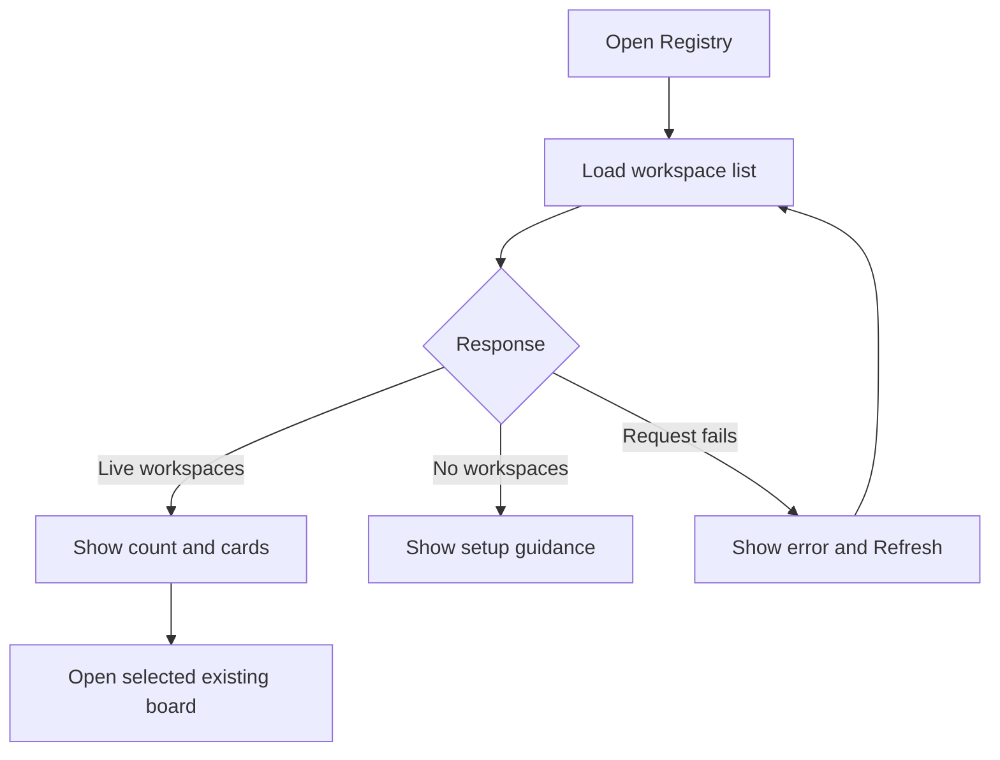

# Kanban Pilot Registry UI redesign

## Design outcome

Turn the Registry from a marketing-style landing page into a calm, utility-first workspace launcher. The first screen should answer “which boards are available?” immediately, while retaining the existing public listing, redirect, and board-data privacy boundaries. The local Registry may also show the registered directory path and current active workspace label; the hosted Registry remains limited to sanitized discovery metadata.

## Primary flow and layout

- **Header:** compact Kanban Pilot mark, “Registry” label, and a right-aligned connection badge such as “Directory online.”
- **Intro band:** “Your live workspaces” heading with one sentence explaining that selecting a card opens the existing board. Keep this concise; remove decorative hero copy that delays the directory.
- **Workspace surface:** a raised panel containing the result count, explicit `Refresh` action, and a responsive card grid. Each card shows the sanitized workspace name, a non-color “Live” label, local directory and active-workspace details when supplied, and a full-card “Open board” link.
- **Trust note:** small, persistent text below the grid explaining that the local Registry can expose the directory path and active workspace label alongside safe connection links; share it only on trusted networks.
- **Footer:** minimal service identity; no secondary navigation that suggests unsupported Registry features.

## Essential components and interactions

- `RegistryHeader`, `DirectorySummary`, `WorkspaceCard`, `DirectoryState`, and `PrivacyNote` remain presentation components over the existing `GET /api/workspaces` response. Local registrations add sanitized `directoryPath` and `activeWorkspace` display metadata without adding board content.
- `Refresh` performs an explicit reload and returns focus to the status region; it does not add background polling.
- Workspace cards use native links so keyboard, middle-click, and browser navigation work naturally. Never interpolate workspace names into HTML; render text through DOM text nodes.
- Keep the existing board URL redirect behavior and never display query parameters, credentials, task data, or board snapshots.

## Loading, empty, and error behavior

- **Loading:** show two or three quiet card skeletons plus “Finding live workspaces…” in a polite status region; avoid layout shift.
- **Empty:** show “No live workspaces” with a short instruction to start/share a board in VS Code; keep Refresh available.
- **Error:** show “Couldn’t load the Registry” with a plain retry explanation and a prominent `Refresh` button; preserve the last successful list only if one exists.
- **Loaded:** announce the count once, then keep updates quiet.

## Responsive and accessibility intent

Use a centered `max-width` shell, one-column cards below 640px, and a two/three-column grid above it. Keep touch targets at least 44px, visible focus rings, semantic `header/main/section/footer`, labelled status updates, WCAG AA contrast, and no color-only state meaning. Respect `prefers-reduced-motion`; skeletons and hover elevation become static.

## Implementation notes

Keep the redesign in the hosted and extension-local Registry page templates and their focused tests/documentation. Reuse sanitized discovery contracts and explicit failure retry. Validate at narrow and wide viewports plus loading, populated, empty, and failed-fetch states before implementation is considered ready.
